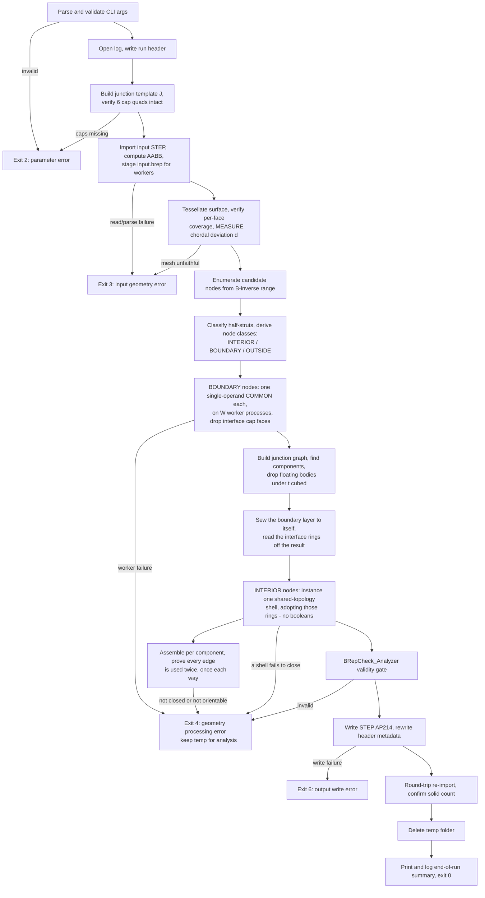
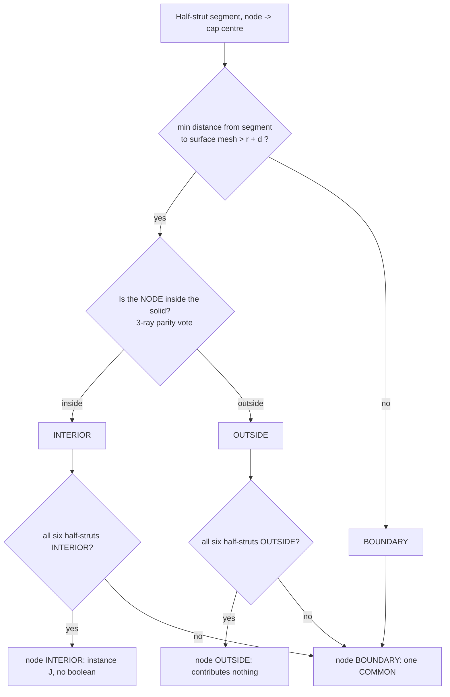

# latticegen2 Algorithm Specification

This document is the normative, implementable specification of the lattice
generation algorithm. It is referenced from [../CLAUDE.md](../CLAUDE.md) and
expands on [specification.md](specification.md) §4 (Geometry Domain) and §4.4
(Performance & Optimization). Where this document gives a formula or a diagram,
source code must implement it exactly — do not re-derive or approximate the
maths below.

All coordinates are in millimetres, in the same coordinate system as the input
STEP file. All angles are computed from expressions (`arcsin`, `arccos`, `sqrt`,
…), never as hard-coded decimals, so precision is IEEE-754 double throughout.

---

## 1. Terminology and symbols

| Symbol | Meaning |
|---|---|
| `cc` | CLI input: XY-plane distance between the bottom nodes of two adjacent cells (mm). |
| `t` | CLI input: side length of the diamond (square) strut profile (mm). |
| `a` | Cube edge length, `a = cc / √2`. |
| `θ` | Strut recline angle from +Z, `θ = arcsin(sqrt(2/3))` ≈ 54.7356°. |
| `e_k` | Unit direction vector of strut family `k ∈ {0,1,2}`. |
| `node (i,j,k)` | A lattice node addressed by integer triple, `i,j,k ∈ ℤ`. |
| `B` | 3×3 basis matrix mapping integer node indices to world coordinates. |
| `r` | Strut circumradius, `r = t/√2` (half the profile's diagonal). |
| `d` | Measured chordal deviation of the classification mesh from the true surface. |
| half-strut `(n, k, s)` | The half of a strut adjacent to node `n`, along `s·e_k`, `s ∈ {+1,−1}`, length `a/2`. |
| junction solid `J` | Union of the six half-struts one node owns. Congruent at every node. |
| cap quad | The `t×t` diamond face at distance `a/2` from a node along `±e_k`, where two adjacent junctions meet exactly. |
| junction graph | One vertex per instantiated junction (or piece of one), one edge per surviving cap interface. |
| INTERIOR / BOUNDARY / OUTSIDE | Classification of a half-strut, and derived from that, of a node (§5). |

---

## 2. Lattice mathematics

### 2.1 Strut directions

The lattice is a simple cubic lattice of node points, rotated so its `[1,1,1]`
body diagonal is aligned with +Z (a cube "standing on its tip" per spec §4.1).
Three strut directions emanate from every node, at azimuths 120° apart around Z,
each reclined from +Z by `θ`:

```python
THETA = arcsin(sqrt(2/3))              # ≈ 54.7356°, an expression, not a literal
SIN_THETA = sqrt(2/3)
COS_THETA = 1/sqrt(3)

def strut_direction(k):                # k = 0, 1, 2
    phi = 2*pi*k/3
    return (SIN_THETA*cos(phi), SIN_THETA*sin(phi), COS_THETA)   # |e_k| == 1
```

### 2.2 Cube edge length and node lattice

Per the user's decision (see [specification.md](specification.md) §4.2), `cc` is
the **XY-plane** distance between the bottom nodes of two adjacent cells, so
`a = cc / sqrt(2)`.

```python
node(i, j, k) = a * (i*e0 + j*e1 + k*e2)     # (i,j,k) in Z^3
```

From every node, three struts of length `a` extend along `+e0, +e1, +e2`.

### 2.3 Verified identities

These are both the mathematical justification for the model and the contents of
`test/test_lattice.py`. All hold to machine precision (`atol=1e-9`):

1. **Unit length:** `|e_k| ≈ 1` for `k = 0,1,2`.
2. **Recline angle:** `arccos(e_k · ẑ) ≈ θ`.
3. **Azimuthal separation:** the horizontal projections of `e0, e1, e2` are
   pairwise 120° apart.
4. **In-plane neighbour spacing:** `|node(1,0,0) − node(0,1,0)| ≈ cc`, and the two
   points have equal `z` — verifying `cc` really is a pure XY-plane distance.
5. **Vertical space diagonal:** `node(1,1,1) − node(0,0,0) ≈ (0, 0, a·sqrt(3))`.
6. **Mutual orthogonality:** `e0·e1 = e0·e2 = e1·e2 ≈ 0`.

Identity 6 is the one the whole architecture rests on, and it is not a
coincidence: the three strut directions are the edges of a cube meeting at a
corner, and the rotation that stands that cube on its tip does not change the
angles between them. Its consequences are developed in §3.

### 2.4 Basis matrix and candidate index range

```python
B = a * column_stack([e0, e1, e2])     # node(i,j,k) = B @ [i,j,k]
```

To enumerate every node whose junction could reach a world-space AABB
`[lo, hi]` (the input solid's bounds):

```python
corners   = the 8 corners of [lo, hi]
idx       = solve(B, corners)                  # world -> index space
pad       = ceil(r / a) + 1                    # safety margin, in cells
lo_idx    = floor(min(idx)) - pad
hi_idx    = ceil (max(idx)) + pad
```

A junction reaches at most `a/2` from its node, and `pad ≥ 1` cell, so no node
outside this range can contribute material inside the box. The cost of the
padding is a handful of nodes that classify trivially as OUTSIDE.

---

## 3. Strut cross-section, the junction solid, and cap integrity

### 3.1 Profile frame ("diamond" orientation)

The square profile for strut direction `k` is built in an orthonormal frame
`{u_k, v_k}` transverse to `e_k`:

```python
u_k = normalize(cross(ẑ, e_k))     # horizontal, perpendicular to e_k's azimuth
v_k = cross(e_k, u_k)              # lies in the vertical plane containing e_k and ẑ
```

The four profile vertices, centred on the strut axis at `c`:

```python
verts(c) = (c + r*u_k, c + r*v_k, c - r*u_k, c - r*v_k)      # r = t/sqrt(2)
```

This is a square of side `t` whose diagonals are `t·sqrt(2)` long, one horizontal
(along `u_k`) and one in the vertical plane of the strut axis — the "diamond on
edge" of spec §4.1.

### 3.2 The junction solid `J`

Cut every strut at its midpoint and assign each half to its nearer node. Every
node then owns exactly six **half-struts**, `(k, s)` for `k ∈ {0,1,2}` and
`s ∈ {+1,−1}`, each a prism of length `a/2`. Their union is the **junction
solid** `J`.

`J` is congruent at every node in the lattice — nodes differ only by a
translation — so it is built exactly once per run:

1. Build the six half-strut prisms at the origin (profile polygon → planar face →
   prism along `s·(a/2)·e_k`).
2. Fuse them with **one** boolean call. This is the only general fuse in the
   entire program. It takes about 40 ms.

**The key consequence of mutual orthogonality (§2.3 identity 6):** at every node
the six half-struts run along ±3 mutually perpendicular axes, so all strut-strut
overlap is confined to the node region and lies *inside* `J`. Two adjacent
junctions therefore **do not overlap in volume at all** — they meet exactly on
the shared mid-strut cap quad. Hence:

> **The fused lattice is translated copies of one solid, meeting on coincident
> planar quads.**

and the union's volume is the plain sum `N · volume(J)`, with no
inclusion-exclusion correction. That identity is an exact, independent check on
the assembled result and is asserted in `test/test_junction.py`.

### 3.3 Cap integrity holds across the whole parameter range

The architecture needs the six cap quads to survive the fuse of §3.2 intact: they
are the interfaces junctions are joined along. They always do, for every `(cc, t)`
the CLI accepts.

The bound is exact. A half-strut along `e_j` reaches toward an orthogonal `e_k`
only as far as its profile's **support** in that direction, which is

```
r · max(|u_j · e_k|, |v_j · e_k|)  =  r / sqrt(2)  =  t/2
```

— the square's *inradius*, because each diamond profile presents an **edge**, not
a corner, toward every orthogonal strut direction (verified for all six `(j,k)`
pairs in `test/test_junction.py`). The cap sits at `a/2`, so caps are intact
while `t/2 < a/2`, i.e. for exactly **`t < a`** — which is the cross-constraint
the CLI already enforces so a strut fits inside its cell.

An intermediate revision of this implementation assumed the relevant reach was
the circumradius `r` rather than the inradius, concluded that `t < cc/2` was
required, and rejected valid parameters accordingly. Measurement disproved it: a
sweep of `t/cc` from 0.45 up to the `t < a` limit at `cc ∈ {5, 10, 20}` mm keeps
all six caps throughout, and the analytic support calculation above explains why.
The restriction was removed rather than shipped — refusing valid input is not an
acceptable failure mode, the same principle §5.1's mesh-coverage gate rests on.

`build_template` still verifies cap integrity geometrically at the run's actual
parameters. It is a cheap defensive gate, not a documented limit: if a future
change to the profile or the cell invalidated the argument above, the run fails
immediately instead of producing geometry with broken interfaces.

---

## 4. End-to-end pipeline



Each stage maps to one source module — see §13.

---

## 5. Boundary classification

The single biggest performance lever is **avoiding boolean operations wherever
they are provably unnecessary**. Classification turns an O(all nodes) boolean
workload into an O(boundary nodes) ≈ O(surface area / cell area) one.

### 5.1 Surface pre-processing (once, on the master)

Tessellate the input solid's boundary with OCCT's `BRepMesh_IncrementalMesh`,
asking for a linear chordal deviation of `min(t, a)/10` and an angular deflection
of 0.2 rad.

No maximum element size is needed: a planar face meshes to a couple of *exact*
triangles however large it is, and only curvature drives refinement. The mesh
stays small as a result — ~1,000 triangles for the test cylinder — without any
loss of fidelity, because the fidelity that matters is measured directly by the
second gate below rather than bought with element count.

Two gates run on the result.

**Gate 1 — per-face coverage (`check_surface_mesh_coverage`).** Every
classification decision depends on the mesh faithfully representing the solid's
boundary, so a silently incomplete mesh would misclassify struts beyond the
missing region as OUTSIDE — the one failure mode the rest of the design rules
out. Two per-face tests, each using a quantity that is sound *in the direction it
is used*:

* **Coverage** against the face's **exact trimmed area** (`BRepGProp`, OCCT Gauss
  quadrature) versus the summed area of that face's triangles. Rejected only when
  the shortfall clears **both** a relative bar (`area_rel_tol`, default 0.25) and
  an absolute one (`min_deficit = min(t, a)²`, one coarsest element's worth of
  area). Both bars are needed and both fire on real data: a relative bar alone
  false-positives on the thousands of tiny trimmed sliver faces a *lattice* has
  (this gate also runs on generated output, where one 0.0403 mm² face meshes to
  75% of its area over a physically irrelevant 0.01 mm² shortfall), while an
  absolute bar alone misses a large fractional loss on a large face (an 18.5 mm²
  shortfall at a 0.990 ratio, measured on a heat-exchanger part).
* **Containment** against the face's CAD bounding box as an **upper bound only** —
  every mesh node must lie inside it, inflated by 1 mm.

A face with zero elements is always an error.

**The bounding box is deliberately never used to test coverage**, and this
distinction is the whole reason the gate is split in two. OCCT's box is a
deliberate over-estimate: for a B-spline edge it returns the hull of the control
points, for a planar face the untrimmed UV rectangle. On a real part, one face
reported reaching `x=190.25` while sampling its own boundary curve at 2001 points
put the true maximum at `x=171.58` — an 18.7 mm over-reach. A conservative
over-estimate is perfectly sound to test *containment* against (nothing may lie
outside it) and meaningless to test *coverage* against (the mesh is not required
to reach it). Testing coverage against it rejects valid input, which is a worse
failure than the one the gate exists to catch: a correctness gate is only as
trustworthy as the tightness of the quantity it compares.

**Gate 2 — measured chordal deviation.** The classification margin below depends
on a bound for how far the mesh departs from the true surface. That bound is
**measured, not assumed**: for every curved face, the true surface is evaluated at
the parametric midpoint of each triangle edge and the parametric centroid of each
triangle, and each sample's distance to the **nearest** triangle of the welded
mesh is taken. `d` is then `max(requested deflection, worst measured deviation)`.

Measuring is necessary because OCCT does not reliably deliver the deflection it
is asked for: on `TD_HX_Indre_Volum.step`, asked for 0.15 mm, the real worst
sagitta is 0.49 mm. A margin built on the requested figure would have been over
three times too small there.

**Nearest, not parametrically-owning, and the distinction is load-bearing.** A
parametric midpoint is not a geometric midpoint, and where a surface's
parametrization is degenerate the two are nowhere near each other. A sphere is
the ordinary case: at `v = ±π/2` every pole-cap triangle owns a vertex at the
pole, so the midpoint of an edge running to it can evaluate 90° of longitude away
from the triangle that owns its parameters. Measuring against that triangle
reported **2.1988 mm** on `80mm-test-ball.step` at a requested 0.1 mm, against a
true worst sagitta of **0.0786 mm** — 28× too large, and past the `a/4` bar at
`cc = 10`, so v2.0.0 refused sound input (issue #6). The giveaway was that it
shrank like `O(h)` under refinement rather than a sagitta's `O(h²)`. Comparing
against the nearest triangle instead gives 0.0848 mm and is unchanged on
geometry that has no such degeneracy — 0.0726 mm on `test-cylinder.STEP`,
0.4907 mm on the heat exchanger.

The search is still deliberately conservative. It is restricted to the sample's
own grid neighbourhood, which is a minimum over a *subset* of the triangles and
therefore can only ever come out too large; and it takes the worst sample rather
than an average. Both err the same way, and that way is the safe one —
over-estimating `d` only sends more junctions down the correct-but-slower
boundary path, while under-estimating it could let a strut that genuinely touches
the surface be treated as clear of it. Measured, the restriction costs nothing:
all three committed parts return the same deviation to six decimals whether the
neighbourhood is searched or every triangle is.

A deviation exceeding `a/4` is a hard failure: classification would then be
dominated by meshing error rather than by geometry. The bar itself was never the
problem in issue #6 — it fired correctly on the number it was given, and a gate
is only as trustworthy as the quantity it compares, exactly as with Gate 1 above.

Finally a uniform spatial hash is built over the triangles, plus a coarser
occupancy grid sized to the near-surface query radius.

### 5.2 Per-half-strut classification, and node classes



* **Segment-mesh minimum distance:** query the spatial hash for triangles near the
  segment's AABB inflated by `r + d`; compute exact segment-triangle distances
  only for those; short-circuit as soon as any distance `≤ r + d` is found, since
  only the *predicate* matters, not the true minimum.
* **Point-in-solid:** ray-cast parity from the node against the triangle set,
  along **three fixed** non-parallel directions, majority vote. Three rays defeat
  the classic single-ray degeneracies (a ray grazing a shared edge or passing
  through a vertex is counted twice). The directions are fixed rather than
  sampled so a run is exactly reproducible — nondeterminism in a
  correctness-critical step would be at odds with the precision priority.
* **Why the margin is `r + d`:** the strut solid extends `r` from its axis, and
  the mesh approximates the true surface to within `d`. Folding both in means the
  discrete test can never wrongly promote a strut that genuinely touches the true
  surface into INTERIOR or OUTSIDE. The worst it can do is call a strut BOUNDARY
  that was actually clear — a wasted but still-correct boolean.

### 5.3 Two properties the rest of the pipeline depends on

**(a) One inside/outside test per node suffices.** If a half-strut's whole axis
segment stays further than `r + d` from the surface, the segment cannot cross the
surface, so its midpoint and its node are on the same side. The ray-parity test —
by far the most expensive part — therefore runs once per node rather than once per
half-strut.

**(b) An INTERIOR node's neighbours are always kept.** If node `A`'s half-strut
toward `B` is INTERIOR, then the strut `A→B` never approaches the surface along
that half and `A` is inside. `B`'s half-strut back toward `A` covers the other
half of the same strut; for it to be OUTSIDE, the surface would have to cross the
strut somewhere — but both halves are further than `r + d` from it. So `B` is
never classified OUTSIDE. Consequently **every cap of an INTERIOR node faces real
geometry**, which is what lets §6 drop all six unconditionally.

The same argument run the other way gives a third property used in §7: if a
node's neighbour *is* OUTSIDE, the shared cap lies entirely outside the solid and
the trim removes it completely. So an intact cap always has material on both
sides.

All three are statements about the *true* geometry, and the pipeline is careful
not to treat them as statements about what a boolean returns. Property (b) says
the junction across an INTERIOR node's cap must keep that cap whole; on grazing
input, OCCT has been observed not to. So the implementation verifies presence
from both sides rather than inferring it from classification — see §7.1, and
§11's rule that a correctness argument is only as good as the quantity actually
compared.

### 5.4 Staging, and complexity

The sweep is ordered cheapest-first:

1. A coarse occupancy query rules out every node whose junction cannot come near
   the surface at all — the interior and the padding, i.e. the overwhelming
   majority.
2. Those nodes are decided by the inside/outside test alone.
3. Only the remaining near-surface nodes pay for exact segment-triangle
   distances, six segments each.

Let `N` be the candidate node count (∝ volume) and `S` the near-surface count
(∝ surface area, so `S = O(N^{2/3})`). Classification is `O(N)` cheap tests plus
`O(S)` exact ones. The payoff is downstream: booleans run on `O(S)` junctions.

---

## 6. Interior construction: indexed instancing, zero booleans

Every INTERIOR node contributes one translated copy of the junction template's
faces **minus all six cap quads** (legitimate by §5.3(b)). Two adjacent instances
therefore present matching square holes to each other, and joining them is
bookkeeping rather than geometry.

The construction is *indexed*, not geometric:

* A global vertex is keyed by `(owning node, local template vertex)`. A vertex on
  an **incoming** cap (`h ≥ 3`) is re-attributed to the neighbour that owns the
  outgoing side of the same cap, via a correspondence map computed once at
  template build time by matching `verts[i] + a·e_k` against the opposite cap's
  vertices. At run time this is an integer lookup — never a coordinate search.
* Its position is computed once, from its owner. Two junctions sharing a vertex
  therefore reference the *same* `TopoDS_Vertex`, and edges built from those
  vertices are shared too. The shell is watertight **by construction**: there is
  no tolerance involved and no possibility of a near-miss.
* Each face is built on a plane whose normal is stated explicitly from the
  template's outward normal. Letting OCCT infer the plane from the wire picks an
  arbitrary normal direction and yields a shell whose faces point every which way
  — closed, but enclosing zero volume. This was observed directly during
  development.
* Edge usage is tallied as faces are added. A closed orientable surface uses every
  edge exactly twice, once in each direction; edges used once are the genuine open
  boundary (the holes where boundary junctions attach); anything else means the
  index is wrong and the build fails rather than presenting a bad shell as a
  solid. OCCT's `Closed` flag is then set from this computed truth, because
  `BRep_Builder` leaves it false on a hand-built shell regardless of the geometry
  and downstream code reads the flag rather than recomputing it.

**Why not simply sew the instances together.** Sewing has to *discover* by
geometric search the pairing that is already known here exactly, and it does not
scale: measured, `BRepBuilderAPI_Sewing` takes 14.9 s for 1,000 junctions and had
not finished after 250 s of CPU at 8,000. The indexed build is linear — 0.2 s at
64 junctions, 1.2 s at 512, 199 s at 64,000 (1.55 M faces) — and produces a valid
solid whose volume matches `N · volume(J)` to a relative 2×10⁻¹⁴. Sewing remains
the right tool where the pairing genuinely *isn't* known (§8), but it must not sit
on the path whose size scales with the volume of the part.

**Why not OCCT's glued boolean mode.** `BOPAlgo_Builder` with
`SetGlue(BOPAlgo_GlueFull)` is designed for operands meeting only on coincident
faces, which is exactly this contact pattern. Measured on 1,000 junctions it took
9.5 s and returned **1,000 solids** — it did not merge them at all. Rejected.

---

## 7. Boundary junctions

Each BOUNDARY node contributes exactly one boolean: its instanced junction solid
intersected with the input solid.

**One object operand per call, always.** OCCT's general boolean runs over all
object operands together, so two overlapping objects in one call are
*partitioned* against the tool rather than each trimmed independently. Measured:
three struts sharing a node, intersected against a containing box in one call,
return **7** fragment solids (four 0.125 mm³ junction wedges plus three 3.16 mm³
pieces) instead of the 1 solid of 9.98 mm³ produced by fusing them first. Those
wedges are exactly the kind of sub-threshold fragment the floating-body rule (§8)
must never mistake for debris. A single already-fused junction cannot trigger the
fragmentation at all, by construction — which is why this design needs no
machinery to keep operands disjoint.

After trimming, every face lying in a cap plane is **tagged, not dropped**.
Identifying one is unambiguous: lateral faces of any half-strut lie at `t/2` from
the node (§3.3), caps at `a/2`, and `t < a`. Whether a tagged cap is actually an
**interface** — a hole this junction punches for its neighbour to fill — is
decided later, on the master, once both sides are known (§7.1).

### 7.1 Interfaces are resolved symmetrically, from both sides

A cap is an interface iff **both sides present material there and the two
regions agree**:

* an INTERIOR node presents all six of its caps whole, by §5.3(b);
* a trimmed boundary piece presents whichever cap-plane faces its own boolean
  left, summed over the pieces one junction split into;
* the two areas must agree to `CAP_AREA_REL_TOL` (1e-6 relative to `t²`) —
  they are the same nominal region computed twice, so only quadrature noise is
  expected.

Anything else keeps its cap face and stays closed there.

**Why this cannot be decided in the worker.** The obvious rule is the one this
implementation used first: a cap is an interface iff the node across it is kept,
which classification already knows, so the worker can drop it on the spot. That
rule is wrong, and its failure mode is the worst kind. The two sides of a cap are
produced by two *independent* `BRepAlgoAPI_Common` calls, in different processes,
against the same nominal quad — and OCCT does not guarantee a shared face comes
back the same from both. Wherever they disagreed, one junction punched a hole
with nothing behind it.

**Confirmed, on the part that failed.** `TD_HX_Indre_Volum` at `cc=5, t=1` re-run
with this rule reports 122,180 interfaces and exactly **three** caps the two sides
disagreed about — all of them in one tight cluster, at nodes `(633,-97,-61)` and
`(633,-97,-62)`, around `[2055.4, -90.0, 969.6]`:

| Cap | Side A | Side B | |
|---|---|---|---|
| `(633,-97,-61)` h3 | present | **absent** | the neighbour produced geometry but no cap at all |
| `(633,-97,-61)` h0 | 1.000000 mm² | **0.014613 mm²** | a whole cap against a 1.5 % sliver |
| `(633,-97,-62)` h2 | 0.736809 mm² | **1.000000 mm²** | 26 % apart |

The one-sided rule would have dropped all three from both sides, opening one hole
with nothing behind it and two pairs of holes that cannot be stitched to each
other. Three unmatched holes in one connected region is exactly
`1 of 14 stitched shells are not closed`.

All four nodes involved classify **BOUNDARY**, so §5.3(b) was never violated: the
proven property — an INTERIOR node's caps face whole caps — held at all 29,375
interior nodes. The failure was entirely in the boundary↔boundary region, where
nothing is proven and the old rule assumed anyway. That is the general shape of
it: this part is dense in grazing intersections (2,969 of 19,552 junctions
produced no geometry at all, 21,955 pieces from the 16,583 that did, dropped
bodies down to 5×10⁻⁶ mm³), and that is exactly where two independent booleans
stop agreeing about a face they share.

Three caps out of 122,180 is also why the two committed scenarios never showed
it: both report zero disagreements, and a rate of 2.5×10⁻⁵ needs a part of this
size before it appears at all.

Resolving it symmetrically makes "every hole has a partner" true by construction.
The failure mode of the new rule is the acceptable one (§11): a cap that *should*
have been an interface but is not recognised as one stays closed, leaving one
extra solid in the output rather than a hole in it. Both counts are logged.

A trim can legitimately split one junction into several disconnected pieces when
the input surface cuts between its arms. Each piece becomes its own vertex in the
junction graph, carrying whichever caps ended up on it.

The work is embarrassingly parallel — constant-size, independent jobs — and is
distributed over worker processes with small-IPC discipline: the input body goes
to disk once as a `.brep` and workers read it directly; only file paths and small
plain metadata cross the process boundary.

---

## 8. Connectivity, the floating-body rule, and stitching

[specification.md](specification.md) §5 forbids emitting a floating body smaller
than `t³`, and is emphatic that "floating" means *provably disconnected* — a small
fragment still attached to the rest must never be deleted.

Here connectivity is known by construction. Two junctions are joined exactly when
they share a surviving cap interface, and which caps survived is recorded while
the geometry is built. So:

1. Build the **junction graph**: vertices are instantiated junctions (interior
   nodes, plus one per piece of each trimmed boundary junction), edges are the
   interfaces §7.1 resolved. Both sides of an interface register it, so a cap
   registered from one side with no partner on the other is a hole with nothing
   behind it, and is a **hard failure naming the junction** (exit 4) rather than
   something to skip. §7.1 makes it unreachable; it is checked because a
   watertightness invariant discovered in seconds beats the same invariant
   discovered hours later as an unclosed shell, with no indication of where.
2. Find connected components by union-find. A component's volume is the sum of its
   members'.
3. Drop a component iff its total volume `< t³`. It is a floating body by
   definition of being a separate component.

No boolean is involved, and there is **no unresolvable case** — the previous
implementation's exit-4 "cannot determine whether this fragment is connected"
path does not exist here. When a trim splits a cap region across several pieces,
every pair is joined rather than left ambiguous: over-connecting can only keep a
body that might have been droppable, never delete one that was attached.

Removals are logged as **one aggregate line** (count, total volume, min/max, up to
20 sample volumes), never one line per body. A line per body turns a run that
drops many of them into a multi-thousand-line tail that buries the rest of the
log, for no information the aggregate does not already carry.

**Stitching.** The interior shell and the surviving trimmed boundary pieces are
then sewn together. Two cross-checks follow:

* If sewing yields **more** solids than the junction graph has components, some
  interface failed to close and the output would not be watertight — hard failure
  (exit 4), temp kept.
* Any shell that is not closed is a hard failure for the same reason.

Boundary interfaces are stitched with a tolerance (1e-6 mm) rather than by index,
because a trimmed junction's faces come back from the boolean and cannot be
re-indexed. That tolerance only has to absorb the last-ulp difference between
computing a shared cap from one side of a strut or the other (~1e-14 mm at
realistic coordinates), and stays far below the smallest real feature
(`t ≥ 0.4` mm), so it can never weld two genuinely distinct vertices.

**The interior shell must never enter sewing.** The design originally assumed
sewing's cost tracks the *free* edges it has to pair up, so feeding it
already-shared shells would keep stitching proportional to surface area.
Measurement says otherwise (`tools/prototypes/RESULTS.md` G5): the cost grows at
about `n^1.8` in piece count, no combination of OCCT's optional phases changes it
by more than 2 %, and — decisively — adding one **closed** 194,400-face shell
with *zero* free edges to a 4,000-piece sew takes it from 76.5 s to 716.6 s. Face
count alone dominates, and the interior shell's face count scales with the
*volume* of the part. That is what cost the `cc=5, t=1` rehearsal 4 h 45 m of its
5 h 04 m.

So the assembly runs the other way round, in three steps:

1. **Sew the boundary pieces to each other**, per junction-graph component. This
   is the only place a pairing is genuinely unknown — both sides of a
   boundary↔boundary cap come out of independent booleans with no shared topology
   to exploit — and it is the surface-area-scaling part, which is what the lever
   in §12 always intended.
2. **Read the interface rings off the sewn result.** Its free edges are exactly
   the holes facing the interior, and each is provably the whole template cap
   quad (§5.3(b)), so its four corners are known from the lattice expressions and
   the lookup is a dictionary hit rather than a search.
3. **Build the interior shell onto those rings.** The instancing index *adopts*
   the boundary's `TopoDS_Vertex` and `TopoDS_Edge` objects at every interface
   instead of creating its own, so the two sides are the same objects from the
   start and nothing has to be reconciled afterwards.

Assembly is then `BRep_Builder.Add` into one shell per component, and
watertightness is proved rather than assumed: **every edge used exactly twice,
once in each direction**. Both halves of that test are load-bearing. Counting
uses alone passes a shell whose faces are joined back-to-front — measured during
development: 0 open edges, 954 edges traversed the same way twice, volume
29,111 mm³ against a true 51,393 mm³.

**Why the interior is the side that adapts, and not the other way round.** The
obvious alternative is to rewrite the boundary pieces onto the interior's
topology with `BRepTools_ReShape`. It does not work, and it fails quietly.
`ReShape` will swap an edge inside a face happily, but replacing that edge's
**vertices** leaves the neighbouring edges still pointing at the old ones and the
wire comes apart: `BRepCheck_NotConnected`, the solid invalid, the volume wrong —
while every edge still has exactly two faces and the shell still "closes". The
same swap *keeping* the vertices is exact. A cap's two sides cannot both keep
their own vertices, so the side that gives way has to be the one whose faces the
program builds itself.

---

## 9. STEP export and metadata

* **Same-domain unification.** Before anything else, each solid's B-rep is
  compacted with `ShapeUpgrade_UnifySameDomain`, merging adjacent faces (and
  edges) that lie on one underlying surface.

  This is needed precisely *because* the lattice is instanced rather than fused.
  Instancing merges nothing, so across every shared mid-strut interface junction
  A's lateral face and junction B's are coplanar and share an edge yet remain two
  faces — every strut carries eight lateral faces where four suffice. The old
  fuse-based pipeline got this merge for free as a side effect of the boolean;
  removing the boolean removed the merge with it. The junction template itself is
  already minimal and unifies to itself (30 faces → 30): within one junction the
  `+e_k` and `−e_k` lateral faces are coplanar but *not* adjacent, because the
  other four half-struts cut them apart at the node. `test/test_junction.py` pins
  both halves of that finding.

  Measured on `dense-lattice`: **29,974 → 15,966 faces**, 122,556 → 67,898 edges,
  98.9 MB → 52.6 MB, with the exact symmetric-difference volume against the
  un-unified solid confirming no geometry moved. It costs ~8 s and *pays for
  itself*: export drops from 9.3 s
  to 5.7 s and the round-trip check from 23.5 s to 13.5 s, so the whole run gets
  faster. Re-tessellation also drops from 85,832 to 62,152 triangles, so
  downstream meshing and display get cheaper too.

  It is a **representation** change and must never become a geometry change, so
  two guards bracket it, both hard failures: the solid count must be unchanged
  (a change would also invalidate the junction-graph cross-check that precedes
  it), and each solid's volume must be preserved to `UNIFY_VOLUME_TOL` (1e-5
  relative). That bar is calibrated, not guessed: on purely planar geometry,
  where the volume is known analytically, the drift is 1.9e-15 — exact; it only
  appears on boundary solids carrying curved trimmed faces, where quadrature over
  a larger merged region differs slightly, at 2.4e-7 on `dense-lattice`. Every run
  logs the observed drift so the margin is visible rather than assumed. The
  stronger guard is the validity gate below: merging faces that are not the same
  surface moves the boundary, which shows up as an invalid solid long before it
  shows up as a changed volume.

  Each solid is unified independently rather than as one compound, which keeps the
  count guard exact and leaves the step straightforward to parallelise if it ever
  becomes the bottleneck at scale (~0.24 ms/face).

  **A kernel that declines to unify must not end the run.** Unification makes the
  output smaller, not more correct, so failing on it would refuse sound geometry
  over a size optimization — §11's principle again. `ShapeUpgrade_UnifySameDomain`
  does throw on geometry this tool legitimately produces: on the 80 mm ball at
  `cc=10, t=1` it raises `Standard_Failure: Courbes non jointives` on a solid that
  `BRepCheck_Analyzer` has already passed as valid. So the step degrades in two
  rungs, and everything downstream still gates the result either way.

  The rungs are chosen from where the value is. It is specifically the **edge**
  merging — concatenating the collinear pairs left inside a merged wire — that
  throws, and on this geometry it is worth almost nothing: run alone it removes
  4 edges out of 81,816. Face merging, the part that matters, succeeds on the same
  solid and takes it from 20,268 faces to 10,554 and 81,816 edges to 62,376. So
  the first retry drops edge merging, and only if that fails too is the solid
  exported as built, with an explicit note in the log and the summary.

* **Validity gate.** Every output solid is checked with OCCT's
  `BRepCheck_Analyzer` before export. This is an *exact* B-rep check rather than a
  mesh-based approximation of one, which matters because mesh-based
  self-intersection tests have well-known false-positive modes on this kind of
  geometry (see the plane-straddle pre-check in `tools/verify_geometry.py`).
* **Units.** STEP I/O is pinned to millimetres defensively, even though that is
  the default: a mismatched unit would silently corrupt every dimension rather
  than fail.
* **Export.** `STEPControl_Writer` with `write.step.schema = AP214IS`, producing an
  AP214 file per spec §5.
* **Header rewrite.** STEP is plain text. After export, a small quote-aware pass
  sets `FILE_NAME`'s first field to the part name `<input_stem>+cc<cc>+t<t>`
  (spec §5's `+`-separated convention, distinct from the `-`-separated default
  *file* name) with floats formatted without trailing zeros, and appends the full
  parameter string to `FILE_DESCRIPTION`. **`FILE_SCHEMA`'s value is only ever
  filled in when blank, never overwritten** — that is what keeps the file a clean
  standard document rather than a hand-patched hybrid.
* **Round-trip self-check.** Before declaring success the written file is re-read
  and its solid count compared against what the run believes it wrote. A mismatch
  is a failure (exit 6), not a warning: a run whose own accounting disagrees with
  the file it produced has not established that it wrote what it thinks it did,
  and a summary claiming success over a file nobody checked is worse than a
  visible error.

---

## 10. Logging and failure modes

* Log path: `<output-stem>.log`, derived the same way as the output path, never
  `<output>.step.log`. Always written in full regardless of `-v`; `-v` only raises
  *console* verbosity.
* Content: run header (all parameters, start timestamp), one line per stage with
  its wall-clock duration, template/mesh/classification statistics, boundary-trim
  progress, the interface tally (stitched caps, plus counts and sample world
  positions for any the two sides disagreed about — §7.1), the interior shell's
  open-edge count, the aggregate floating-body line, and the mandatory end-of-run
  summary (spec §3's list) printed to both console and log on success.
* Exit codes:

  | Code | Meaning |
  |---|---|
  | 0 | Success |
  | 1 | An unexpected exception reached the top level, or the launcher's interpreter cannot load the dependencies (see below) |
  | 2 | Parameter validation failure (before any computation) |
  | 3 | Input geometry read/parse failure, or a mesh too unfaithful to classify against |
  | 4 | Geometry processing failure (boundary trim, an interface that failed to close, an invalid output solid) |
  | 5 | Resource limits — retained for compatibility, currently unreachable |
  | 6 | Output write failure, or a failed round-trip check |
  | 130 | Cancelled by the user with Ctrl+C (`128 + SIGINT`) |

* Every non-zero exit prints exactly one human-readable reason line. Exit 130
  prints `CANCELLED:` rather than `FAILED:` and no traceback: a cancelled run did
  what the user asked, it did not malfunction.
* **Exit 1 has two sources, and they are distinguishable by what got printed.**
  From the pipeline it is an unexpected exception: `__main__` reports it as one
  `FAILED: unexpected ...` line and then re-raises, so a traceback follows and
  Python exits 1. From the launcher it means the tool never started, and it
  exists because that failure cannot be reported from inside Python at all. An
  interpreter that cannot load `numpy` or `OCP` dies during import, before
  `main()` runs — and when the cause is a native library it is not even an
  exception: MKL prints
  `Intel oneMKL FATAL ERROR: Cannot load mkl_intel_thread.2.dll` and aborts the
  process, uncatchable by `except BaseException`. Worse, it exits **2**, which
  would otherwise read as this tool rejecting a parameter.

  So `latticegen2.bat` / `latticegen2.sh` re-check the interpreter **after** a
  non-zero exit, never before, so a healthy run pays nothing for it. The probe
  is scoped further, because it costs ~1.2 s: codes 3, 4, 5, 6 and 130 above are
  produced only by the pipeline's own error paths, which proves the tool ran, so
  those return immediately. Probing them would be pure delay — and after a
  Ctrl+C, an unexplained pause following the clean shutdown spec §3 asks for.
  What remains is what an interpreter that never started can produce: 1, 2, and
  the shell's own "cannot execute" codes.

  If `import numpy, OCP.TopoDS` then also fails, the launcher says so, shows the
  real error, names the interpreter it chose, and exits 1 instead of passing on a
  code that would misattribute the failure to the pipeline. If the probe
  succeeds, the child's own exit code goes through untouched and the launcher
  stays silent.
* If a failure occurs after `temp/<ts>/` has been created it is left in place for
  post-mortem analysis (spec §4.4), and the message says where.

---

## 11. Correctness safeguards recap

Because priority #1 is precision, every optimization is designed so that its
*failure mode is "do more work", never "produce a wrong result"*:

* Classification degrades ambiguous cases to BOUNDARY (§5.2) — worst case is an
  unnecessary boolean, never a missed trim or a phantom strut.
* Interfaces are resolved from both sides at once (§7.1), so a cap is only ever
  opened when there is proven material behind it. The worst case is an extra
  solid in the output; a hole is unreachable, and an inconsistency between the
  two sides fails immediately and by name (§8) instead of surfacing much later
  as an unclosed shell.
* The classification margin uses a **measured** upper bound on mesh error (§5.1),
  so the guarantee above does not rest on the mesher honouring its parameters.
* Instancing is not an approximation of fusing: by §3.2 the union of translated
  junctions *is* the fused lattice, and the exact volume identity
  `N · volume(J)` is asserted against it.
* Watertightness of the interior is structural (shared topology, §6), and is
  additionally verified by the edge-use tally before the shell is accepted.
* Connectivity is proven, not guessed (§8), so no body is ever deleted without
  proof that it is disconnected.
* The output is checked with an exact B-rep validity test, and the file is re-read
  and compared before success is reported (§9).
* `check_surface_mesh_coverage` fails loudly rather than classifying against an
  incomplete mesh — while being careful that the gate is only as trustworthy as
  the tightness of the quantity it compares (§5.1). A gate that rejects valid
  input is its own violation of the principle above: "do more work" is an
  acceptable failure mode, "refuse correct input" is not.
* The same reading applies to steps that are *optimizations* rather than
  correctness requirements. Same-domain unification only makes the output
  smaller, so when the kernel refuses to perform it the run degrades to a
  larger file rather than failing (§9). Both halves of issue #6 were this
  mistake: a sound part rejected first by a mis-measured mesh gate, then by an
  optional compaction step that threw.

---

## 12. Complexity and the optimization strategy

Let `N` = candidate nodes (∝ volume), `S` = boundary nodes (∝ surface area,
`S = O(N^{2/3})`), `W` = worker count.

| Stage | Cost |
|---|---|
| Template | `O(1)` — one 6-operand fuse per run, ~40 ms |
| Tessellation | `O(input faces)`, independent of lattice density |
| Classification | `O(N)` cheap tests + `O(S)` exact ones |
| Interior | `O(N)` index operations and face constructions, **no booleans** |
| Unification | `O(faces)`, ~0.24 ms/face |
| Boundary | `O(S/W)` single-operand intersections |
| Connectivity | `O(N + S)` union-find |
| Stitching | `O(S^1.8)` over the boundary layer only — the interior no longer enters it (§8) |
| Assembly | `O(N + S)` index operations, **no booleans and no search** |
| Export | `O(faces)` — irreducible |

| Lever | Effect |
|---|---|
| Classify before intersecting | Booleans only for the `O(S)` boundary junctions |
| One junction template, instanced everywhere | The only general fuse is 6 operands, once per run |
| Indexed shared-topology interior shell | `O(N)` and exactly watertight; replaces a sewing step measured at 14.9 s per 1,000 junctions and growing superlinearly |
| Explicit face plane normals | Avoids a silently zero-volume shell (§6) |
| One object operand per COMMON | Makes OCCT's operand-fragmentation failure mode unreachable |
| Connectivity by graph | Floating-body rule needs no boolean, and has no unresolvable case |
| Sewing confined to the boundary layer | Delivered by inverting the assembly: the boundary is sewn first and the interior is then *built onto* its topology, so the volume-scaling shell never reaches a geometric search (§8) |
| Same-domain unification before export (§9) | Recovers the face merging the removed boolean used to do for free: 47% fewer faces and half the file size, and it makes the run *faster* by shrinking export and the round-trip check |
| Process-parallel boundary junctions | Constant-size independent jobs |
| Coarse occupancy pre-filter before exact distance tests | Only near-surface nodes pay for segment-triangle maths |
| Vectorised ragged cell assignment in the spatial index | Building the index over a 200 k-triangle *output* mesh stays interactive |
| One ray-parity test per node, not per half-strut | Justified by §5.3(a); a third of the work |
| Planar faces skipped in deviation measurement | Lattice output is all planar, so verification re-tessellation stays cheap |
| Deviation samples binned once against inflated triangle AABBs | One vectorised `searchsorted` replaces a 27-cell query per sample; on the 26 k-triangle heat exchanger that was most of the stage (§5.1) |
| Centroid/AABB bounds before the exact point-triangle test | A neighbourhood holds tens of triangles and two can be nearest; the cheap bounds discard the rest without exact work |
| Measured rather than assumed mesh deviation | Correctness safety net, not a speed lever (§5.1) |

Alternatives evaluated and rejected:

* **Voxel / marching-cubes implicit surfacing:** approximate, faceted output;
  violates the exact-B-rep requirement (spec §5).
* **Fusing struts, or blocks of struts, into the lattice:** OCCT's boolean fuse
  cost grows at roughly N^2.5 in operand count — measured, 192 struts in 12.4 s
  against 648 struts in 256 s — so any design with fusion on the volume-scaling
  path becomes unreachable well before the sizes this tool targets.
* **`BOPAlgo_GlueFull`:** measured, does not merge (§6).
* **CGAL Nef polyhedra:** correct and robust, but redundant once no large boolean
  exists to perform.

---

## 13. Mapping to source modules

| Module | Implements |
|---|---|
| [`src/latticegen2/cli.py`](../src/latticegen2/cli.py) | CLI parsing and validation, output path resolution |
| [`src/latticegen2/lattice.py`](../src/latticegen2/lattice.py) | §2 (directions, basis, node enumeration, index range), §3.1 (profile), half-struts |
| [`src/latticegen2/occ.py`](../src/latticegen2/occ.py) | OCCT helpers: STEP I/O, measurement, meshing, sewing, validity |
| [`src/latticegen2/junction.py`](../src/latticegen2/junction.py) | §3.2–§3.3 (the template and its cap-integrity gate) |
| [`src/latticegen2/classify.py`](../src/latticegen2/classify.py) | §5 (tessellation, both mesh gates, spatial indices, distance and ray-parity tests, node classes) |
| [`src/latticegen2/interior.py`](../src/latticegen2/interior.py) | §6 (template topology extraction, cap correspondence, indexed shell build) |
| [`src/latticegen2/boundary.py`](../src/latticegen2/boundary.py) | §7 (single-operand trim, cap tagging, worker processes), §7.1 (interface resolution) |
| [`src/latticegen2/connect.py`](../src/latticegen2/connect.py) | §8 (junction graph, components, floating-body rule) — kernel-free |
| [`src/latticegen2/weld.py`](../src/latticegen2/weld.py) | §8 (boundary sew, interface-ring lookup, assembly and its watertightness proof) |
| [`src/latticegen2/stepout.py`](../src/latticegen2/stepout.py) | §9 (header rewrite, round-trip check) |
| [`src/latticegen2/runlog.py`](../src/latticegen2/runlog.py) | §10 (logging, stage timings, summary) |
| [`src/latticegen2/pipeline.py`](../src/latticegen2/pipeline.py) | §4 (orchestration) |
| [`src/latticegen2/__main__.py`](../src/latticegen2/__main__.py) | Entry point, failure reporting, exit codes |
