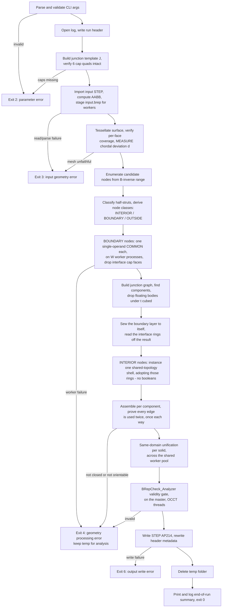
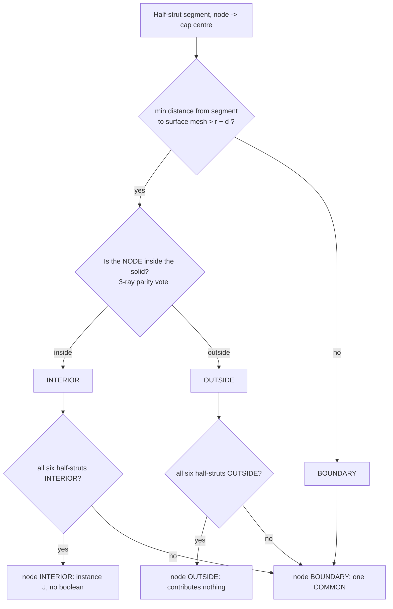

# latticegen2 Algorithm Specification

This document is the normative, implementable specification of the lattice
generation algorithm. It is referenced from [../CLAUDE.md](../CLAUDE.md) and
expands on [specification.md](specification.md) §4 (Geometry Domain) and §4.4
(Performance & Optimization). Where this document gives a formula or a diagram,
source code must implement it exactly — do not re-derive or approximate the
maths below.

All coordinates are in millimetres, in the same coordinate system as the input
STEP file. All angles are computed from expressions (`arcsin`, `arccos`, `sqrt`,
…), never as hard-coded decimals, so precision is IEEE-754 double throughout.

---

## 1. Terminology and symbols

| Symbol | Meaning |
|---|---|
| `cc` | CLI input: XY-plane distance between the bottom nodes of two adjacent cells (mm). |
| `t` | CLI input: side length of the diamond (square) strut profile (mm). |
| `a` | Cube edge length, `a = cc / √2`. |
| `θ` | Strut recline angle from +Z, `θ = arcsin(sqrt(2/3))` ≈ 54.7356°. |
| `e_k` | Unit direction vector of strut family `k ∈ {0,1,2}`. |
| `node (i,j,k)` | A lattice node addressed by integer triple, `i,j,k ∈ ℤ`. |
| `B` | 3×3 basis matrix mapping integer node indices to world coordinates. |
| `r` | Strut circumradius, `r = t/√2` (half the profile's diagonal). |
| `d` | Measured chordal deviation of the classification mesh from the true surface. |
| half-strut `(n, k, s)` | The half of a strut adjacent to node `n`, along `s·e_k`, `s ∈ {+1,−1}`, length `a/2`. |
| junction solid `J` | Union of the six half-struts one node owns. Congruent at every node. |
| cap quad | The `t×t` diamond face at distance `a/2` from a node along `±e_k`, where two adjacent junctions meet exactly. |
| junction graph | One vertex per instantiated junction (or piece of one), one edge per surviving cap interface. |
| INTERIOR / BOUNDARY / OUTSIDE | Classification of a half-strut, and derived from that, of a node (§5). |

---

## 2. Lattice mathematics

### 2.1 Strut directions

The lattice is a simple cubic lattice of node points, rotated so its `[1,1,1]`
body diagonal is aligned with +Z (a cube "standing on its tip" per spec §4.1).
Three strut directions emanate from every node, at azimuths 120° apart around Z,
each reclined from +Z by `θ`:

```python
THETA = arcsin(sqrt(2/3))              # ≈ 54.7356°, an expression, not a literal
SIN_THETA = sqrt(2/3)
COS_THETA = 1/sqrt(3)

def strut_direction(k):                # k = 0, 1, 2
    phi = 2*pi*k/3
    return (SIN_THETA*cos(phi), SIN_THETA*sin(phi), COS_THETA)   # |e_k| == 1
```

### 2.2 Cube edge length and node lattice

Per the user's decision (see [specification.md](specification.md) §4.2), `cc` is
the **XY-plane** distance between the bottom nodes of two adjacent cells, so
`a = cc / sqrt(2)`.

```python
node(i, j, k) = a * (i*e0 + j*e1 + k*e2)     # (i,j,k) in Z^3
```

From every node, three struts of length `a` extend along `+e0, +e1, +e2`.

### 2.3 Verified identities

These are both the mathematical justification for the model and the contents of
`test/test_lattice.py`. All hold to machine precision (`atol=1e-9`):

1. **Unit length:** `|e_k| ≈ 1` for `k = 0,1,2`.
2. **Recline angle:** `arccos(e_k · ẑ) ≈ θ`.
3. **Azimuthal separation:** the horizontal projections of `e0, e1, e2` are
   pairwise 120° apart.
4. **In-plane neighbour spacing:** `|node(1,0,0) − node(0,1,0)| ≈ cc`, and the two
   points have equal `z` — verifying `cc` really is a pure XY-plane distance.
5. **Vertical space diagonal:** `node(1,1,1) − node(0,0,0) ≈ (0, 0, a·sqrt(3))`.
6. **Mutual orthogonality:** `e0·e1 = e0·e2 = e1·e2 ≈ 0`.

Identity 6 is the one the whole architecture rests on, and it is not a
coincidence: the three strut directions are the edges of a cube meeting at a
corner, and the rotation that stands that cube on its tip does not change the
angles between them. Its consequences are developed in §3.

### 2.4 Basis matrix and candidate index range

```python
B = a * column_stack([e0, e1, e2])     # node(i,j,k) = B @ [i,j,k]
```

To enumerate every node whose junction could reach a world-space AABB
`[lo, hi]` (the input solid's bounds):

```python
corners   = the 8 corners of [lo, hi]
idx       = solve(B, corners)                  # world -> index space
pad       = ceil(r / a) + 1                    # safety margin, in cells
lo_idx    = floor(min(idx)) - pad
hi_idx    = ceil (max(idx)) + pad
```

A junction reaches at most `a/2` from its node, and `pad ≥ 1` cell, so no node
outside this range can contribute material inside the box. The cost of the
padding is a handful of nodes that classify trivially as OUTSIDE.

---

## 3. Strut cross-section, the junction solid, and cap integrity

### 3.1 Profile frame ("diamond" orientation)

The square profile for strut direction `k` is built in an orthonormal frame
`{u_k, v_k}` transverse to `e_k`:

```python
u_k = normalize(cross(ẑ, e_k))     # horizontal, perpendicular to e_k's azimuth
v_k = cross(e_k, u_k)              # lies in the vertical plane containing e_k and ẑ
```

The four profile vertices, centred on the strut axis at `c`:

```python
verts(c) = (c + r*u_k, c + r*v_k, c - r*u_k, c - r*v_k)      # r = t/sqrt(2)
```

This is a square of side `t` whose diagonals are `t·sqrt(2)` long, one horizontal
(along `u_k`) and one in the vertical plane of the strut axis — the "diamond on
edge" of spec §4.1.

### 3.2 The junction solid `J`

Cut every strut at its midpoint and assign each half to its nearer node. Every
node then owns exactly six **half-struts**, `(k, s)` for `k ∈ {0,1,2}` and
`s ∈ {+1,−1}`, each a prism of length `a/2`. Their union is the **junction
solid** `J`.

`J` is congruent at every node in the lattice — nodes differ only by a
translation — so it is built exactly once per run:

1. Build the six half-strut prisms at the origin (profile polygon → planar face →
   prism along `s·(a/2)·e_k`).
2. Fuse them with **one** boolean call. This is the only general fuse the
   pipeline runs unconditionally, once per run; it takes about 40 ms. §7.1's
   local repair fuse is the sole exception, and runs only for the rare boundary
   cap pair the kernel itself disagreed about.

**The key consequence of mutual orthogonality (§2.3 identity 6):** at every node
the six half-struts run along ±3 mutually perpendicular axes, so all strut-strut
overlap is confined to the node region and lies *inside* `J`. Two adjacent
junctions therefore **do not overlap in volume at all** — they meet exactly on
the shared mid-strut cap quad. Hence:

> **The fused lattice is translated copies of one solid, meeting on coincident
> planar quads.**

and the union's volume is the plain sum `N · volume(J)`, with no
inclusion-exclusion correction. That identity is an exact, independent check on
the assembled result and is asserted in `test/test_junction.py`.

### 3.3 Cap integrity holds across the whole parameter range

The architecture needs the six cap quads to survive the fuse of §3.2 intact: they
are the interfaces junctions are joined along. They always do, for every `(cc, t)`
the CLI accepts.

The bound is exact. A half-strut along `e_j` reaches toward an orthogonal `e_k`
only as far as its profile's **support** in that direction, which is

```
r · max(|u_j · e_k|, |v_j · e_k|)  =  r / sqrt(2)  =  t/2
```

— the square's *inradius*, because each diamond profile presents an **edge**, not
a corner, toward every orthogonal strut direction (verified for all six `(j,k)`
pairs in `test/test_junction.py`). The cap sits at `a/2`, so caps are intact
while `t/2 < a/2`, i.e. for exactly **`t < a`** — which is the cross-constraint
the CLI already enforces so a strut fits inside its cell.

An intermediate revision of this implementation assumed the relevant reach was
the circumradius `r` rather than the inradius, concluded that `t < cc/2` was
required, and rejected valid parameters accordingly. Measurement disproved it: a
sweep of `t/cc` from 0.45 up to the `t < a` limit at `cc ∈ {5, 10, 20}` mm keeps
all six caps throughout, and the analytic support calculation above explains why.
The restriction was removed rather than shipped — refusing valid input is not an
acceptable failure mode, the same principle §5.1's mesh-coverage gate rests on.

`build_template` still verifies cap integrity geometrically at the run's actual
parameters. It is a cheap defensive gate, not a documented limit: if a future
change to the profile or the cell invalidated the argument above, the run fails
immediately instead of producing geometry with broken interfaces.

---

## 4. End-to-end pipeline



Each stage maps to one source module — see §13.

---

## 5. Boundary classification

The single biggest performance lever is **avoiding boolean operations wherever
they are provably unnecessary**. Classification turns an O(all nodes) boolean
workload into an O(boundary nodes) ≈ O(surface area / cell area) one.

### 5.1 Surface pre-processing (once, on the master)

Tessellate the input solid's boundary with OCCT's `BRepMesh_IncrementalMesh`,
asking for a linear chordal deviation of `min(t, a)/10` and an angular deflection
of 0.2 rad.

No maximum element size is needed: a planar face meshes to a couple of *exact*
triangles however large it is, and only curvature drives refinement. The mesh
stays small as a result — ~1,000 triangles for the test cylinder — without any
loss of fidelity, because the fidelity that matters is measured directly by the
second gate below rather than bought with element count.

Two gates run on the result.

**Gate 1 — per-face coverage (`check_surface_mesh_coverage`).** Every
classification decision depends on the mesh faithfully representing the solid's
boundary, so a silently incomplete mesh would misclassify struts beyond the
missing region as OUTSIDE — the one failure mode the rest of the design rules
out. Two per-face tests, each using a quantity that is sound *in the direction it
is used*:

* **Coverage** against the face's **exact trimmed area** (`BRepGProp`, OCCT Gauss
  quadrature) versus the summed area of that face's triangles. Rejected only when
  the shortfall clears **both** a relative bar (`area_rel_tol`, default 0.25) and
  an absolute one (`min_deficit = min(t, a)²`, one coarsest element's worth of
  area). Both bars are needed and both fire on real data: a relative bar alone
  false-positives on the thousands of tiny trimmed sliver faces a *lattice* has
  (this gate also runs on generated output, where one 0.0403 mm² face meshes to
  75% of its area over a physically irrelevant 0.01 mm² shortfall), while an
  absolute bar alone misses a large fractional loss on a large face (an 18.5 mm²
  shortfall at a 0.990 ratio, measured on a heat-exchanger part).
* **Containment** against the face's CAD bounding box as an **upper bound only** —
  every mesh node must lie inside it, inflated by 1 mm.

A face with zero elements is always an error.

**The bounding box is deliberately never used to test coverage**, and this
distinction is the whole reason the gate is split in two. OCCT's box is a
deliberate over-estimate: for a B-spline edge it returns the hull of the control
points, for a planar face the untrimmed UV rectangle. On a real part, one face
reported reaching `x=190.25` while sampling its own boundary curve at 2001 points
put the true maximum at `x=171.58` — an 18.7 mm over-reach. A conservative
over-estimate is perfectly sound to test *containment* against (nothing may lie
outside it) and meaningless to test *coverage* against (the mesh is not required
to reach it). Testing coverage against it rejects valid input, which is a worse
failure than the one the gate exists to catch: a correctness gate is only as
trustworthy as the tightness of the quantity it compares.

**Gate 2 — measured chordal deviation.** The classification margin below depends
on a bound for how far the mesh departs from the true surface. That bound is
**measured, not assumed**: for every curved face, the true surface is evaluated at
the parametric midpoint of each triangle edge and the parametric centroid of each
triangle, and each sample's distance to the **nearest** triangle of the welded
mesh is taken. `d` is then `max(requested deflection, worst measured deviation)`.

Measuring is necessary because OCCT does not reliably deliver the deflection it
is asked for: on `TD_HX_rehearsal_test.step`, asked for 0.15 mm, the real worst
sagitta is 0.49 mm. A margin built on the requested figure would have been over
three times too small there.

**Nearest, not parametrically-owning, and the distinction is load-bearing.** A
parametric midpoint is not a geometric midpoint, and where a surface's
parametrization is degenerate the two are nowhere near each other. A sphere is
the ordinary case: at `v = ±π/2` every pole-cap triangle owns a vertex at the
pole, so the midpoint of an edge running to it can evaluate 90° of longitude away
from the triangle that owns its parameters. Measuring against that triangle
reported **2.1988 mm** on `80mm-test-ball.step` at a requested 0.1 mm, against a
true worst sagitta of **0.0786 mm** — 28× too large, and past the `a/4` bar at
`cc = 10`, so v2.0.0 refused sound input (issue #6). The giveaway was that it
shrank like `O(h)` under refinement rather than a sagitta's `O(h²)`. Comparing
against the nearest triangle instead gives 0.0848 mm and is unchanged on
geometry that has no such degeneracy — 0.0726 mm on `test-cylinder.STEP`,
0.4907 mm on the heat exchanger.

The search is still deliberately conservative. It is restricted to the sample's
own grid neighbourhood, which is a minimum over a *subset* of the triangles and
therefore can only ever come out too large; and it takes the worst sample rather
than an average. Both err the same way, and that way is the safe one —
over-estimating `d` only sends more junctions down the correct-but-slower
boundary path, while under-estimating it could let a strut that genuinely touches
the surface be treated as clear of it. Measured, the restriction costs nothing:
all three committed parts return the same deviation to six decimals whether the
neighbourhood is searched or every triangle is.

A deviation exceeding `a/4` is a hard failure: classification would then be
dominated by meshing error rather than by geometry. The bar itself was never the
problem in issue #6 — it fired correctly on the number it was given, and a gate
is only as trustworthy as the quantity it compares, exactly as with Gate 1 above.

Finally a uniform spatial hash is built over the triangles, plus a coarser
occupancy grid sized to the near-surface query radius.

### 5.2 Per-half-strut classification, and node classes



* **Segment-mesh minimum distance:** query the spatial hash for triangles near the
  segment's AABB inflated by `r + d`; compute exact segment-triangle distances
  only for those; short-circuit as soon as any distance `≤ r + d` is found, since
  only the *predicate* matters, not the true minimum.
* **Point-in-solid:** ray-cast parity from the node against the triangle set,
  along **three fixed** non-parallel directions, majority vote. Three rays defeat
  the classic single-ray degeneracies (a ray grazing a shared edge or passing
  through a vertex is counted twice). The directions are fixed rather than
  sampled so a run is exactly reproducible — nondeterminism in a
  correctness-critical step would be at odds with the precision priority.
* **Why the margin is `r + d`:** the strut solid extends `r` from its axis, and
  the mesh approximates the true surface to within `d`. Folding both in means the
  discrete test can never wrongly promote a strut that genuinely touches the true
  surface into INTERIOR or OUTSIDE. The worst it can do is call a strut BOUNDARY
  that was actually clear — a wasted but still-correct boolean.

### 5.3 Two properties the rest of the pipeline depends on

**(a) One inside/outside test per node suffices.** If a half-strut's whole axis
segment stays further than `r + d` from the surface, the segment cannot cross the
surface, so its midpoint and its node are on the same side. The ray-parity test —
by far the most expensive part — therefore runs once per node rather than once per
half-strut.

**(b) An INTERIOR node's neighbours are always kept.** If node `A`'s half-strut
toward `B` is INTERIOR, then the strut `A→B` never approaches the surface along
that half and `A` is inside. `B`'s half-strut back toward `A` covers the other
half of the same strut; for it to be OUTSIDE, the surface would have to cross the
strut somewhere — but both halves are further than `r + d` from it. So `B` is
never classified OUTSIDE. Consequently **every cap of an INTERIOR node faces real
geometry**, which is what lets §6 drop all six unconditionally.

The same argument run the other way gives a third property used in §7: if a
node's neighbour *is* OUTSIDE, the shared cap lies entirely outside the solid and
the trim removes it completely. So an intact cap always has material on both
sides.

All three are statements about the *true* geometry, and the pipeline is careful
not to treat them as statements about what a boolean returns. Property (b) says
the junction across an INTERIOR node's cap must keep that cap whole; on grazing
input, OCCT has been observed not to. So the implementation verifies presence
from both sides rather than inferring it from classification — see §7.1, and
§11's rule that a correctness argument is only as good as the quantity actually
compared.

### 5.4 Staging, and complexity

The sweep is ordered cheapest-first:

1. A coarse occupancy query rules out every node whose junction cannot come near
   the surface at all — the interior and the padding, i.e. the overwhelming
   majority.
2. Those nodes are decided by the inside/outside test alone.
3. Only the remaining near-surface nodes pay for exact segment-triangle
   distances, six segments each.

Let `N` be the candidate node count (∝ volume) and `S` the near-surface count
(∝ surface area, so `S = O(N^{2/3})`). Classification is `O(N)` cheap tests plus
`O(S)` exact ones. The payoff is downstream: booleans run on `O(S)` junctions.

**The sweep is dispatched across the run's shared `WorkerPool`**, which is built
before this stage rather than after it for that reason (§13,
`latticegen2.parallel`). Every node is decided independently of every other —
`Occupancy.near` is elementwise, `SpatialHash.query` takes only one node's own
box, and the ray caster buckets each point by its own projected cell and sums an
integer crossing count over that bucket's triangles — so there is no reduction
across nodes anywhere to reassociate, and a node's class is bit-identical
whether it arrives in the whole candidate set or in a slice of it.

**This is the one parallel stage in the pipeline that moves no geometry.** The
mesh and the node indices are plain arrays, staged as an `.npz` rather than the
`.brep` every other stage uses, and what comes back is one integer array per
slice. So neither of the two findings that constrain parallelism everywhere else
applies: G7/G17's GIL result is about OCP calls and this code is pure NumPy, and
G15's identity result is about topology surviving a file boundary and no
topology crosses one here.

**Slices are strided, not contiguous** — deliberately the opposite of
`boundary._split_batches`, which keeps batches contiguous so a worker's junctions
share input-body regions and help OCCT's caching. There is no kernel here to
cache, and contiguity would actively hurt: `candidate_nodes` ravels a meshgrid
with the last index varying fastest, so a contiguous slice is a slab through the
part, while step 3 — the only expensive step — runs solely for near-surface
nodes, which lie on a shell. Slabs divide that cost very unevenly; a stride of
`W * 4` spreads the shell across every batch.

The mesh-derived indices are rebuilt per worker rather than shipped, since they
are a pure function of `(cc, t)` and the mesh. **Per worker means memoised
across slices**, at module scope in the worker, keyed on the staged mesh and
`(cc, t)`: the sweep is dispatched as `W * 4` slices and the pool hands them out
one at a time, so without that the rebuild would be paid once per *slice* —
four times over — and this sentence would be pricing a cost the code paid four
times. Reuse is sound for the same reason the sweep divides at all: the index
is a function of `lp` and the mesh alone, and is read-only once built. Measured on
`TD_HX_rehearsal_test` at `cc=5, t=1`, whose mesh is 28,654 triangles: the
rebuild is **0.37 s**, against a **122.6 s** serial sweep over 527,425
candidates — 6.7 % of one job's cost, paid in parallel. Measured on
`dense-lattice`, the stage goes **10.33 s → 3.39 s** on six cores (3.05×), with
the serial-only stages either side agreeing to within 1 % and the classification
itself identical: 23,064 candidates → 594 interior, 968 boundary, 21,502
outside, both ways.

---

## 6. Interior construction: indexed instancing, zero booleans

Every INTERIOR node contributes one translated copy of the junction template's
faces **minus all six cap quads** (legitimate by §5.3(b)). Two adjacent instances
therefore present matching square holes to each other, and joining them is
bookkeeping rather than geometry.

**Where both ends of a strut are instanced, its lateral faces are built merged.**
A half-strut contributes four lateral faces, so a strut whose two junctions are
both interior would carry eight where four suffice — and §9's same-domain
unification then spends the `simplify` stage merging them back, rediscovering by
search over the whole solid a pairing that is known here exactly: one per
surviving mid-strut interface. Instead the two loops are spliced at template
build time into one full-strut face, as a fixed pattern of
`(side, local vertex)` indices — the same shape of precomputation the cap
correspondence below already is, and at run time equally an integer lookup.

The splice is the union of the two half-faces along the cap edge they share:
each face's boundary minus that edge, walked one after the other. Because a
closed orientable surface traverses a shared edge oppositely from its two sides,
the neighbour presents `b → a` where this face presents `a → b`, so the two walks
join without any search. The two cap corners then cease to be corners — in the
merged face the edges meeting there both run along the strut axis — and are
dropped, which makes the wire minimal and delivers the *edge* reduction OCCT's
own edge pass would otherwise have to be paid for (§9).

Merging is confined to interfaces where **both** nodes are interior. At an
interior↔boundary interface the other side's faces come out of a boolean, so
there is no template loop to splice and the half-faces stand as built. That
condition must be read from the instanced node set itself and not from any cache
the build populates as it goes: an earlier revision took it from the node-position
cache, which `position` grows with any neighbour it is asked about — including
boundary nodes reached through the cap correspondence — and merged an interior
junction onto a neighbour that was never built, leaving 366 unmatched edges on
the 80 mm ball. §8's every-edge-twice proof caught it, which is the argument for
that proof in miniature.

Each splice is validated once, at template build time, against the geometry it
claims to replace: coplanar with the template's stated face plane, wound so its
Newell normal is that plane's outward one, and of area exactly equal to the sum
of the two halves (to a relative 1e-12, since both sides are the same Newell sum
over the same exact coordinates). A family that fails falls back to its two
half-faces, so the worst case is the face count this optimization exists to
reduce — never a wrong face. `test/test_junction.py` runs this over the whole
CLI parameter range.

Measured on `dense-lattice`: interior faces 14,256 → 9,516, interior edges
30,900 → 21,420, and with less to do downstream `simplify` 13.21 → 9.93 s,
`validate` 6.24 → 5.44 s, `export` 6.25 → 5.32 s, the run 55.6 → 44.8 s. The
output is unchanged — same 15,966 faces and 67,898 edges, both golden samples at
0 mm³ — because this builds the result unification was already producing, rather
than a different one.

At production scale (`TD_HX_rehearsal_test` at `cc=5, t=1`, a controlled pair)
the interior reduction is larger — 705,000 → 389,492 faces, −44.8 %, since that
part has proportionally more interior nodes — while the *run* improves less,
55 m 18 s → 51 m 43 s (−6.5 %), because `boundary` and `stitch` are 43 % of it
and neither is touched. `instance` falls 43.8 % and `assemble` 31.9 %, tracking
the face count directly; `simplify` falls only 12.4 % on a 31 % smaller input,
because its cost tracks the output it must produce — unchanged at 584,028 faces
— more than the input it consumes. Its peak memory falls 26.3 %. Output
identical throughout: 584,028 faces, 2,517,881 edges, 14 solids,
330,354.002 mm³ (docs/specification.md §11).

The construction is *indexed*, not geometric:

* A global vertex is keyed by `(owning node, local template vertex)`. A vertex on
  an **incoming** cap (`h ≥ 3`) is re-attributed to the neighbour that owns the
  outgoing side of the same cap, via a correspondence map computed once at
  template build time by matching `verts[i] + a·e_k` against the opposite cap's
  vertices. At run time this is an integer lookup — never a coordinate search.
* Its position is computed once, from its owner. Two junctions sharing a vertex
  therefore reference the *same* `TopoDS_Vertex`, and edges built from those
  vertices are shared too. The shell is watertight **by construction**: there is
  no tolerance involved and no possibility of a near-miss.
* Each face is built on a plane whose normal is stated explicitly from the
  template's outward normal. Letting OCCT infer the plane from the wire picks an
  arbitrary normal direction and yields a shell whose faces point every which way
  — closed, but enclosing zero volume. This was observed directly during
  development.
* Edge usage is tallied as faces are added. A closed orientable surface uses every
  edge exactly twice, once in each direction; edges used once are the genuine open
  boundary (the holes where boundary junctions attach); anything else means the
  index is wrong and the build fails rather than presenting a bad shell as a
  solid. OCCT's `Closed` flag is then set from this computed truth, because
  `BRep_Builder` leaves it false on a hand-built shell regardless of the geometry
  and downstream code reads the flag rather than recomputing it.

**Why not simply sew the instances together.** Sewing has to *discover* by
geometric search the pairing that is already known here exactly, and it does not
scale: measured, `BRepBuilderAPI_Sewing` takes 14.9 s for 1,000 junctions and had
not finished after 250 s of CPU at 8,000. The indexed build is linear — 0.2 s at
64 junctions, 1.2 s at 512, 199 s at 64,000 (1.55 M faces) — and produces a valid
solid whose volume matches `N · volume(J)` to a relative 2×10⁻¹⁴. Sewing remains
the right tool where the pairing genuinely *isn't* known (§8), but it must not sit
on the path whose size scales with the volume of the part.

**Why not OCCT's glued boolean mode.** `BOPAlgo_Builder` with
`SetGlue(BOPAlgo_GlueFull)` is designed for operands meeting only on coincident
faces, which is exactly this contact pattern. Measured on 1,000 junctions it took
9.5 s and returned **1,000 solids** — it did not merge them at all. Rejected.

---

## 7. Boundary junctions

Each BOUNDARY node contributes exactly one boolean: its instanced junction solid
intersected with the input solid.

**One object operand per call, always.** OCCT's general boolean runs over all
object operands together, so two overlapping objects in one call are
*partitioned* against the tool rather than each trimmed independently. Measured:
three struts sharing a node, intersected against a containing box in one call,
return **7** fragment solids (four 0.125 mm³ junction wedges plus three 3.16 mm³
pieces) instead of the 1 solid of 9.98 mm³ produced by fusing them first. Those
wedges are exactly the kind of sub-threshold fragment the floating-body rule (§8)
must never mistake for debris. A single already-fused junction cannot trigger the
fragmentation at all, by construction — which is why this design needs no
machinery to keep operands disjoint.

Each piece then has its **pinhole wires removed**, before anything reads its
faces.

A strut grazing the input surface almost tangentially leaves a face carrying an
extra *inner wire* made of a single edge a few microns long whose two endpoints
do not meet. It bounds no area — it is a pinhole, not a sliver — but it is a
wire, so its edge is used by exactly one face and §8's every-edge-twice proof
rejects the shell for it. Measured on `TD_HX_rehearsal_test` at `cc=5, t=1`: two of
them, 3.171690e-06 and 5.808982e-06 mm, on planar faces of 1.19 and 1.25 mm², in
a solid `BRepCheck_Analyzer` itself calls valid. The defect is present in the
raw boolean output, so it is repaired at source, in the worker, where the piece
that produced it is still identifiable.

`remove_pinhole_wires` drops a wire only when **all** of these hold, and it is
the third that carries the argument:

* it is not the face's outer wire;
* every edge in it is shorter than `PINHOLE_WIRE_TOL` (3e-5 mm), so the region
  it could bound is negligible against a strut of side `t`;
* every edge in it is used exactly **once** — already unpaired, already a
  defect. An inner wire properly shared with a neighbouring face is left alone
  however small it is.

So the repair can only ever delete edges that are already unpaired, and only
when they bound nothing. That makes "it cannot open a hole" a property of the
construction rather than of the threshold — verified by running it on a closed
solid at a bar larger than every edge in it, where it removes nothing
(`tools/prototypes/RESULTS.md` G10). The threshold is consequently not
load-bearing, which is why it needs no wide calibrated margin.

It is nonetheless checked rather than trusted, per §11, and by two things that
are both exact.

**Surface area must be unchanged to `PINHOLE_AREA_TOL` (1e-12 relative).** That
bar sits near zero deliberately, and it is sound here specifically: a wire
bounding no area cannot change the area of the face carrying it, so unlike §9's
same-domain unification there is no larger merged region to re-integrate and no
quadrature noise to absorb — the measured drift is 0.0, bit-identical. Anything
else means a wire that bounded something was removed.

**And the repair must be structural: `occ.only_inner_wires_dropped` requires
that the face count is unchanged, that every face's outer wire comes back as the
*same object*, that no face changed orientation or area, and that the wires lost
across the piece number exactly the ones removed.** Together those pin the
enclosed region object-for-object, which is a stronger statement than any
measured quantity can make, and it costs one area evaluation per face —
`BRepTools_ReShape` rebuilds only the face it touches, so 27 of 28 faces come
back `IsSame`.

Either failing is a hard failure naming the junction rather than a silent skip:
this is a repair, not an optimization, so "carry on without it" would simply
reinstate the defect hours later as an unclosed shell with no indication of
where (§11). Removals are reported as one aggregate line per run.

**Volume is deliberately not among the checks, and the reason is a property of
OCCT rather than of this repair.** A relative-volume bar of 1e-9 stood beside
the area one until it refused a valid run — `-cc 12 -t 2.5` on
`TD_HX_rehearsal_test`, drift 1.235e-09 on a junction of 77.4 mm³ — where the
same repair on the same part at `cc=5, t=1` drifts 3.1e-15. Nothing had moved.
`BRepGProp::VolumeProperties` documents that its shape "must be exempt of any
free boundary", and a pinhole wire **is** a free boundary — an edge used by
exactly one face is the definition of the defect. So the pre-repair volume
carries a spurious term that vanishes with the wire, and the bar was comparing a
figure OCCT does not promise against one it does.

The three readings that fit the symptom are each disproved rather than argued
away (`tools/prototypes/RESULTS.md` G19): the difference is stable under
adaptive Gauss-Kronrod integration to 1e-11, so it is not quadrature noise; it
is unchanged when the piece is moved to the origin or ten times further out, so
it is not a coordinate-magnitude artifact; and the cc=12 wire is *shorter* than
either cc=5 wire while drifting seven orders further, so it does not scale with
the wire, the junction or `t`. The control settles it: adding a synthetic open
wire to a *clean* face reproduces the defect's own footprint on that face to
within 1 %, at a magnitude that moves under 1 % when the wire is lengthened a
thousandfold — where a length-proportional term would move by 1000× — and that
varies tenfold with **which** face carries it. There is therefore nothing the
repair controls to express a bar in terms of, and the 2.7e-15 the original bar
was calibrated on was a face that happened to contribute nothing, not a
tolerance with headroom.

The volume the pipeline goes on to use — for §8's floating-body rule — is the
repaired piece's, which is the one measured on a shape satisfying OCCT's
precondition.

**OCCT's own repair tools do not touch these, which is why this is hand-rolled
rather than delegated.** `ShapeFix_Wireframe` targets small *edges* between two
faces and reports no candidates here at any precision from 1e-5 to 1e-2;
`ShapeFix_Face.FixSmallAreaWire` targets small *wires* and removes nothing.
Both expect a well-formed closed wire, and a single non-closing edge is not one.
That mattered more than it sounds: this defect was tracked for two days as
"micron-scale debris edges" with `ShapeFix` small-edge removal as the proposed
fix, and a synthetic reproduction matching the symptom's scale to four
significant figures passed a full measurement gate while repairing an entirely
different defect (G10).

Every face lying in a cap plane is then **tagged, not dropped**.
Identifying one is unambiguous: lateral faces of any half-strut lie at `t/2` from
the node (§3.3), caps at `a/2`, and `t < a`. Tagging runs over the repaired face
list, so a piece's faces and its cap tags come from one pass and are aligned by
construction. Whether a tagged cap is actually an
**interface** — a hole this junction punches for its neighbour to fill — is
decided later, on the master, once both sides are known (§7.1).

### 7.1 Interfaces are resolved symmetrically, from both sides

A cap is an interface iff **both sides present material there and the two
regions agree**:

* an INTERIOR node presents all six of its caps whole, by §5.3(b);
* a trimmed boundary piece presents whichever cap-plane faces its own boolean
  left, summed over the pieces one junction split into;
* the two areas must agree to `CAP_AREA_REL_TOL` (1e-6 relative to `t²`) —
  they are the same nominal region computed twice, so only quadrature noise is
  expected.

Anything else keeps its cap face and stays closed there.

**Why this cannot be decided in the worker.** The obvious rule is the one this
implementation used first: a cap is an interface iff the node across it is kept,
which classification already knows, so the worker can drop it on the spot. That
rule is wrong, and its failure mode is the worst kind. The two sides of a cap are
produced by two *independent* `BRepAlgoAPI_Common` calls, in different processes,
against the same nominal quad — and OCCT does not guarantee a shared face comes
back the same from both. Wherever they disagreed, one junction punched a hole
with nothing behind it.

**Confirmed, on the part that failed.** `TD_HX_rehearsal_test` at `cc=5, t=1` re-run
with this rule reports 122,180 interfaces and exactly **three** caps the two sides
disagreed about — all of them in one tight cluster, at nodes `(633,-97,-61)` and
`(633,-97,-62)`, around `[2055.4, -90.0, 969.6]`:

| Cap | Side A | Side B | |
|---|---|---|---|
| `(633,-97,-61)` h3 | present | **absent** | the neighbour produced geometry but no cap at all |
| `(633,-97,-61)` h0 | 1.000000 mm² | **0.014613 mm²** | a whole cap against a 1.5 % sliver |
| `(633,-97,-62)` h2 | 0.736809 mm² | **1.000000 mm²** | 26 % apart |

The one-sided rule would have dropped all three from both sides, opening one hole
with nothing behind it and two pairs of holes that cannot be stitched to each
other. Three unmatched holes in one connected region is exactly
`1 of 14 stitched shells are not closed`.

All four nodes involved classify **BOUNDARY**, so §5.3(b) was never violated: the
proven property — an INTERIOR node's caps face whole caps — held at all 29,375
interior nodes. The failure was entirely in the boundary↔boundary region, where
nothing is proven and the old rule assumed anyway. That is the general shape of
it: this part is dense in grazing intersections (2,969 of 19,552 junctions
produced no geometry at all, 21,955 pieces from the 16,583 that did, dropped
bodies down to 5×10⁻⁶ mm³), and that is exactly where two independent booleans
stop agreeing about a face they share.

Three caps out of 122,180 is also why the two committed scenarios never showed
it: both report zero disagreements, and a rate of 2.5×10⁻⁵ needs a part of this
size before it appears at all.

Resolving it symmetrically makes "every hole has a partner" true by construction,
and both counts are logged.

**Declining is not by itself a safe degradation, and this was got wrong once.**
Where the two sides present the *same* region, keeping both caps is harmless.
Where they present *mismatched partial* regions — 1.000000 mm² against
0.014613 mm² above — keeping both leaves the overlap as non-manifold material and
the remainder as an unfilled hole, which §8's edge-use tally reports as 12 edges
on one face and 12 on three. A cap the two booleans genuinely disagree about has
to be repaired rather than sidestepped: `fuse_disagreeing_pairs`
(`src/latticegen2/boundary.py`) rebuilds each side of every mismatched cap as a
solid — from its own share of the trim's faces, before either has been sorted
into "kept" or "given up" — and fuses them with one local `BRepAlgoAPI_Fuse`
call, the second and only other general boolean in the pipeline besides §3.2's
template fuse. Pieces touching more than one disagreement (a node's caps can
disagree with two different neighbours at once, as `(633,-97,-61)` does above)
are grouped by shared membership and fused together, so no piece is consumed
twice. The result's faces are re-tagged against **every** node in the group —
`is_cap_plane_face` alone tests only one axis, so it passes for more than one
node when two share a coordinate along an axis orthogonal to the one separating
them, and proximity of the face's centroid to each candidate's own ideal cap
centre resolves that. Interfaces are then resolved a second time: the merged
piece presents one agreed region, so nothing is declined at that cap, and it
typically ceases to exist as a boundary face at all — the disagreement is now
interior material, shared by construction, needing no interface. A fuse that
returns anything other than one solid is a hard failure naming the junctions:
sound and costs nothing at the three occurrences this rehearsal produced out of
122,180 caps. `BoundaryPiece.caps` and `.cap_faces` are keyed by `(node,
half-strut)` throughout boundary, connect, pipeline and weld to make this
possible, since a fused piece can hold faces belonging to either node it spans.
`test/test_boundary.py` carries the regression, reproduced with a real
`BRepAlgoAPI_Cut` notch rather than a synthetic scale mismatch.

**Confirmed on the part that motivated it.** The 2026-08-14 rehearsal of
`TD_HX_rehearsal_test` at `cc=5, t=1` reports `1 disagreeing cap cluster(s)
repaired with a local boolean fuse`, and the second `resolve_interfaces` pass
finds nothing left to decline there. The 3 caps that remain declined are the
separate "one side produced no cap at all" case above, which is closed on both
sides and stays watertight. The fuse cost is not measurable against `connect`'s
11 s.

A trim can legitimately split one junction into several disconnected pieces when
the input surface cuts between its arms. Each piece becomes its own vertex in the
junction graph, carrying whichever caps ended up on it.

The work is embarrassingly parallel — constant-size, independent jobs — and is
distributed over worker processes with small-IPC discipline: the input body goes
to disk once as a `.brep` and workers read it directly; only file paths and small
plain metadata cross the process boundary.

### 7.2 An intersection that returns its own operand

`BRepAlgoAPI_Common(junction, body)` can return the junction **untrimmed**,
reporting `IsDone`, leaving a whole junction's material outside the input body.
Measured on `SpiralTest.step` at `cc=5, t=1`: **8 junctions of 2,073**, each
coming back at exactly the template's 8.606602 mm³, putting lattice material up
to **1.29 mm** outside a body every one of them was supposed to be trimmed
against.

**Established against four independent tests, because a boolean cannot be used
to check a boolean here.** The obvious cross-check — `BRepAlgoAPI_Cut(junction,
body)` — returns 0 mm³, agreeing that the junction is wholly inside, and it is
wrong in exactly the same way. What settles it is that OCCT's own
`BRepClass3d_SolidClassifier`, ray parity over the body's tessellation at 12k,
35k and 129k triangles, `BRepExtrema_DistShapeShape` (0.13 to 1.29 mm, so not a
tie), and a **well-conditioned** sphere∩body intersection all put those
junctions outside. This is docs/testing.md's `material_outside` lesson in a new
place: on geometry whose faces lie on the body's surface, a boolean's answer is
evidence about the boolean.

**It is specific to the fused junction operand, and none of the usual knobs
reach it.** At the same nodes, spheres and boxes of the same scale trim
correctly, so the kernel is not simply broken in that region. The input solid
is `BRepCheck_Analyzer`-valid, one closed shell. Baking the `Moved()` location
into real coordinates changes nothing, and neither does `SetFuzzyValue` at
1e-7 through 1e-2, nor swapping the operands.

**The repair re-derives the trim from operands the same call handles
correctly**: the six half-strut prisms, each convex where `J` is not, trimmed
separately and fused back with one local `BRepAlgoAPI_Fuse`. That is a third
general boolean in this pipeline, alongside §3.2's template fuse and §7.1's
disagreeing-cap repair, and it is on the same footing as §7.1's — it runs only
where the kernel has already contradicted itself.

| node | fused trim | per-half-strut repair |
|---|---|---|
| (3,6,3) | 8.606602 (whole) | **2.477128** |
| (6,2,4) | 8.606602 | **3.694974** |
| (6,1,4) | 8.606602 | **7.668692** |
| (4,6,5) | 8.606602 | **7.471461** |

**The detector is self-validating, which is what makes it safe to run on a
result the kernel says is fine.** It fires whenever the intersection returns a
single solid at the junction's own volume — which includes the perfectly
legitimate case of a junction wholly inside the body — and the re-trim then
decides: if every half-strut comes back whole, the original result stands
untouched. So a false positive costs a check and never a different answer, and
the repair needs no independent opinion about which side of the surface the
junction is on, which is precisely the question the kernel just got wrong.
Measured on this part: the check fires on **9.2 %** of boundary junctions and
the repair changes **0.4 %** of them, for about **+11 %** on a stage that is
worker-parallel anyway.

`BoundaryResult.n_retrimmed_junctions` reports the count, logged without `-v`
because a run where the kernel contradicts itself should say so.

#### The residual: when every intersection agrees and all of them are wrong

The repair above rests on the per-half-strut intersection being trustworthy
where the fused one is not. That holds for the whole-junction failures it was
built for and **not** for what remained: junctions where the fused result and
the six half-strut ones agree with each other and are both wrong, leaving
nothing to compare against and no boolean that can grade either.

    cc=5, node (6,4,6):  fused 8.3772  | per-half 10.3772 of 10.6066
    cc=7, node (8,2,6):  fused 3.9504  | per-half  3.9504 of 29.1045

Closing it took a check that does not use the kernel and a repair that gives
the kernel less to chew on.

**The check — `classify.OutsideProbe`.** Ray parity over the classification
mesh, plus a distance bar, asked of every trimmed junction's vertices. Both
halves are load-bearing: a trimmed junction's vertices lie *on* the input
surface by construction and parity there is a coin flip, so parity alone flags
sound junctions exactly as readily as broken ones — measured, 2 of 38 vertices
either way. Distance separates them by two orders: **0.004 to 0.007 mm** on
sound junctions against **0.47 to 0.69 mm** on protruding ones. The bar is
twice the mesh's own *measured* deviation, for §5.1's reason: below `d` the
mesh cannot tell the sides apart at all. Exact point-triangle distances are
computed only for the handful parity rejects, so this costs milliseconds per
junction and every junction can be asked.

**The repair — a local block.** A box of `LOCAL_BLOCK_CELLS` around the node is
intersected with the body first, and the junction is intersected with *that*.
A box/body intersection is well conditioned at exactly the nodes where the
junction/body one is not. Against Monte Carlo ground truth built from point
classification alone, node (6,4,6) goes from 8.3772 (5 sigma out) to
**8.0662**, against a truth of 8.010 ± 0.074. The result is re-probed rather
than trusted: it is the same kernel with a smaller tool, not a different kind
of answer, so it is kept only when it is measurably better.

**Where nothing works, the junction is dropped.** On `SpiralTest` at
`cc=5, t=1` one junction of 2,073 — (3,13,5) — resists both: it is almost
entirely inside (truth 8.301 ± 0.281 against a trim of 8.6009, within 1.1
sigma) while two of its vertices reach 0.32 and 0.53 mm outside. A thin sliver
of negligible volume, which is why no volume-based check would ever see it, and
the local block returns byte-identical geometry. Since specification.md §1 is
"fits exactly within the user's boundary geometry", that cannot ship — and a
hard failure would cost the whole part to save 0.03 % of the lattice, so the
junction is discarded instead and reported by name. It is structurally the same
as the 215 junctions whose intersection is legitimately empty: the neighbours'
caps stay closed and the output stays watertight.

**Measured across three parameter sets on that part**, each verified at ~4,000
surface points with every candidate cross-checked by a sphere/body
intersection:

| run | localized | dropped | points outside |
|---|---|---|---|
| `cc=5, t=1` | 10 | 1 | **0** (was 0.239 mm) |
| `cc=7, t=1.4` | 4 | 0 | **0** (was 0.771 mm) |
| `cc=4, t=0.8` | 13 | 0 | **0** (was 0.380 mm) |

Probing every junction costs about **+24 %** on `boundary`, which is
worker-parallel.

**One consequence reaches §8, and it is why `unweldable` now checks
boundary-to-boundary caps.** A rebuilt junction's caps are geometrically
identical to what its neighbours expect — measured within 1e-15 mm, four orders
inside `SEW_TOLERANCE` — but they can be *subdivided* differently, and sewing
pairs edges rather than regions. See §8.
### 7.3 How much of the trim is tolerance rather than geometry

Every trimmed piece is also *measured*, in the worker, on the face list the trim
has already produced: for each face, the largest tolerance recorded on any of
its edges divided by `sqrt` of that face's exact trimmed area, worst face
winning (`occ.tolerance_feature_ratio`). One area and one centroid on the single
worst face, alongside the boolean that produced it.

**The quantity, and why it is not a millimetre figure.** A boolean trimming a
strut almost tangentially against a curved input surface fits an intersection
curve it can only place to within some distance, and records that distance as
the edge's tolerance. While the tolerance stays far below the feature it bounds,
the description is sound. Once it approaches the feature size, the B-rep is
"valid" only in the sense that everything agrees within a slack the size of the
thing itself — and §9 explains why that specific geometry is the geometry the
exported file cannot carry. An absolute bar cannot express this: 2e-03 mm is a
defect on a 0.05 mm² face and nothing at all on a 100 mm² one, and this tool's
legal parameters span both.

`sqrt(area)` rather than a bounding-box diagonal deliberately. A long thin
sliver has a small area and a large diagonal, so the diagonal would flatter
exactly the shape whose thin direction is the one the tolerance swallows.
Erring high sends a junction into a report; erring low ships it.

**Measured here rather than on the output, because this is the last moment the
junction has a name.** By `simplify` the piece is one region of a solid of tens
of thousands of faces; here it is junction `(-6, -10, 1)`.

**It reports, and does not refuse, and that is a measurement rather than
caution.** On `SpiralTest.step` at `cc=5, t=1` the reading clears
`TOLERANCE_FEATURE_RATIO_WARN` (1e-2) on **79 of 2,404** pieces — a family of
grazing trims against that part's swept B-spline surface, all carrying the same
2.120e-02 mm the boolean fits there, spread over 90 mm of the part. Most are
then welded into the 27,864 mm³ dominant body, where one loosely described
region is absorbed by everything around it and the exported solid is sound.
Failing on this alone would refuse a part whose output is fine, which §11
forbids more strongly than it asks for any gate.

**What it is for is naming junctions, and combined with connectivity it is
sharp.** The same part's 4.17 mm³ floating island is six junctions, two of which
rank **2nd and 4th of 2,404** here — 2.907e-01 and 2.093e-01, on faces of
0.005 and 0.010 mm². So by the end of `boundary`, five minutes into an
eight-minute run and before the junction graph exists, the geometry that cannot
be exported has already been pointed at.

`pipeline._check_component_tolerance` is what turns that into one line per
body. After §8's components are built it asks, per surviving component, how many
of its *boundary* junctions clear the bar — interior ones are built by index,
with no boolean and no slack — and reports the count, the fraction and the
worst.

**On this part the fraction separates them where the maximum does not.** Both
surviving components contain a flagged junction: the dominant body holds the
single worst one in the whole part (4.041e-01 at `(-4, -8, 2)`). With 2,348
boundary junctions in it, a body that large is almost certain to contain a bad
one, so its maximum says nothing about it. How much of the body is described
that way does:

| component | volume | flagged | fraction |
|---|---|---|---|
| 0, the lattice proper | 27,864 mm³ | 82 / 2,348 | **3.5 %** |
| 14, the island | 4.17 mm³ | 2 / 6 | **33.3 %** |

**Neither figure is a bar, and on the second part measured the ordering
inverts.** `TD_HX_rehearsal_test` at `cc=5, t=1` flags its dominant body at
**0.6 %** and two small bodies at **66.7 %** — and it is the 0.6 % body that
§9's gate refuses, while both 66.7 % bodies tessellate cleanly
(docs/specification.md §10). So the fraction is sharper than the maximum *on
`SpiralTest`* and is not a general discriminator; a two-junction component
reaches 100 % trivially, and this reading must never become a gate. A ranking is
not a calibration, and treating it as one would be the mistake
specification.md §11 records four times over.

So this predicts and §9's export-truth gate decides. What it buys is the report
arriving at `connect`, about 40 s into an eight-minute part, naming junctions of
a body the run has not yet built.

| body | worst piece reading |
|---|---|
| 80 mm ball, `cc=20 t=4` | 8.80e-06 |
| `SpiralTest`, `cc=5 t=1`, median piece | 2.01e-05 |
| ...p90 | 1.09e-03 |
| ...p99 | 3.71e-02 |
| ...worst piece | 4.04e-01 |

### 7.4 Whether the input's own faces meet, measured once at `import`

A B-rep may record a gap between the two faces meeting at an edge and cover it
with that edge's tolerance. That is legal, ordinary, and invisible at the scale
the input was drawn. It stops being harmless when this tool cuts the region
carrying it into features smaller than the gap.

`occ.surface_seam_gaps` evaluates both faces' pcurves at the **edge's own
parameter** — orientation-safe, a pcurve being stored same-parameter with its
edge — and compares the two surface points. Measured on the committed parts,
against the `t` each is normally run at:

| input | worst gap | shared edges | gap ÷ its usual `t` | writes output? |
|---|---|---|---|---|
| `80mm-test-ball.step` | 7.7e-14 | 5 | 2e-14 | yes |
| `test-cylinder.STEP` | 4.5e-04 | 27 | 3.0e-04 | yes |
| `SpiralTest.step` | 6.9e-03 | 33 | 6.9e-03 | yes |
| `TD_HX_rehearsal_test.step` | **8.1e-03** | 1,043 | **8.1e-03** | **no** (§9) |

**What a gap does when it matters is take a region the trim then cuts into
features smaller than itself.** The clearest instance is committed as
`test/spiral-island-unwritable.brep`: two swept B-spline patches **42.4 microns
apart along the whole of their shared edge** — constant to six figures at every
sample, and returned identically by projecting either face's boundary onto the
other's surface, so the two surfaces simply never meet. At `t = 1` mm the trim
cuts that seam into faces of 0.010 to 0.226 mm², and the 4.17 mm³ island built
from six such junctions is refused by §9's export-truth gate. That fixture is
why this measurement exists, and it stays refused.

**It reports and does not refuse, and the table above is why that is not
timidity.** The two largest readings are within 18 % of each other and fall on
opposite sides of the outcome column, so a bar placed between them would be
fitted to two points. Worse, the correlation is not a diagnosis: the rehearsal
is the part that fails **and none of the 26 defects in its output lies at the
coordinate this check names** (docs/specification.md §10). So the reading orders
the parts and does not explain any one of them.
`pipeline.SEAM_GAP_WARN_FRACTION`, a thousandth of `t`, decides only whether the
line is worth writing, and §9's failure message cites the reading as a family to
consider rather than as a location to go to.

**This is also the disproof of the repair that used to be proposed here.**
docs/specification.md §11 records it in full: no re-fitting of a pcurve keeps
that body, because no curve on either surface closes a gap between the surfaces.
The measurement costs 0.1 s on `SpiralTest` and 1.2 s on the rehearsal's 1,043
shared edges.

---

## 8. Connectivity, the floating-body rule, and stitching

[specification.md](specification.md) §5 forbids emitting a floating body smaller
than `t³`, and is emphatic that "floating" means *provably disconnected* — a small
fragment still attached to the rest must never be deleted.

Here connectivity is known by construction. Two junctions are joined exactly when
they share a surviving cap interface, and which caps survived is recorded while
the geometry is built. So:

1. Build the **junction graph**: vertices are instantiated junctions (interior
   nodes, plus one per piece of each trimmed boundary junction), edges are the
   interfaces §7.1 resolved. Both sides of an interface register it, so a cap
   registered from one side with no partner on the other is a hole with nothing
   behind it, and is a **hard failure naming the junction** (exit 4) rather than
   something to skip. §7.1 makes it unreachable; it is checked because a
   watertightness invariant discovered in seconds beats the same invariant
   discovered hours later as an unclosed shell, with no indication of where.
2. Find connected components by union-find. A component's volume is the sum of its
   members'.
3. Drop a component iff its total volume `< t³`. It is a floating body by
   definition of being a separate component.

No boolean is involved, and there is **no unresolvable case** — the previous
implementation's exit-4 "cannot determine whether this fragment is connected"
path does not exist here. When a trim splits a cap region across several pieces,
every pair is joined rather than left ambiguous: over-connecting can only keep a
body that might have been droppable, never delete one that was attached.

Removals are logged as **one aggregate line** (count, total volume, min/max, up to
20 sample volumes), never one line per body. A line per body turns a run that
drops many of them into a multi-thousand-line tail that buries the rest of the
log, for no information the aggregate does not already carry.

**An interface's two sides must correspond edge for edge, and that is checked
on every cap rather than only the interior's.** `weld.unweldable` declines an
interface whose two rings do not match up, before the caps are dropped, so a
rejection costs an extra solid rather than a hole (§11). It used to check only
interior-to-boundary caps, on the reasoning that boundary-to-boundary caps are
*sewn* rather than adopted and the sew would reconcile whatever two independent
booleans produced.

**That reasoning is false, and the case that disproves it passes every other
check.** At the cap between nodes (3,6,5) and (4,6,5) of `SpiralTest.step` at
`cc=5, t=1`, both sides present the **whole** quad — 1.000000 mm² to six
decimals, so §7.1's area agreement is satisfied exactly — and the two rings
carry **six edges against four**, because one junction was trimmed directly and
the other rebuilt per half-strut (§7.2). Sewing pairs free edges; against a
ring subdivided differently there is no pairing to find, and both sides having
given up their caps, six edges were left welded to nothing. `assemble` reports
that as six holes, which is the failure this check exists to make unreachable.

Extending it changes nothing where correspondence genuinely holds: both
committed golden samples come back at 0 mm³ with unchanged solid counts and
file sizes.

**`SpiralTest.step` no longer flags that cap, and the reason is worth knowing
before reading the paragraph above as current.** §7.2's residual repair — the
local-block re-trim and the containment drop — changed which junctions are
rebuilt per half-strut, and at `cc=5, t=1` the part now flags **no**
boundary-to-boundary cap at all (6 unpaired, 0 mismatched, 0 unweldable). The
case above is still what the check is *for*, and it remains the clearest
statement of the mechanism; it is simply no longer reproduced by that input.
`TD_HX_rehearsal_test` at `cc=5, t=1` flags exactly one, which is the only
committed part that currently exercises this at all — and it does exercise it
end to end: the run repairs that cap with the local fuse, and the two mesh edges
the duplicate used to produce, plus the `4x` edge beside them, are gone from its
export-truth reading (`tools/prototypes/RESULTS.md` G23).

**A flagged cap is fused, not simply declined, and that is a correction to what
this section used to claim.** Declining withdraws *both* keys, so
`finalize_pieces` keeps *both* sides' cap faces — and where the two sides are
coincident, as they are whenever the disagreement is about subdivision rather
than extent, that is two sheets at one nominal quad. It costs "an extra solid"
only if the decline separates the bodies; where the two pieces stay connected
through their other interfaces the duplicate lands *inside* one solid, as
material counted twice. Measured on `TD_HX_rehearsal_test` at `cc=5, t=1`: one
flagged cap, both sides planar and 7.368093e-01 mm², and the two mesh edges
between them are the only defects in that body attributable to this generator
(`tools/prototypes/RESULTS.md` G23).

That is the same hazard §7.1's `fuse_disagreeing_pairs` already exists to avoid
for a *mismatched* cap, so it gets the same repair: the pieces on either side
are fused into one solid, which presents one region and needs no interface.
Interfaces are then resolved again and correspondence re-checked, one bounded
extra pass. **Unlike a mismatched cap this one has a safe fallback** — the
decline that stood before — so a fuse that does not return a single solid leaves
the group untouched and the cap is declined exactly as it used to be, rather
than failing the run. `stats["fused_unweldable_clusters"]` reports how often the
repair fires.

**Stitching.** The interior shell and the surviving trimmed boundary pieces are
then sewn together. Two cross-checks follow:

* If sewing yields **more** solids than the junction graph has components, some
  interface failed to close and the output would not be watertight — hard failure
  (exit 4), temp kept.
* Any shell that is not closed is a hard failure for the same reason.

Boundary interfaces are stitched with a tolerance (1e-6 mm) rather than by index,
because a trimmed junction's faces come back from the boolean and cannot be
re-indexed. That tolerance only has to absorb the last-ulp difference between
computing a shared cap from one side of a strut or the other (~1e-14 mm at
realistic coordinates), and stays far below the smallest real feature
(`t ≥ 0.4` mm), so it can never weld two genuinely distinct vertices.

**The interior shell must never enter sewing.** The design originally assumed
sewing's cost tracks the *free* edges it has to pair up, so feeding it
already-shared shells would keep stitching proportional to surface area.
Measurement says otherwise (`tools/prototypes/RESULTS.md` G5): the cost grows at
about `n^1.8` in piece count, no combination of OCCT's optional phases changes it
by more than 2 %, and — decisively — adding one **closed** 194,400-face shell
with *zero* free edges to a 4,000-piece sew takes it from 76.5 s to 716.6 s. Face
count alone dominates, and the interior shell's face count scales with the
*volume* of the part. That is what cost the `cc=5, t=1` rehearsal 4 h 45 m of its
5 h 04 m.

So the assembly runs the other way round, in three steps:

1. **Sew the boundary pieces to each other**, per junction-graph component. This
   is the only place a pairing is genuinely unknown — both sides of a
   boundary↔boundary cap come out of independent booleans with no shared topology
   to exploit — and it is the surface-area-scaling part, which is what the lever
   in §12 always intended.
2. **Read the interface rings off the sewn result.** Its free edges are exactly
   the holes facing the interior, and each is provably the whole template cap
   quad (§5.3(b)), so its four corners are known from the lattice expressions and
   the lookup is a dictionary hit rather than a search.
3. **Build the interior shell onto those rings.** The instancing index *adopts*
   the boundary's `TopoDS_Vertex` and `TopoDS_Edge` objects at every interface
   instead of creating its own, so the two sides are the same objects from the
   start and nothing has to be reconciled afterwards.

**Step 1 is itself tiled**, once a component is large enough for it to matter.
G5a's `n^1.8` scaling means the boundary sew is still the one term in the
pipeline that grows faster than the part: 195.8 s at 8,000 pieces, which the
rehearsal confirmed at full scale — sewing its 21,955 pieces in one call takes
**20 m 27 s**. A component above
`MIN_PIECES_TO_TILE` (1,500 pieces — three tiles' worth, below which a second
sewing round could not possibly pay for itself) is first split into spatial
tiles by lattice-index block, sized to average `TILE_TARGET_PIECES` (500) pieces
each; each tile is sewn on its own — in parallel across the run's worker
processes when there are enough of them, via the same small-IPC `.brep`
round-trip §7 uses — and only then are the tiles' results sewn together.
Tiling only changes the *route* to the component's sewn shell, never the shell
itself: every piece still passes through exactly one final sewing call's input
either way, so which partition produced it is invisible in the result — a
wall-clock lever, not a geometry decision, per §11.

The saving is real but bounded, and it was measured rather than assumed
(`tools/prototypes/RESULTS.md` G6), on the same real trimmed pieces G5 used, at
two scales. Round 1 shrinks roughly as the `n^1.8` model predicts — an 8×
tile-count increase drops round 1 by 8–10× at both 4,000 and 8,000 pieces — but
round 2 does not shrink to match: it still sews shells whose combined face count
equals the untiled input's, and G5b already found that `BRepBuilderAPI_Sewing`
pays a face-count cost even where there is nothing to merge, so round 2 *grows*
slightly as tiles get smaller rather than shrinking. Best measured: 1.45× at
4,000 pieces / 8 tiles of 500 (11.0 s + 51.8 s = 62.8 s against a 91.3 s
baseline), 1.43× at 8,000 pieces / 8 tiles of 1,000 (27.8 s + 131.8 s = 159.6 s
against 228.3 s) — real, but round 2 alone is more than half the baseline at
both scales, so there is a shallow optimum around a few hundred to ~1,000 pieces
per tile rather than a runaway win from finer tiling, and `TILE_TARGET_PIECES`
(500) is chosen inside that plateau rather than pushed as small as possible.
Round 1 alone parallelises across workers in the real pipeline, which this
measurement's serial sum does not credit, so the production saving should exceed
what is measured here.

**It does, and both claims were checked against a control at full scale.** The
2026-08-14 rehearsal was run twice on `TD_HX_rehearsal_test` at `cc=5, t=1`,
identical but for tiling being disabled: **8 m 57 s tiled against 20 m 27 s
untiled, a 2.25× saving** on a component of 21,955 pieces split into 35 tiles —
better than G6's 1.43–1.45×, exactly because production round 1 runs across
worker processes. And the two runs produce the *same shell*: 21,694 pieces,
301,505 faces, 14 components and 18,496 interface rings either way, so the
"route, not result" property above is measured rather than argued. What remained
at that point was round 2's serial merge, which held the stage's mean CPU at
1.16 cores while round 1 peaked at 5.96 (specification.md §11) — the two levers
below are what closed that gap.

**Round 2 is now dispatched per component across the same shared worker pool
round 1 uses**, rather than run in one serial loop on the master. Components
share no interface, so splitting by component is exact and embarrassingly
parallel — the same argument round 1's tiling already rests on. It is
generality rather than the win on a part shaped like the `cc=5, t=1` rehearsal,
whose 21,955 pieces sit almost entirely in one dominant component: with
essentially one job there is nothing to parallelise across, and the gain there
is close to zero. The real lever for that shape of part is the second one:

**Round 2 only sews the faces a full round 2 could ever actually touch.**
After round 1, every tile's own result is itself a sewn shell: each of its
edges is used **twice** already (joined to a neighbour within the same tile —
nothing left for round 2 to do with the face that owns it) or used **once** — a
genuine free edge, either a tile-to-tile seam round 2 exists to close, or an
interface hole meant to stay open for the interior shell, and round 2 cannot
(and does not need to) tell those two apart in advance any more than a full
round 2 call already does. So only the free-edge-bearing subset of each tile's
faces is sewn together; the rest is carried into the final shell unchanged, by
direct reference, with no sewing call ever touching it. Gate G8
(`tools/prototypes/RESULTS.md`) confirmed this by identity rather than by
argument alone — sewing only the seam subset and concatenating the rest by
reference reproduced a full round 2 exactly (same face count, same free-edge
count, same volume to machine precision) at two scales tried, with the
free-edge subset only 13–14 % of a tile's faces at both. `weld._split_seam_interior`
implements the split; `test_weld.py` pins the identity as a permanent
regression, not just a one-off measurement.

**That identity held at every scale G8 tried and failed at production scale,
and the gap is now closed by a checked fallback, not by argument.** G8's
junctions were all lightly trimmed (a box far larger than the chain). Run on
the `cc=5, t=1` rehearsal's real, heavily trimmed pieces, the split produced
**118,760** open edges at `assemble` where 10 were expected — effectively
every free edge in the part, not a handful (docs/specification.md §10,
memory `rehearsal-assemble-failure-is-not-debris`). The mechanism: a seam
face can share an edge with a face the split carries through unchanged (a
"straddling" edge — free within the seam-only subset even though the full
tile uses it twice, since 144–720 such edges were measured in every
prototype block tried once the check for them existed), and sewing that
subset without its carried neighbour present lets `BRepBuilderAPI_Sewing`
rebuild the edge onto a new `TopoDS_Edge` while the carried face keeps the
original — one shared edge becomes two, each used once. `_split_seam_interior`
itself is unchanged by this; the guarantee needed is downstream, in
`_sew_round_two`. Every interior interface a correctly sewn boundary layer
presents is the whole template cap quad — four edges, by §5.3(b) — and every
other cap a boundary piece carries stays a closed face rather than a free
edge (§7.1), so a component's total free-edge count after round 2 must equal
exactly `4 × its interior interfaces`, never more and never less. `weld.
sew_boundary` now takes the same `want_rings` its caller already computes for
`interface_rings`, turns it into that per-component count, and checks it
after round 2; a component whose count is wrong is redone on the unsplit
tile results (the behaviour before the split existed) rather than allowed
into `assemble`. `SewStats.repaired_components` reports how many times this
fires, logged in the run summary; it is 0 on every committed scenario, since
none is large enough to tile (`MIN_PIECES_TO_TILE`) in the first place.

**A count still wrong after that unsplit re-sew is a hard failure (exit 4), and
was not until a v3.0.0 report showed why it has to be.** The unsplit sew is
what the component was sewn with before the split existed, so the split is not
the cause and no further route remains; what is left is a hole in the boundary
layer itself, which only the boundary layer could have closed — §6's instancing
adopts `want_rings` and nothing else, so an unaccounted free edge is a hole the
interior will not fill. Two runs of a heat-exchanger part at `cc=5, t=1` and
`cc=7, t=1.4` reported `full unsplit sew gives 105477` against an expected
105460, and `38170` against `38156`; both were allowed through, and both then
failed `assemble` with **exactly** the excess — 17 and 14 edges used by one
face — one `instance` stage and a minute later, in a message naming assembly
rather than the sew. The invariant was measured at `stitch` and discarded
there. Failing on it is the same principle §8 already applies to an interface
registered from one side with no partner on the other: a watertightness
invariant discovered in seconds beats the same invariant discovered later with
no indication of where. Both the failure and the surviving repair line now
print the free edges' world positions, rounded exactly as `shell_defects`
rounds its own, so the two reports name the same edges.

**That count must exclude degenerate edges, and did not until it was measured.**
An edge with no extent is a parametric artefact whose one owning face uses it
once by construction — `shell_defects` below has always skipped them for that
reason, and records exactly 10 on this part. `free_edges` counted them, so a
*correct* unsplit sew of the rehearsal's dominant component read 73,994 against
the 73,984 expected: the check fired whatever round 2 did, and could never have
reported a correct split as correct. `free_edges` now applies the same
`BRep_Tool.Degenerated_s` test `shell_defects` does, which is where the two
counts should have agreed all along (§11's rule that a gate is only as
trustworthy as the quantity it compares, in the one place both quantities were
already in the file).

**What the repair costs on this part is structural, and the one proposed fix is
disproved.** `SewStats` records `(component, want, got_split, got_unsplit)` for
every repaired component — free, since the unsplit sew has to run before either
number is known — and the rehearsal reports `expected 73984, seam-only split
gave 192692, full unsplit sew gives 73994` (the last of those is the 10
degenerate edges above, and reads 73984 once they are excluded). So the split
genuinely fails here, by a factor of 2.6 rather than by a rounding error, and
the repair earns its 545 s. The fix docs/specification.md §10 proposed —
carry a seam face's straddling neighbours into the sewn subset — was measured by
G21 and **cannot work**: a subset with no straddling edge is a union of
connected components of the tile's face-adjacency graph, and a tile's round-1
result is one connected shell, so the closure of "add my straddling neighbours"
is the tile itself (23,546 faces → 23,523, in 8 hops) and costs what the
unsplit sew costs (523.20 s against 520.89 s). Every hop short of the fixpoint
leaves a fresh frontier of exactly the edges it exists to remove. There is no
lever left in this stage; see docs/specification.md §11.

**A hierarchical tree reduction was considered for round 2 itself — sewing
tile results together pairwise across levels instead of in one call — and
rejected on paper, without being built.** G6 already showed round 2's cost
tracks total face count almost flatly in shape count: going from 8 tiles to
8,000 pieces' worth of unified shells barely moves it, the signature of a cost
dominated by a flat `a·F` term rather than G5a's `n^1.8` shape-count term
(`n^1.8` at `n` in the tens is negligible next to `F` in the
hundred-thousands). A tree cannot beat a floor every level pays in full:
`L = ⌈log₂ T⌉` levels of pairwise merges each pass all `F` faces through a
sew, so a tree costs `L · a·F` against one call's `a·F` — and the final,
root-level merge alone, over both halves of the tree, already costs the
entirety of what one call costs today, before any of the other `L−1` levels
are counted. Parallelism across workers hides the early levels but never the
root, so a tree is strictly worse than what is built here at every tile count
measured. The seam-only reduction above is the lever that survives this
argument: it reduces `F` itself, which a tree over the same `F` never could.

**Vertex tolerances are corrected on the sewn result, before the rings are
read.** Sewing leaves two faults that are both a *recorded tolerance* being
wrong rather than any geometry being wrong, on a shell that is perfectly closed.
`occ.fix_vertex_tolerances` repairs both, in two rungs. The trimmed pieces going
into the sew are clean, which is why this runs here rather than in the worker
beside §7's pinhole removal.

**Rung 1 — a vertex recorded off its edge's own 3D curve**, with that vertex's
tolerance inflated to exactly the distance, so `BRepCheck_Analyzer` rejects both
faces sharing the edge. Measured on `TD_HX_rehearsal_test` at `cc=5, t=1`: 17
such edges, 34 faces, deviations of 2.474044e-05 and 3.316370e-04 mm
(`tools/prototypes/RESULTS.md` G11). Repaired with
`ShapeFix_Edge.FixVertexTolerance`, OCCT's own tool for it.

**Rung 2 — a false self-intersection at a shared vertex.** What rung 1 leaves is
a face every edge and vertex of which is valid *standalone*, and which passes
`IntersectWires`, `ClassifyWires` and `OrientationOfWires`, yet the analyzer
rejects: 4 faces on the same rehearsal. The fault is
`BRepCheck_SelfIntersectingWire`, reported for two edges **adjacent in the
wire** — a tight-tolerance trim edge against the fat-tolerance (8.741e-04 to
1.540e-03 mm) B-spline the boolean fitted to the strut/input-surface
intersection. It is not a real self-intersection: the two pcurves cross at
exactly one point, and that point lies at the shared vertex, *inside* its
tolerance (3.5e-04 mm against 8.7e-04 mm on the worst of the four). What OCCT
keys on is that vertex's recorded tolerance, left a little too tight to swallow
the crossing — widening it clears the check on all four, while widening the fat
edge does nothing at any factor up to 5× (G12).

So rung 2 widens that vertex, asking OCCT's own predicate whether the result is
enough rather than re-deriving the rule OCCT applies. It is bounded twice — at
`SELF_INTERSECT_TOL_GROWTH` (4×) times the tolerance the kernel itself recorded,
and absolutely at `SELF_INTERSECT_MAX_VERTEX_TOL_FRACTION` (a tenth) of the
run's own `t` — so its failure mode is a face left for `validate` to report,
never an unbounded tolerance. Widening is also monotonically *permissive*:
every check that reads a vertex tolerance is a "within tolerance" test, so a
neighbouring face sharing the vertex can only become more valid.

**The absolute bound is a fraction of `t` because a fixed one was silently an
off switch.** It was 4e-3 mm, a hundredfold below the CLI's smallest legal
strut and 3.7× the most G12 ever needed — sound for the rehearsal, whose
vertices carry 8.7e-04 to 1.5e-03 mm. `SpiralTest.step` at `cc=5, t=1` is a
swept B-spline, and the boolean records **6.573e-02 mm** on the shared vertex
of its falsely self-intersecting wire: sixteen times that cap, so the first
candidate step was refused, nothing grew, and the run reported the face as
residual **without having tried it**. A bound that can sit below the value it
bounds is not a bound on growth. The repair itself was never wrong — one
1.25× step clears the face with its area bit-identical, exactly as on the
rehearsal's four — so the relative bound is what governs in every case
measured, and the absolute one only has to stop forbidding what the kernel
itself already recorded. A tenth of `t` gives 0.04 mm at `t = 0.4` and 0.1 mm
at `t = 1`, clearing the 8.216e-02 mm the spiral needs with 22 % to spare.

**Neither rung moves geometry, and that is the property that makes this safe on
a shell `assemble` has already proven watertight.** No `TopoDS_Edge` or
`TopoDS_Vertex` object is ever replaced, so the every-edge-twice proof cannot be
disturbed — which is why `ShapeFix_Shape` is rejected even though it fixes all
four rung-2 faces: it moves geometry (up to 6.4e-04 relative area) and rebuilds
faces, minting new edges, the exact mechanism behind the seam-split regression
(G9). `BRepLib.SameParameter` is rejected too, though more narrowly: it fixes
three of the four at ~1e-09 drift by re-fitting pcurves until the pair happens to
separate, which treats a symptom on a subset where the widening treats the
mechanism on all four at zero drift. The bound both rungs are held to, as a hard
failure, is that a repaired face's surface area comes back **bit-identical** —
exact rather than approximate because a tolerance is metadata, with no
quadrature noise to allow for.

It runs before `interface_rings` so the interior adopts corrected vertices rather
than a copy needing the same fix again, and it examines only faces the analyzer
already rejects, so a sound boundary layer pays nothing beyond finding that out.
Faces it does not account for are counted and logged rather than failed on: §9's
validity gate is already the gate for that, and failing twice for one cause only
obscures which check found it.

**Finding that out is the stage's own cost, and it is a batch scan that
proposes rather than a serial one that decides.** Asking one analyzer per face
measured **44.6 s** of the `cc=5, t=1` rehearsal's `stitch` across 301,505
faces, all of it on the master (docs/specification.md §10), to find 19. So
`occ.invalid_faces` packs each window of faces into a `TopoDS_Compound`, runs a
single `BRepCheck_Analyzer` over it with `theIsParallel` on — OCCT's own native
threads, the same flag §9's validity gate uses — and then **re-checks every
candidate alone**, which is the predicate the repair is calibrated against.
Measured as a controlled pair on the rehearsal: **44.1 s → 22.6 s**, with the
set of faces repaired unchanged and the output byte-identical.

**Why a compound rather than the solid.** §10 had rejected the version of this
that runs one analyzer over the assembled *solid*, because `IsValid(subshape)`
there is the **in-context** overload — the very difference G12 used to diagnose
rung 2 above. A compound of loose faces has no shell and no solid in it, and
G22 confirmed that face for face over a 17,308-face corpus with the four real
committed faults mixed in: zero disagreements. The confirmation stage is kept
anyway, because the one case that corpus cannot exercise is the one where the
two could plausibly differ — its faults are loose faces, while a sewn layer's
have neighbours, and a compound analyzer holds one result per subshape shared
between the faces using it. Confirming tens of candidates costs nothing beside
scanning hundreds of thousands, and whatever they disagree about can only run
one way: the batch scan records at least the statuses the standalone one does,
so it can over-report and cannot hide a fault.

**What did go wrong is worth more than either.** The first version scanned
every face up front and then repaired, and the rehearsal reported 19 faces
corrected and **15 "still invalid"** where the per-face loop had always
reported none — on a run whose validity gate then passed all 14 solids, which
is what identified them as phantoms. The cause is not the predicate but *when*
it is evaluated: both rungs widen tolerances on vertices and edges that
neighbouring faces share, and widening is monotonically permissive, so
repairing one face can make the next one valid before the loop reaches it. The
serial loop asked at the moment it arrived at each face and so never saw them;
a scan-then-repair pass asks before any repair has happened. `fix_vertex_tolerances`
therefore re-checks each candidate as it reaches it, which restores the
original set exactly — and cannot fail the other way, since no repair here
invalidates a face.

The scan is chunked at `FACE_SCAN_CHUNK` (20,000) faces because the analyzer
holds ~14 kB per face while it is alive — one call over the rehearsal's faces
would hold ~4.2 GB where `stitch` already carries ~3 GB — and chunking costs
nothing measurable at any window from 1,000 faces upward.

Assembly is then `BRep_Builder.Add` into one shell per component, and
watertightness is proved rather than assumed: **every edge used exactly twice,
once in each direction**. Both halves of that test are load-bearing. Counting
uses alone passes a shell whose faces are joined back-to-front — measured during
development: 0 open edges, 954 edges traversed the same way twice, volume
29,111 mm³ against a true 51,393 mm³.

**Why the interior is the side that adapts, and not the other way round.** The
obvious alternative is to rewrite the boundary pieces onto the interior's
topology with `BRepTools_ReShape`. It does not work, and it fails quietly.
`ReShape` will swap an edge inside a face happily, but replacing that edge's
**vertices** leaves the neighbouring edges still pointing at the old ones and the
wire comes apart: `BRepCheck_NotConnected`, the solid invalid, the volume wrong —
while every edge still has exactly two faces and the shell still "closes". The
same swap *keeping* the vertices is exact. A cap's two sides cannot both keep
their own vertices, so the side that gives way has to be the one whose faces the
program builds itself.

---

## 9. STEP export and metadata

* **Same-domain unification.** Before anything else, each solid's B-rep is
  compacted with `ShapeUpgrade_UnifySameDomain`, merging adjacent faces (and
  edges) that lie on one underlying surface.

  This was needed precisely *because* the lattice is instanced rather than fused:
  instancing merges nothing, so across every shared mid-strut interface junction
  A's lateral face and junction B's were coplanar and shared an edge yet remained
  two faces — every strut carrying eight lateral faces where four suffice. The old
  fuse-based pipeline got this merge for free as a side effect of the boolean;
  removing the boolean removed the merge with it.

  **§6 now builds the interior already merged**, so most of what this stage used
  to find is gone before it runs — on `dense-lattice`, interior faces arrive at
  9,516 rather than 14,256, and unifying a purely interior grid is measurably a
  no-op (`test/test_junction.py`). What remains for it is the boundary layer,
  where the faces come out of booleans and no pairing is known in advance, and
  the interior↔boundary seam. The step therefore stays, and stays worth its cost;
  it simply no longer carries the volume-scaling part of the job. The junction template itself is
  already minimal and unifies to itself (30 faces → 30): within one junction the
  `+e_k` and `−e_k` lateral faces are coplanar but *not* adjacent, because the
  other four half-struts cut them apart at the node. `test/test_junction.py` pins
  both halves of that finding.

  **Aiming the merge at only that region was tried and does not pay.** The two
  statements above are together a proof about *which* faces can still merge —
  an interior face has no interior partner left, so its only possible partner is
  a boundary-derived face it touches — and the boundary-derived faces are known
  by construction, being the objects §8's assembly added. Restricting the face
  merge to them plus one hop is therefore exact, and it was implemented and
  measured: on the `cc=5, t=1` rehearsal it took the kernel's input from 690,997
  faces to 375,489 (−46 %) and produced a **byte-identical output**, losing no
  merge at all. It also made the stage **slower**: cutting its input 20 % cut
  its time only 6 % (1.515 s → 1.420 s on `dense-lattice`), an elasticity near
  0.3, against ~0.045 ms/face of linear bookkeeping to achieve it.

  **The reason is not that the kernel prices its input poorly — G16 measures it
  pricing a generic subset almost exactly linearly, at 0.98.** It is that a
  *correct* restriction skips exactly the faces unification would have returned
  unchanged, which are exactly the cheap ones, and keeps exactly the faces that
  merge. It is self-defeating by construction, so no implementation improves on
  it. There is consequently no input-side lever here at all, and
  docs/specification.md §11 keeps the measurement rather than the code.

  Measured on `dense-lattice`: **29,974 → 15,966 faces**, 122,556 → 67,898 edges,
  98.9 MB → 52.6 MB, with the exact symmetric-difference volume against the
  un-unified solid confirming no geometry moved. It costs ~8 s and *pays for
  itself*: export drops from 9.3 s
  to 5.7 s and the (since-removed, see below) round-trip check dropped from
  23.5 s to 13.5 s, so the whole run got faster. Re-tessellation also drops
  from 85,832 to 62,152 triangles, so downstream meshing and display get
  cheaper too.

  It is a **representation** change and must never become a geometry change, so
  two guards bracket it, both hard failures: the solid count must be unchanged
  (a change would also invalidate the junction-graph cross-check that precedes
  it), and each solid's boundary must not move by more than
  `UNIFY_MAX_DISPLACEMENT` (1e-3 mm), tested as `|ΔV| / surface area` and
  reached only through a `UNIFY_VOLUME_TOL` (1e-4 relative) pre-filter on the
  volume — see below for why the relative figure cannot be the bar itself.
  That pre-filter is calibrated, not guessed: on purely planar geometry,
  where the volume is known analytically, the drift is 1.9e-15 — exact; it only
  appears on boundary solids carrying curved trimmed faces, at 2.4e-7 on
  `dense-lattice`. Every run logs the observed drift so the margin is visible
  rather than assumed. The stronger guard is the validity gate below: merging
  faces that are not the same surface moves the boundary, which shows up as an
  invalid solid long before it shows up as a changed volume.

  **The bar was 1e-5 until it refused a valid run**, at 1.381e-05 on a 181 mm³
  floating island of `TD_HX_rehearsal_test` at `cc=12, t=2.5` — the same failure
  mode §11 names, and the second instance of it found in one session. Nothing
  had moved: the exact symmetric difference between the two solids, cut both
  ways, is 0.000000000 mm³, and both are `BRepCheck_Analyzer`-valid. Nor is it
  the integrator's truncation error, since adaptive Gauss-Kronrod to a requested
  1e-11 leaves the two figures exactly as far apart; surface area shifts too
  (3.16e-06). It is a genuine re-description of the boundary, and the honest way
  to size it is as a **displacement**: `|ΔV| / surface area` is **6.96e-06 mm**
  there, against the 8.7e-04 to 1.5e-03 mm tolerances OCCT itself records on the
  trimmed B-spline faces being merged (§8, G12) — the two descriptions are the
  same surface to well inside the kernel's own idea of one. At 1e-4, across the
  1.5–3.7 per mm surface-to-volume ratios that run's nine solids span, the bar
  admits at most ~3e-05 to 7e-05 mm of movement, still over an order of
  magnitude inside those face tolerances. The failing island's mirror twin —
  same volume and area to 0.1 % — drifts 29x less, which is why no tighter bar
  is defensible: the magnitude belongs to the merge the kernel happened to
  perform, not to the geometry, so it cannot be predicted from the part.

  **So the bar is now the displacement itself, and 1e-4 relative is only the
  pre-filter that decides whether to measure it.** Loosening the relative
  figure a second time was the wrong response to the same evidence: the
  paragraph above already establishes that displacement is the honest quantity,
  and a relative-volume bar is biased by the *size* of the solid rather than by
  the movement it is supposed to detect. `SpiralTest.step` at `cc=5, t=1` shows
  both readings on two solids unified by the same call in the same stage:

  | solid | relative drift | displacement |
  |---|---|---|
  | 27,864 mm³, 64,363 faces | 1.013e-05 (passes) | 2.752e-06 mm |
  | 4.17 mm³, 53 faces | **1.837e-03 (fails)** | 2.494e-04 mm |

  Ninety times apart in the first column and both far inside the **2.1e-02 mm**
  tolerances OCCT records on the very edges it merged. The small one is sound
  by the strongest test available: cut both ways against the un-unified solid
  the symmetric difference is **0 mm³**, their intersection measures the
  un-unified volume to twelve decimals, and both are `BRepCheck_Analyzer`-valid
  once §8's rung 2 has run. `UNIFY_MAX_DISPLACEMENT` is **1e-3 mm** — 4× the
  worst displacement measured anywhere, at or below the face tolerances above,
  and 400× below the smallest legal strut.

  **Measuring it is expensive and is therefore paid only where it decides
  something.** `BRepGProp` surface area on that 64,363-face solid takes 7.7 s
  against 2.9 s for its volume, so measuring every solid's area would add ~70 s
  to every rehearsal-scale run for a guard that almost never fires. The area is
  requested through a callable that `_check_unify_result` invokes only after
  the relative pre-filter has tripped — the same "pay for the exact measurement
  only on the path that was about to fail" shape as §8's free-edge recount.

  Each solid is unified independently rather than as one compound, which keeps
  the count guard exact and is what let this stage become the first item on
  specification.md §10's ranked optimization list once it did become the
  bottleneck at scale (17 m 17 s of a 73.1-minute rehearsal, ~0.24 ms/face
  before parallelising). It now dispatches across
  :class:`latticegen2.parallel.WorkerPool` — the same process pool boundary
  trimming and the boundary sew already share — largest-solid-first, since the
  14 solids a real part like the rehearsal produces are very unequal and the
  largest one alone sets the floor. G7 (`tools/prototypes/RESULTS.md`) measured
  that OCP holds the GIL around `ShapeUpgrade_UnifySameDomain`, so this is a
  process pool with a `.brep` round-trip rather than threads, which showed no
  real speedup (0.91–1.01× on 6 threads). A solid still travels this round-trip
  once more than before — read back on the master after unification, to run
  `validate` and `export` against a live shape — which is new serial cost that
  did not exist when this ran on the master alone; it is measured, not assumed
  away, in specification.md §10.

  **A kernel that declines to unify must not end the run.** Unification makes the
  output smaller, not more correct, so failing on it would refuse sound geometry
  over a size optimization — §11's principle again. `ShapeUpgrade_UnifySameDomain`
  does throw on geometry this tool legitimately produces: on the 80 mm ball at
  `cc=10, t=1` it raises `Standard_Failure: Courbes non jointives` on a solid that
  `BRepCheck_Analyzer` has already passed as valid. So the step degrades rather
  than aborts, and everything downstream still gates the result either way.

  **The two passes are run as two calls**, face merging first with edge merging
  off, then edge merging alone over the result. The reason is structural, not
  speed: the edge pass concatenates collinear pairs *on* a tile boundary as
  readily as inside one, so with it enabled a tiled unification's pieces stop
  sharing topology and no longer reassemble without sewing (G13,
  `tools/prototypes/RESULTS.md`; specification.md §10 Phase 3). Splitting is
  measured neutral on `dense-lattice` — `simplify` 13.87/13.94 s split against
  13.21/16.18 s combined — and produces an identical B-rep, faces and edges
  alike, which `test/test_pipeline.py` pins.

  Degradation follows from the split. The **edge** merging is what throws, and
  running it last means a refusal costs only the edge concatenation: the face
  merge is already done and is kept, where the previous two-rung ladder discarded
  a completed merge and paid for a second one. A solid whose *face* merge throws
  is exported as built, with an explicit note in the log and the summary.

  **Edge merging is not optional, and an earlier claim here was wrong.** This
  section previously recorded it as "worth almost nothing" on the strength of the
  80 mm ball, where run alone it removes 4 edges of 81,816. That does not hold at
  lattice scale: G13 measured it taking 307,200 edges down to 215,040, a 30 %
  reduction. Dropping it was tried on that basis and rejected on measurement —
  `simplify` fell to 9.45 s on `dense-lattice` and handed all of it back to
  `validate` (6.24 → 8.21 s) and `export` (6.25 → 10.50 s), which scale with edge
  count too, for a 35 % larger file (52.80 → 71.29 MB) and no net run-time change
  (57.28 → 57.57 s). The face count was identical throughout, which is what
  identifies edges as the whole of the difference. A gate is only as good as the
  part it was measured on — the same lesson as §5.1's, in a different place.

* **Export-truth gate — what the validity gate below structurally cannot see.**
  `BRepCheck_Analyzer` asks whether a shape agrees with itself to within the
  tolerances **recorded in this process**. STEP AP214 has nowhere to record
  them: a file carries exactly one `UNCERTAINTY_MEASURE_WITH_UNIT`, in its
  `geometric_representation_context`, against one tolerance per vertex, per edge
  and per face in an OCCT B-rep. Export collapses N into 1 and import re-derives
  all N from that one number. **A shape whose validity is *carried by* a
  locally fat tolerance is valid here and is not guaranteed valid in the file
  the user receives**, and no in-memory check can tell.

  Measured directly, and pinned by `test_export_truth.py` because everything
  here rests on it: a vertex tolerance of 6.573e-02 mm — the figure OCCT itself
  records on `SpiralTest`'s fat vertex — written to STEP and read back comes
  home at 1e-07. On `dense-lattice`'s dominant body, the same solid before and
  after its own round trip:

  | | worst pcurve↔3D deviation | max edge tolerance | pairs over tolerance |
  |---|---|---|---|
  | as built | 5.1514e-04 mm | **5.151e-04** | **0** of 62,792 |
  | after a round trip | 1.2716e-04 mm | **1.525e-04** | **4** of 62,792 |

  The tolerance that exactly covered the deviation was clamped, and the geometry
  became inconsistent. The file had declared `2.E-07` — because OCCT's
  `write.precision.mode` defaults to **Average**, which on a lattice is
  pathological by construction: ~99 % of edges are exactly-built interior edges
  at `Precision::Confusion`, so the average is ~1e-7 and the 1 % of boundary
  trims that carry real tolerance are truncated.

  **What is measured, and three cheaper things that were measured first.** The
  question is whether a body survives being written, so the instrument answers
  exactly that: `occ.exported_mesh_defects` writes one solid to STEP, reads it
  back, tessellates it, and counts edges not used by exactly two triangles. That
  is the property that makes a body useless downstream rather than a proxy for
  it, and it is the symptom that found the one genuinely unwritable body this
  project has produced.

  **Triangles with two coincident vertices are skipped**, which is
  `shell_defects`' and `free_edges`' rule about degenerate *edges* restated one
  level down: a thing with no extent cannot be a hole. Mesh points are interned
  by rounded coordinate, so at a pole -- a cone apex, a sphere pole -- a whole
  parametric range collapses to one id, and such a triangle contributes its
  collapsed key once *and the real edge twice*, making a closed fan read as four
  uses. The test is interned-id equality rather than area, because the defect is
  created by the interning; a thin triangle with three distinct ids still bounds
  material and is still counted. Measured: a plain sphere reported 4 defects and
  a cone 2, both now 0, while a cone with its base removed still reports all 63
  segments of that hole -- and on `TD_HX_rehearsal_test` at `cc=5, t=1` the
  dominant body falls from 26 readings to **13**, every survivor used once
  (`tools/prototypes/RESULTS.md` G23) — 16 from this skip alone, and the last
  three with §8's fused cap.

  Three cheaper quantities were tried as the gate before this one. `SpiralTest`
  at `cc=5, t=1` produces two solids — the 27,864 mm³ lattice, sound, and the
  4.17 mm³ island, not — and on that part alone two of the three look decisive:

  | quantity | lattice (sound) | island (broken) |
  |---|---|---|
  | fault count after the round trip | 4 of 193,310 | **0** of 192 |
  | worst face, deviation ÷ √area | **3.07e-02** | 2.45e-02 |
  | share of surface loosely described | 5.6178e-04 | **3.9685e-01** |

  A fault count is blind and the worst face is backwards, but the third
  separates by 706×. **It then false-positives on the second part.** Every one
  of the `TD_HX_rehearsal_test` rehearsal's fourteen solids was round-tripped
  and tessellated as ground truth:

  | body | faces | loose area | faults after RT | **bad mesh edges** |
  |---|---|---|---|---|
  | `SpiralTest` island | 36 | 3.97e-01 | 29 | **11** |
  | rehearsal unify 3 | 12 | 1.76e-01 | 0 | 0 |
  | rehearsal unify 5 | 12 | 1.76e-01 | 0 | 0 |
  | rehearsal unify 10 | 29 | 0 | 8 | 0 |
  | rehearsal unify 13 | 7 | 0 | 1 | 0 |
  | rehearsal, nine others | — | 0 | 0 | 0 |

  Exactly one of the sixteen is broken. The loose-area fraction refuses unify 3
  and 5; a fault count refuses unify 10 and 13; only the last column is right
  about all of them. Both rejected proxies would have refused — or, in the shape
  of rule this replaces, **deleted** — geometry from a part that has been
  inspected and accepted.

  The pcurve readings are still measured and logged, because they are cheap and
  they say *why* a body is fragile, and `LOOSE_PCURVE_RATIO` /
  `LOOSE_AREA_FRACTION_MAX` keep the calibration history. They decide nothing,
  and `test_export_truth.py` pins that.

  **The demonstration that this gate is needed at all is on the real body, and
  it turns on the pipeline's own repair.** As this pipeline builds it, the
  island is `BRepCheck_Analyzer`-**invalid**: §8's rung 2 declines the fat vertex
  and the validity gate refuses the run. Let rung 2 act on it — widen the vertex,
  which moves no geometry — and **the body becomes valid**. Written, its 147
  triangles still carry 11 broken edges. So the repair that makes a body pass
  every gate this pipeline had is precisely what makes the remaining defect
  invisible, and this check is the only thing left that sees it.

  **Every solid is measured, with no size bound, and that is this section's
  expensive decision.** An earlier revision skipped solids above a face count
  and reported them *unmeasured* — honest, and wrong in the way that matters:
  the dominant body of every production part fell outside the only detector
  with a clean record, which is exactly where an unwritable description would do
  the most damage. Per the user's decision the cost is accepted instead. This
  section removed a whole-output re-import for costing **22 minutes**, and this
  is that cost returning knowingly — for a correctness check this time, rather
  than for a count of solids.

  What that buys is that no body ships unexamined, and on the rehearsal it is
  immediately what the bound was hiding: the 583,894-face dominant body
  tessellates into 1,427,670 triangles carrying **26** edges not used by exactly
  two of them, so that part now writes nothing (docs/specification.md §10). What
  it costs there is **2,068.9 s (34.5 min)**, taking `validate` from 3 m 44.9 s
  to 36 m 32.2 s — the check writes, re-reads and tessellates that solid where
  the removed re-import only re-read one. Peak memory does not move (18,951 MB
  against 19,291 MB without it), because points are interned to integers and
  edges counted by integer key precisely so a solid this size can be attempted
  at all. `export_truth_s` in the run summary is what to read.

  **Past the bar the run fails (exit 4), naming the face and its position, and
  nothing is discarded.** Deleting material to make an export succeed is
  "produce a wrong result", which §11 forbids; the temp folder is kept and the
  user decides. §7.3's component reading is what has already named the junctions
  responsible, minutes earlier.

  **Three export-side levers were tried and none of them fixes this** — recorded
  so they are not retried. `write.precision.mode` at Greatest, Least and an
  explicit session value leaves the ball's over-tolerance count at 60–95 in
  every mode; `write.surfacecurve.mode = Off` makes the worst deviation *worse*
  (1.5e-06 → 6.3e-06 mm), the reader then reprojecting from the 3D curves alone;
  and `BRepLib::SameParameter` before writing changes the round trip not at all.
  Coordinate precision is not a factor either and is ruled out with a number:
  the writer emits up to 14 significant digits, ~1e-11 mm at 2,000 mm
  coordinates, six orders below the tightest tolerance in play. What OCCT *does*
  do is mark every `surface_curve`'s `master_representation` as `.PCURVE_S1.`,
  so where the two representations disagree the file instructs the reader to
  believe the pcurve — which is exactly why the pcurve deviation is the quantity
  that decides what the geometry becomes on import.

* **Validity gate.** Every output solid is checked with OCCT's
  `BRepCheck_Analyzer` before export. This is an *exact* B-rep check rather than a
  mesh-based approximation of one, which matters because mesh-based
  self-intersection tests have well-known false-positive modes on this kind of
  geometry (see the plane-straddle pre-check in `tools/verify_geometry.py`).

  **Run on the master, in one process, with OCCT's own parallel flag on** —
  `BRepCheck_Analyzer(shape, True, True)`, the `theIsParallel` constructor
  argument. This is the only heavy call in the pipeline that has such a flag:
  §12 and specification.md §11 record that `ShapeUpgrade_UnifySameDomain` has
  none, which is half of why sub-body parallelism is closed for `simplify` and
  open here. The other half is that **this stage returns a scalar rather than
  geometry**, so G15's finding — that tiles reassemble by shared topology only
  inside one process — has nothing to attach to.

  Gate G18 measured **1.60×** at 3.43 core-equivalents, with the verdict
  unchanged on valid solids *and* on all four of the real invalid faces
  committed from the `cc=5, t=1` rehearsal. That control is the load-bearing
  half: this is the exit-4 gate before a 2 GB file ships, and per G10 a check
  that only ever agrees on sound geometry proves nothing. `test_pipeline.py`
  pins it.

  **It is on the master rather than in workers, and the two are one decision.**
  Per-solid dispatch across the shared pool was specification.md §10's path 4,
  kept despite measuring slower (2 m 59 s → 3 m 29.6 s) on the argument that a
  part with evenly-sized components would benefit. It cannot be combined with
  the flag: `--cores` is "honoured exactly" (specification.md §3), and `W`
  worker processes each launching `W` OCCT threads is `W²` threads on `W`
  cores — so keeping the dispatch would mean bounding each worker to one thread,
  giving up precisely the win. Since the dominant solid is what sets this
  stage's floor on any real part, and it is one job either way, the flag reaches
  the case the dispatch never could. `latticegen2.parallel.set_thread_budget`
  caps OCCT's own pool to the `--cores` budget, called once on the master.

  Running here also deletes a `.brep` round trip that existed only to reach the
  workers — the master wrote every solid out and each worker read it back,
  464 MB each way on the rehearsal, to compute two scalars per solid. Measured
  as a controlled pair on `dense-lattice`: **5.49 s → 2.11 s (−61.6 %)**, output
  byte-identical.

  A manual chunked split would go further — G18 measured per-face checks at
  94.4 % of the serial cost against a 4.8 % structural floor, so ~5× is
  available — and is deliberately **not** built: `BRepCheck_Analyzer(solid)`
  checks subshapes *in context*, a standalone per-face check is a different
  predicate (that difference is what G12 used to find rung 2's mechanism), and
  replacing this gate with a hand-assembled conjunction would make its failure
  mode "produce a wrong result", which §11 forbids.
* **Units.** STEP I/O is pinned to millimetres defensively, even though that is
  the default: a mismatched unit would silently corrupt every dimension rather
  than fail.
* **Export.** `STEPControl_Writer` with `write.step.schema = AP214IS`, producing an
  AP214 file per spec §5, and **`write.precision.mode = Greatest`** — the file's
  single `UNCERTAINTY_MEASURE_WITH_UNIT` declares the largest tolerance the
  shape actually carries rather than the average of them.

  OCCT's default is *Average*, which on a lattice is pathological by
  construction: ~99 % of the edges are exactly-built interior edges at
  `Precision::Confusion`, so the average lands near the floor and the 1 % of
  boundary trims carrying real tolerance are clamped below what their own
  geometry needs. Measured on `SpiralTest.step`'s dominant solid — 45,801 faces,
  and 111,618 triangles with **zero** non-manifold edges *in this process*:

  | mode | declared | bad edges after a round trip |
  |---|---|---|
  | Average | 1.E-05 | **2** |
  | Session 1e-4 | 1.E-04 | **2** |
  | Session 5e-4 | 5.E-04 | 0 |
  | **Greatest** | 1.E-02 | **0** |

  Both modes declaring more than the offending edge's own 1.512e-04 mm fix it
  and both declaring less do not, which identifies the mechanism rather than
  correlating with it. Greatest is the only setting that is a property of the
  shape instead of a guess about it, and the figure it produces is bounded by
  the pipeline's own repairs — capped at a tenth of `t` (§8) — so it cannot
  exceed that. The 80 mm ball still declares 1.E-05.

  **It must be set after the writer is constructed.** Constructing a
  `STEPControl_Writer` initialises the STEP session and resets `Interface_Static`
  to its defaults, so a value set beforehand is discarded in any process that
  has not already touched the STEP controller — which the pipeline had, because
  it reads its input first, so the bug appeared only in a fresh process.
* **Header rewrite.** STEP is plain text. After export, a small quote-aware pass
  sets `FILE_NAME`'s first field to the part name
  `<input_stem>+lattice+cc<cc>+t<t>` — spec §5's `+`-separated convention,
  carrying the same four components as the default *file* name in the same
  order, so the two differ in punctuation alone (`ball-lattice-cc20t4.step`
  carries `ball+lattice+cc20+t4`) — with floats formatted without trailing
  zeros, and appends the full parameter string to `FILE_DESCRIPTION`. **`FILE_SCHEMA`'s value is only ever
  filled in when blank, never overwritten** — that is what keeps the file a clean
  standard document rather than a hand-patched hybrid.
* **No round-trip self-check (removed by deliberate decision).** Earlier
  revisions re-read the just-written file and compared its solid count against
  what the run believed it wrote, failing (exit 6) on a mismatch. That gate is
  gone: `round_trip_check` re-parsed the file to full B-rep purely to count
  solids, and on the `cc=5, t=1` rehearsal that cost **22 m 29 s** — the single
  most expensive stage in a 73.1-minute run — for a guarantee `tools/e2e.py`
  already establishes independently, on every committed scenario, in dev/CI
  (`vg.brepcheck`, a real `STEPControl_Reader` round trip, per docs/testing.md).
  specification.md §10 originally ranked cheapening this gate (a text scan for
  `MANIFOLD_SOLID_BREP` entities rather than full reconstruction) as its own
  optimization path and called dropping the gate outright a decision that
  "should be taken deliberately rather than silently" — it was taken, by the
  user, deliberately: production runs no longer pay to re-establish in-process
  what dev/CI already checks at a scale where the cost is affordable. What
  remains from this gate is the file-written-and-non-empty check just above,
  which is what this tool can itself cause and correct for (exit 6).

---

## 10. Logging and failure modes

* Log path: `<output-stem>.log`, derived the same way as the output path, never
  `<output>.step.log`. Always written in full regardless of `-v`; `-v` only raises
  *console* verbosity.
* **A second, optional output channel: the progress event stream.** Under
  `--progress-stream` the same run additionally reports itself as one JSON object
  per line on stdout, for the graphical front-end (specification.md §3.1). It is
  defined once in [`src/latticegen2/progress.py`](../src/latticegen2/progress.py)
  — seven event types, each declaring exactly the fields it carries, so the
  consumer indexes rather than probes.

  **The guarantee is that watching a run does not change it.** The `.log` gets
  the same bytes either way and so does the `.step`;
  `test/test_runlog_events.py` pins the first and `tools/e2e.py`'s
  `progress-stream` scenario the second, by running one committed scenario both
  ways and comparing. That matters more than it sounds, because the emission
  reaches into `RunLog.line` and into `WorkerPool.run`'s dispatch loop — the loop
  every parallel stage goes through.

  Three details are load-bearing. Stdout is **pure** NDJSON, with console text
  carried inside it as `log` events rather than printed alongside: OCCT writes to
  file descriptor 1 below `sys.stdout`, so a mixed stream could not be parsed
  reliably. Every line is emitted with a flag saying whether `-v` would have
  shown it, which makes verbosity a filter the reader can change *during* a
  run — which the window's **verbose** tick box is (specification.md §3.1), and
  it is the one control there that stays live while a run is going. That window
  filters harder than the flag does, showing nothing of the run's own logging
  until it is ticked: the flag answers "would a *terminal* have printed this",
  and §3 makes the whole end-of-run summary console-true, most of which the
  window has already drawn in its own widgets.
  And `stage_begin` **emits without logging** — a reader has to be told that
  `simplify` is what has been running for the last nineteen minutes, but nothing
  may be added to the `.log` for the front-end's benefit.
* **A run can be cancelled by a sentinel file**, `<output-stem>.cancel`, which
  `latticegen2.gui` writes for its Stop button. The watcher removes it and calls
  `_thread.interrupt_main`, so the run takes the ordinary `KeyboardInterrupt`
  path below: exit 130, temp folder kept, one `CANCELLED` line. A sentinel
  already present when the run starts is deleted rather than obeyed — it is left
  over from a window that closed before it could tidy up, and honouring it would
  kill a fresh run for a reason nothing could explain.

  **Both obvious channels were tried and neither works.** A windowed parent has
  no console, and `GenerateConsoleCtrlEvent` can only signal process groups on
  the caller's console, so a GUI cannot send Ctrl+Break at all. And giving the
  child an anonymous pipe for stdin **stalls the worker pool**: measured on the
  development machine, `classify` took 0.2 s with stdin on the null device and
  never completed with a pipe — with and without `CREATE_NO_WINDOW`, and whether
  or not the parent kept its end open, which is what identifies file descriptor 0
  *being a pipe* as the problem rather than anything about how it is used. A file
  has neither difficulty and needs no flag, being derived from the log path both
  sides already agree on.
* Content: run header (all parameters, start timestamp), one line per stage with
  its wall-clock duration, template/mesh/classification statistics, boundary-trim
  progress, the interface tally (stitched caps, plus counts and sample world
  positions for any the two sides disagreed about — §7.1), the interior shell's
  open-edge count, the aggregate floating-body line, and the mandatory end-of-run
  summary (spec §3's list) printed to both console and log on success.
* Exit codes:

  | Code | Meaning |
  |---|---|
  | 0 | Success |
  | 1 | An unexpected exception reached the top level, or the launcher's interpreter cannot load the dependencies (see below) |
  | 2 | Parameter validation failure (before any computation) |
  | 3 | Input geometry read/parse failure, or a mesh too unfaithful to classify against |
  | 4 | Geometry processing failure (boundary trim, an interface that failed to close, an invalid output solid) |
  | 5 | Resource limits — retained for compatibility, currently unreachable |
  | 6 | Output write failure |
  | 130 | Cancelled by the user with Ctrl+C (`128 + SIGINT`) |

* Every non-zero exit prints exactly one human-readable reason line. Exit 130
  prints `CANCELLED:` rather than `FAILED:` and no traceback: a cancelled run did
  what the user asked, it did not malfunction.
* **Exit 1 has two sources, and they are distinguishable by what got printed.**
  From the pipeline it is an unexpected exception: `__main__` reports it as one
  `FAILED: unexpected ...` line and then re-raises, so a traceback follows and
  Python exits 1. From the launcher it means the tool never started, and it
  exists because that failure cannot be reported from inside Python at all. An
  interpreter that cannot load `numpy` or `OCP` dies during import,
  before `main()` runs — and when the cause is a native library it is not even an
  exception: MKL prints
  `Intel oneMKL FATAL ERROR: Cannot load mkl_intel_thread.2.dll` and aborts the
  process, uncatchable by `except BaseException`. Worse, it exits **2**, which
  would otherwise read as this tool rejecting a parameter.

  So `latticegen2.bat` / `latticegen2.sh` re-check the interpreter **after** a
  non-zero exit, never before, so a healthy run pays nothing for it.

  **In GUI mode the probe runs first instead, and it must.** The window is
  launched detached, under `pythonw.exe`, so there is no exit code left to come
  back and inspect and no stderr for a native import abort to print to. Without
  probing up front, a broken interpreter is a double-click that does nothing
  whatsoever. The probe there also names `tkinter` alongside `numpy` and
  `OCP.TopoDS`, for the reason given below: it is a module-scope import of the
  front-end, so an interpreter without it cannot start the window at all. The probe
  is scoped further, because it costs ~1.2 s: codes 3, 4, 5, 6 and 130 above are
  produced only by the pipeline's own error paths, which proves the tool ran, so
  those return immediately. Probing them would be pure delay — and after a
  Ctrl+C, an unexplained pause following the clean shutdown spec §3 asks for.
  What remains is what an interpreter that never started can produce: 1, 2, and
  the shell's own "cannot execute" codes.

  If `import numpy, OCP.TopoDS` then also fails, the launcher says so, shows the
  real error, names the interpreter it chose, and exits 1 instead of passing on a
  code that would misattribute the failure to the pipeline. If the probe
  succeeds, the child's own exit code goes through untouched and the launcher
  stays silent.

  **The probe has to name every dependency the package imports at module scope,
  and that is a constraint on how they are imported.** Every geometry module
  imports `numpy` and `OCP` at the top — deferring either into the functions
  that use it would move the failure from import time to use time, and the
  launcher's own message ("the tool never ran") would then be false for the one
  dependency handled differently from the rest. A dependency is either required
  to start or it is not; splitting that decision per-module is what makes the
  diagnostic unreliable. (`psutil` used to be a third name here, imported by
  `latticegen2.sysinfo` for the `--ram` budget; both are gone now —
  specification.md §11.) **`tkinter` is a fourth name, but only in GUI mode**:
  `latticegen2.gui.app` imports it at module scope, while every command-line
  invocation loads none of that package — `__main__` defers the import into the
  branch that needs it, which is also what keeps `spawn`'s re-imported children
  free of it.
* If a failure occurs after `temp/<ts>/` has been created it is left in place for
  post-mortem analysis (spec §4.4), and the message says where.

---

## 11. Correctness safeguards recap

Because priority #1 is precision, every optimization is designed so that its
*failure mode is "do more work", never "produce a wrong result"*:

* Classification degrades ambiguous cases to BOUNDARY (§5.2) — worst case is an
  unnecessary boolean, never a missed trim or a phantom strut.
* Interfaces are resolved from both sides at once (§7.1), so a cap is only ever
  opened when there is proven material behind it. A cap the two sides only
  partially agree on is repaired with a local fuse rather than left half-open
  (§7.1); the worst case remaining is an extra solid in the output, from a cap
  declined because its two holes do not correspond edge for edge (§8), never a
  hole, and an inconsistency between the two sides fails immediately and by
  name (§8) instead of surfacing much later as an unclosed shell.
* The classification margin uses a **measured** upper bound on mesh error (§5.1),
  so the guarantee above does not rest on the mesher honouring its parameters.
* Instancing is not an approximation of fusing: by §3.2 the union of translated
  junctions *is* the fused lattice, and the exact volume identity
  `N · volume(J)` is asserted against it.
* Watertightness of the interior is structural (shared topology, §6), and is
  additionally verified by the edge-use tally before the shell is accepted.
* Connectivity is proven, not guessed (§8), so no body is ever deleted without
  proof that it is disconnected.
* The output is checked with an exact B-rep validity test before success is
  reported (§9) — and, beside it, with a test that validity check structurally
  cannot perform. `BRepCheck_Analyzer` judges a shape against the tolerances
  **this process** recorded; STEP AP214 carries one tolerance for a whole file,
  so a body whose validity rests on a locally fat tolerance passes here and is
  not guaranteed to survive being written. §9's export-truth gate measures the
  quantity that decides — pcurve deviation against the feature carrying it — on
  every solid, and **fails rather than discarding anything**. Deleting material
  so that an export can succeed is precisely "produce a wrong result"; the run
  stops, the temp folder is kept, and §7.3 has already named the junctions. It is no longer re-read from disk afterward — that gate was
  removed deliberately (§9) once its cost (22 m 29 s of a 73.1-minute run) was
  measured against what it bought over what `tools/e2e.py` already establishes
  in dev/CI on every committed scenario.
* `check_surface_mesh_coverage` fails loudly rather than classifying against an
  incomplete mesh — while being careful that the gate is only as trustworthy as
  the tightness of the quantity it compares (§5.1). A gate that rejects valid
  input is its own violation of the principle above: "do more work" is an
  acceptable failure mode, "refuse correct input" is not.
* The same reading cost the pinhole repair its volume guard (§7). A gate is also
  only as trustworthy as **whether the quantity it compares is defined at all**
  on the shape it is given: OCCT cannot integrate the volume of a piece that
  still carries the defect, so the bar was measuring the defect's footprint and
  refused `-cc 12 -t 2.5` for it. Where a check can be made structural — the
  same objects, in the same places — it should be, because that has an exact
  answer where an integral has a bias.
* The same reading applies to steps that are *optimizations* rather than
  correctness requirements. Same-domain unification only makes the output
  smaller, so when the kernel refuses to perform it the run degrades to a
  larger file rather than failing (§9). Both halves of issue #6 were this
  mistake: a sound part rejected first by a mis-measured mesh gate, then by an
  optional compaction step that threw.

---

## 12. Complexity and the optimization strategy

Let `N` = candidate nodes (∝ volume), `S` = boundary nodes (∝ surface area,
`S = O(N^{2/3})`), `W` = worker count.

| Stage | Cost |
|---|---|
| Template | `O(1)` — one 6-operand fuse per run, ~40 ms |
| Tessellation | `O(input faces)`, independent of lattice density |
| Classification | `O(N/W)` cheap tests + `O(S/W)` exact ones, across the shared pool (§5.4) |
| Interior | `O(N)` index operations and face constructions, **no booleans** |
| Assembly | `O(N + S)` index operations, **no booleans and no search** |
| Unification | `O(faces)` per solid, across the shared pool (§9, specification.md §10 path 1). Cost per face **rises with scale** — 0.06 ms/face at 25 k faces, ~1.1 ms/face at 1 M (G13) — and tracks the faces it must emit, not the merges it finds: a 46 % smaller input leaves it no faster (§9) |
| Validity | `O(faces)` on the master, divided by OCCT's own thread pool rather than this project's process pool — 1.60× measured, G18 (§9) |
| Boundary | `O(S/W)` single-operand intersections |
| Connectivity | `O(N + S)` union-find |
| Stitching | Round 1: `O(S^1.8)` over the boundary layer only, tiled into `O(S/k)` calls of size `k`, across the shared pool. Round 2: `O(F_seam/W)`, where `F_seam` is only the tile-boundary faces still bearing a free edge after round 1 (§8, G8) — not the full tiled face count `F` a monolithic round 2 would pay for |
| Export | `O(faces)` — irreducible. Measured **CPU-bound**, not I/O-bound: 99 % CPU writing 2.00 GB in 6 m 42 s (specification.md §10), so the cost is serialization and a faster disk does not help |

| Lever | Effect |
|---|---|
| Classify before intersecting | Booleans only for the `O(S)` boundary junctions |
| One junction template, instanced everywhere | The only *unconditional* general fuse is 6 operands, once per run — §7.1's repair fuse runs only for a disagreeing cap pair, `O(1)` occurrences in practice |
| Indexed shared-topology interior shell | `O(N)` and exactly watertight; replaces a sewing step measured at 14.9 s per 1,000 junctions and growing superlinearly |
| Full-strut lateral faces built merged (§6) | Removes the volume-scaling half of same-domain unification's job instead of dividing it: interior faces −33 % on `dense-lattice` and **−44.8 % at rehearsal scale** (705,000 → 389,492), shrinking `instance` (−43.8 %), `assemble` (−31.9 %), `simplify` (−12.4 %) and `validate` (−7.4 %) together, for an identical output. Whole-run effect is part-shaped: −19 % on `dense-lattice`, −6.5 % on the rehearsal, where `boundary` and `stitch` are 43 % of the clock and untouched |
| Explicit face plane normals | Avoids a silently zero-volume shell (§6) |
| One object operand per COMMON | Makes OCCT's operand-fragmentation failure mode unreachable |
| A COMMON that returns its operand is re-derived per half-strut (§7.2) | Correctness, not speed. The kernel can return a junction untrimmed while reporting `IsDone`, leaving material up to 1.29 mm outside the body — 8 of 2,073 junctions on `SpiralTest`, and **not** detectable with another boolean, since `Cut` agrees with `Common`. The detector is self-validating: it fires on any result equal to the operand, and the re-trim keeps the original whenever every half-strut really is whole. 9.2 % reach the check, 0.4 % are changed, ~+11 % on a worker-parallel stage |
| Interface correspondence checked on boundary-to-boundary caps too (§8) | Correctness. Sewing pairs edges, so two rings describing the same quad with six edges against four cannot close — and the area test §7.1 applies passes such a cap exactly. A cap whose two sides do not correspond is now *fused* with the same local boolean a mismatched cap gets, and declined only where that fuse cannot merge them — because declining a **coincident** pair keeps both sides' cap faces, which is duplicate material wherever the two pieces stay connected by their other interfaces (G23); both golden samples unchanged |
| Pinhole wires removed in the worker, before tagging | Correctness, not speed: it rides the trim that produced them, so the piece is still identifiable and the repair parallelises for free (§7, G10). Guarded by an exact area bar and a structural one, never by volume — OCCT cannot integrate the volume of the unrepaired piece, because the pinhole is exactly the free boundary its precondition excludes (§7, G19) |
| Vertex tolerances repaired on the sewn boundary, before the rings are read | Correctness, not speed: both rungs adjust recorded tolerances only, so no topology object is replaced and the interior adopts corrected vertices rather than a copy needing the same fix again. Cost is finding the faces to repair, on a sound layer (§8, G11, G12) |
| That scan run as a parallel batch filter over a compound (§8) | The second stage to use OCCT's own threads rather than this project's process pool, and for the same two reasons as `validate`: it returns a verdict rather than geometry, and the call has a flag. **44.1 s → 22.6 s** in a controlled pair, same 19 faces repaired, output byte-identical; chunked at 20,000 faces because the analyzer holds ~14 kB per face. The predicate has to be re-evaluated per face *as the repair reaches it*, not once up front: repairs widen shared tolerances, so a neighbour can be fixed for free, and asking too early counted 15 such faces as unrepaired |
| Tolerance measured against feature size in the worker (§7.3) | Correctness, not speed, and a *localiser* rather than a gate. Costs one area and one centroid per trimmed piece, on the face list the trim already produced, and it is the last point at which the junction still has a name. Two of the six junctions forming `SpiralTest`'s unwritable 4.17 mm³ island rank 2nd and 4th of 2,404 pieces; combined with §8's components it names exactly one body where the piece-level reading names two dozen, at `connect` rather than at the end |
| The input's own seam gaps measured once at `import` (§7.4) | Correctness reporting, not a gate. Two faces of a B-rep may sit apart and be held together by the edge's tolerance; this tool then cuts that region into features smaller than the gap. `SpiralTest.step`'s worst is **4.2e-02 mm**, constant along the edge, and it is why that part's island cannot be written — and why no pcurve re-fit repairs it (docs/specification.md §11). 0.1 s there, 1.2 s on the rehearsal's 1,043 shared edges. Reported at `import` and cited by §9's refusal, so a failure points at the model rather than only at a coordinate |
| The exported file declares the shape's **greatest** tolerance, not the average (§9) | Correctness. AP214 carries one tolerance per file, and OCCT's Average default is pathological on a lattice — ~99 % exact interior edges pull it to the floor and clamp the boundary trims that actually need slack. `SpiralTest`'s dominant body tessellates with **0** broken edges in memory and came back from its own round trip with **2**; declaring the greatest tolerance takes it to **0** and lets the part ship. Free, and self-scaling: a body needing nothing declares nothing |
| Export truth measured on **every** output solid (§9) | Correctness, and the one place on this branch where cost was traded away rather than saved. `BRepCheck_Analyzer` judges against tolerances STEP cannot carry — one `UNCERTAINTY_MEASURE_WITH_UNIT` per file against one per subshape — so a body can pass it and still not survive being written, and §8's rung-2 repair is what turns the first into the second. The instrument asks directly: write the body, read it back, tessellate, count broken edges. Three cheaper proxies were tried and two false-positive on sound rehearsal solids, so they are logged and do not decide. No size bound: bounding it is what puts the dominant body outside the check |
| Connectivity by graph | Floating-body rule needs no boolean, and has no unresolvable case |
| Sewing confined to the boundary layer | Delivered by inverting the assembly: the boundary is sewn first and the interior is then *built onto* its topology, so the volume-scaling shell never reaches a geometric search (§8) |
| Boundary sew tiled by lattice-index block | Applies the `n^1.8` term to tiles instead of the whole component, in parallel across workers; **measured 2.25× against a no-tiling control at 21,955 pieces / 35 tiles** (8 m 57 s against 20 m 27 s), producing an identical shell (§8, G6) |
| Boundary sew round 2 sews only the free-edge-bearing subset | Applies round 2's flat per-face cost to `F_seam` (13–14 % of a tile's faces, measured) instead of the full tiled face count; identical to a full round 2 at every prototype scale tried (§8, G8), but not on real, heavily trimmed production geometry, where the rehearsal measures 192,692 free edges against the 73,984 a correct sew leaves (§8) — a per-component free-edge check against `want_rings`, degenerate edges excluded, catches and repairs that, at the cost of the saving only for the repaired components. **The repair's cost is structural**: making the split correct means growing the sewn subset until it has no straddling edge, and that closure is the whole tile (G21) |
| One shared `WorkerPool` for the whole run | `spawn`'s process-creation cost is paid once per run rather than once per stage; classification, boundary trim, boundary-sew round 1, boundary-sew round 2 and unification all dispatch through it (§5.4, §8, §9, `latticegen2.parallel`). Built before `classify` rather than after it so that stage can use it too — which also means `boundary` now starts with warm workers instead of paying their first import, measured at −12.6 % on `dense-lattice`. Validity is the one parallel stage that does *not* use it, and §9 says why |
| Same-domain unification across the shared pool | Measured single-threaded at 24 % (17 m 17 s) of the `cc=5, t=1` rehearsal; G7 measured OCP holding the GIL around the call, so this is the same process-pool-plus-`.brep` mechanism the rest of the pipeline uses, not threads (§9, specification.md §10 path 1) |
| Validity via OCCT's own thread pool, on the master (§9) | The one heavy call with a `theIsParallel` flag, and the one heavy stage returning a scalar rather than geometry — so G17's GIL result does not bind OCCT's native threads and G15's identity result has nothing to attach to. 1.60× at 3.43 cores, verdict identical on valid solids and on all four real invalid faces (G18). Replaces path 4's per-solid process dispatch, which cannot coexist with it under `--cores` (`W` processes × `W` threads) and never reached the dominant solid that sets the floor; dropping it also deletes a 464 MB round trip |
| Same-domain unification before export (§9) | Recovers the face merging the removed boolean used to do for free: 47% fewer faces and half the file size, and it makes the run *faster* by shrinking export |
| Round-trip re-import removed after export (§9) | Was the single most expensive stage measured (22 m 29 s of 73.1 min) for a guarantee `tools/e2e.py` already establishes in dev/CI; a deliberate, user-approved trade rather than a speed lever discovered by measurement alone |
| Process-parallel boundary junctions | Constant-size independent jobs |
| Coarse occupancy pre-filter before exact distance tests | Only near-surface nodes pay for segment-triangle maths |
| Vectorised ragged cell assignment in the spatial index | Building the index over a 200 k-triangle *output* mesh stays interactive |
| One ray-parity test per node, not per half-strut | Justified by §5.3(a); a third of the work |
| Classification dispatched across the shared pool, strided (§5.4) | Nodes are decided independently, so this divides `O(N)` by `W` exactly. The one parallel stage moving no geometry — plain arrays over an `.npz`, so neither G7/G17's GIL result nor G15's identity result applies. Measured 10.33 s → 3.39 s on `dense-lattice` (3.05× on six cores) for an identical classification; the per-worker index rebuild is 0.37 s against a 122.6 s serial sweep at rehearsal scale |
| Planar faces skipped in deviation measurement | Lattice output is all planar, so verification re-tessellation stays cheap |
| Deviation samples binned once against inflated triangle AABBs | One vectorised `searchsorted` replaces a 27-cell query per sample; on the 26 k-triangle heat exchanger that was most of the stage (§5.1) |
| Centroid/AABB bounds before the exact point-triangle test | A neighbourhood holds tens of triangles and two can be nearest; the cheap bounds discard the rest without exact work |
| Measured rather than assumed mesh deviation | Correctness safety net, not a speed lever (§5.1) |
| Progress emitted at stage and batch boundaries only (§10) | `O(1)` per event and never inside an inner loop, so the front-end costs the pipeline nothing measurable. The one place that needed care is the *sequential* boundary path, which calls its progress callback once per junction — 19,552 times on the rehearsal — so `RunLog.substage` rate-limits, while always emitting a stage's final count |

Alternatives evaluated and rejected:

* **Voxel / marching-cubes implicit surfacing:** approximate, faceted output;
  violates the exact-B-rep requirement (spec §5).
* **Fusing struts, or blocks of struts, into the lattice:** OCCT's boolean fuse
  cost grows at roughly N^2.5 in operand count — measured, 192 struts in 12.4 s
  against 648 struts in 256 s — so any design with fusion on the volume-scaling
  path becomes unreachable well before the sizes this tool targets.
* **`BOPAlgo_GlueFull`:** measured, does not merge (§6).
* **CGAL Nef polyhedra:** correct and robust, but redundant once no large boolean
  exists to perform.
* **Spreading one solid's unification below the body, as spatial tiles**
  (docs/specification.md §11): rejected by measurement, and both transports were
  measured rather than one. *Processes* (G15): tiles reassemble by shared
  topology only inside one process — a `.brep` preserves sharing within a file
  and cannot preserve it between two — so one file per tile returns every seam
  edge duplicated (864 and 1,760 free edges where 0 were expected, against 0 for
  the same tiles written as one file). Re-identifying the duplicates needs
  `BRepTools_ReShape` to replace vertices, which §8 already measured coming
  apart; sewing the seam subset is G8's split, whose production failure mode is
  a full sew of a volume-scaling face set. *Threads* (G17): identity is perfect
  (0 free edges, nothing serialized) and there is no parallelism — 1.04x on six
  threads, because OCP holds the GIL for the whole call, with a Python counter
  retaining 3.7 % of its solo throughput during one. The two fix and break
  exactly opposite things, and `ShapeUpgrade_UnifySameDomain` has no internal
  parallel mode to fall back on.
* **Restricting the face merge to the region that can still merge** (§9):
  built, measured, reverted. Exact — the output was byte-identical on the
  rehearsal — and no faster, because a correct restriction removes exactly the
  faces that were cheapest to process (elasticity ~0.3, against 0.98 for a
  generic subset of the same size — G16). Self-defeating by construction.
* **Hierarchical tree reduction for boundary-sew round 2:** rejected on paper
  before being built (§8) — G6 already showed round 2's cost tracks total face
  count almost flatly in shape count, so it is dominated by a flat per-face
  term rather than a shape-count term a tree could usefully attack, and a tree
  pays that flat term once per level instead of once.
* **Python threads instead of processes, for same-domain unification and
  validity** (specification.md §10 paths 1, 4): rejected by measurement, G7 —
  OCP holds the GIL around both calls, so *Python* threads serialize. Note
  carefully what that does and does not rule out: it is a statement about
  threads this code starts, not about threads OCCT starts inside a call. G18
  found `BRepCheck_Analyzer` has a `theIsParallel` flag of its own and measured
  it at 1.60×, which is why validity is now the one stage using native threads
  rather than the process pool (§9). `ShapeUpgrade_UnifySameDomain` has no such
  flag (G17), so unification keeps the process pool.
* **A hand-assembled per-face conjunction in place of the whole-solid validity
  check** (G18): measured worth ~5× — per-face work is 94.4 % of the check —
  and rejected on correctness rather than cost. `BRepCheck_Analyzer(solid)`
  checks subshapes *in context*; a standalone per-face check is a different
  predicate, which is exactly the difference G12 used to diagnose rung 2. Its
  failure mode would be a missed fault, which §11 forbids.

---

## 13. Mapping to source modules

| Module | Implements |
|---|---|
| [`src/latticegen2/cli.py`](../src/latticegen2/cli.py) | CLI parsing and validation, output path resolution, `--cores` budget resolution |
| [`src/latticegen2/sysinfo.py`](../src/latticegen2/sysinfo.py) | Machine detection behind that budget: logical core count (specification.md §3) |
| [`src/latticegen2/lattice.py`](../src/latticegen2/lattice.py) | §2 (directions, basis, node enumeration, index range), §3.1 (profile), half-struts |
| [`src/latticegen2/occ.py`](../src/latticegen2/occ.py) | OCCT helpers: STEP I/O, measurement, meshing, sewing, validity (whole-shape and the batched per-face scan behind §8's repair), pinhole-wire removal (§7), the sew's two-rung vertex-tolerance repair (§8), the input's own seam gaps (§7.4), and the two export-truth measurements — tolerance against feature size (§7.3) and pcurve-versus-3D-curve deviation (§9) |
| [`src/latticegen2/junction.py`](../src/latticegen2/junction.py) | §3.2–§3.3 (the template and its cap-integrity gate) |
| [`src/latticegen2/classify.py`](../src/latticegen2/classify.py) | §5 (tessellation, both mesh gates, spatial indices, distance and ray-parity tests, node classes), §5.4 (the strided parallel sweep and its `.npz` mesh staging) |
| [`src/latticegen2/interior.py`](../src/latticegen2/interior.py) | §6 (template topology extraction, cap correspondence, indexed shell build) |
| [`src/latticegen2/boundary.py`](../src/latticegen2/boundary.py) | §7 (single-operand trim, pinhole-wire repair and its guard, cap tagging, worker processes), §7.1 (interface resolution) |
| [`src/latticegen2/connect.py`](../src/latticegen2/connect.py) | §8 (junction graph, components, floating-body rule) — kernel-free |
| [`src/latticegen2/weld.py`](../src/latticegen2/weld.py) | §8 (boundary sew — tiled round 1, seam-only round 2 — interface-ring lookup, assembly and its watertightness proof) |
| [`src/latticegen2/parallel.py`](../src/latticegen2/parallel.py) | §5.4, §8, §9, §12 (the shared `WorkerPool`, `.brep` IPC helpers, and the `on_result` observer every parallel stage's progress is reported through) — used by `classify.py`, `boundary.py`, `weld.py` and `pipeline.py` |
| [`src/latticegen2/stepout.py`](../src/latticegen2/stepout.py) | §9 (header rewrite) |
| [`src/latticegen2/runlog.py`](../src/latticegen2/runlog.py) | §10 (logging, stage timings, summary, the declared stage order, and the progress events every stage emits through it) |
| [`src/latticegen2/progress.py`](../src/latticegen2/progress.py) | §10 (the NDJSON event schema, its emitter and its reader, plus the cancel-sentinel path both processes derive) |
| [`src/latticegen2/gui/`](../src/latticegen2/gui/) | specification.md §3.1 (the window, the subprocess runner and the stage weights) — imports no geometry module and no OCP |
| [`src/latticegen2/pipeline.py`](../src/latticegen2/pipeline.py) | §4 (orchestration), §5.4 (dispatching the classification sweep), §9 (parallel unification, and the master-side validity gate) |
| [`src/latticegen2/__main__.py`](../src/latticegen2/__main__.py) | Entry point, failure reporting, exit codes |
