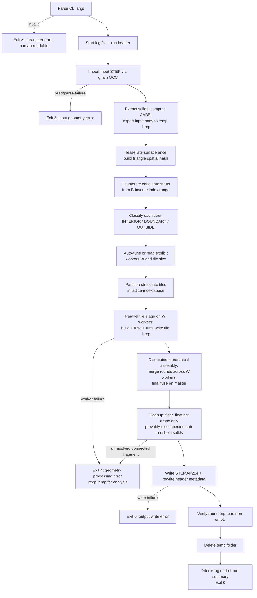
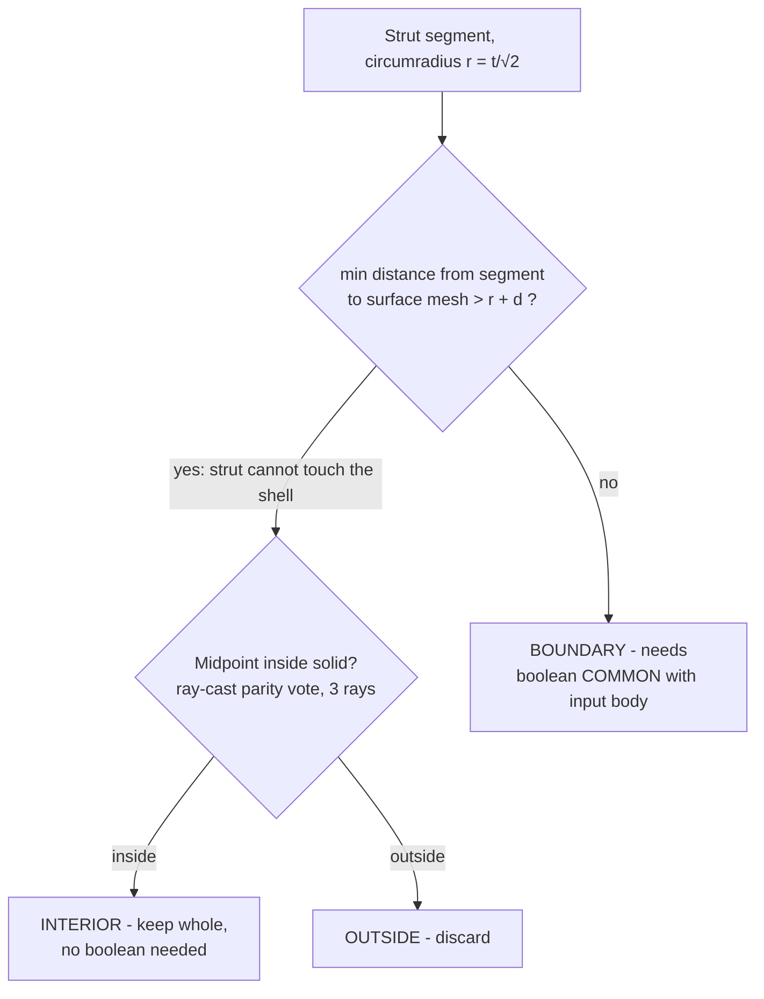
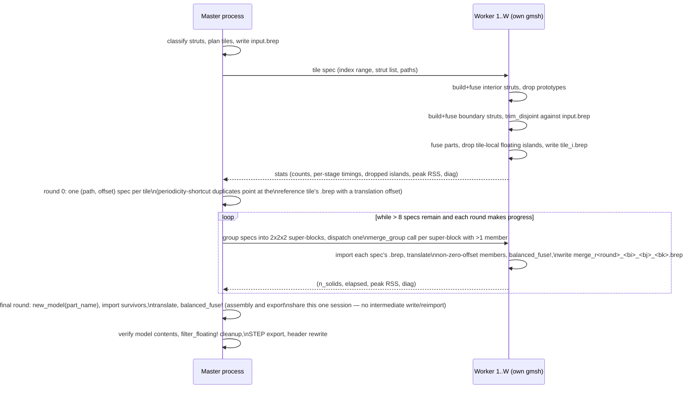

# latticegen2 Algorithm Specification

This document is the normative, implementable specification of the lattice generation
algorithm. It is referenced from [../CLAUDE.md](../CLAUDE.md) and expands on
[specification.md](specification.md) §4 (Geometry Domain) and §4.4 (Performance &
Optimization). Where this document gives a formula or a diagram, source code must
implement it exactly — do not re-derive or approximate the math below.

All coordinates are in millimeters, in the same coordinate system as the input STEP
file. All angles are computed in native Julia (`asin`, `acos`, `sqrt`, …), never as a
hard-coded decimal, so precision matches IEEE 754 double precision throughout.

---

## 1. Terminology and symbols

| Symbol | Meaning |
|---|---|
| `cc` | CLI input: XY-plane distance between the bottom nodes of two adjacent cells (mm). |
| `t` | CLI input: side length of the diamond (square) strut profile (mm). |
| `a` | Cube edge length, `a = cc / √2`. |
| `θ` | Strut recline angle from +Z, `θ = asin(sqrt(2/3))` ≈ 54.7356°. |
| `e_k` | Unit direction vector of strut family `k ∈ {0,1,2}`. |
| `node (i,j,k)` | A lattice node addressed by integer triple, `i,j,k ∈ ℤ`. |
| `B` | 3×3 basis matrix mapping integer node indices to world coordinates. |
| `r` | Strut circumradius, `r = t/√2` (half the profile's diagonal). |
| `d` | Surface mesh chordal deviation tolerance used for classification. |
| tile | An `n×n×n` block of lattice cells, the unit of work distributed to a worker process. |
| INTERIOR / BOUNDARY / OUTSIDE | Classification of a candidate strut relative to the input solid (§6). |

---

## 2. Lattice mathematics

### 2.1 Strut directions

The lattice is a simple cubic lattice of node points, rotated so its `[1,1,1]` body
diagonal is aligned with +Z (a cube "standing on its tip" per spec §4.1). Three strut
directions emanate from every node, at azimuths 120° apart around Z, each reclined from
+Z by `θ`:

```julia
θ = asin(sqrt(2/3))                    # ≈ 54.7356°, exact expression, not a literal
cosθ = inv(sqrt(3))                    # = 1/√3
sinθ = sqrt(2/3)

function strut_direction(k::Integer)   # k = 0, 1, 2
    φ = 2π * k / 3
    return (sinθ * cos(φ), sinθ * sin(φ), cosθ)   # unit vector, |e_k| == 1
end
```

`e0, e1, e2 = strut_direction.(0:2)`.

### 2.2 Cube edge length and node lattice

Per the user's decision (see [specification.md](specification.md) §4.2), `cc` is the
**XY-plane** distance between the bottom nodes of two adjacent cells:

```julia
a = cc / sqrt(2)
```

Node positions and struts:

```julia
node(i, j, k) = a .* (i .* e0 .+ j .* e1 .+ k .* e2)     # (i,j,k) ∈ ℤ³
```

From every node `(i,j,k)`, three struts of length `a` extend along `+e0, +e1, +e2` to
nodes `(i+1,j,k)`, `(i,j+1,k)`, `(i,j,k+1)` respectively. Each strut is uniquely
identified by its origin node index and direction index `(i,j,k,dir)`.

### 2.3 Verified identities

These identities are both the mathematical justification for the model and the
contents of the `lattice.jl` unit tests (§12). All must hold to machine precision
(`atol=1e-9`):

1. **Unit length:** `norm(e_k) ≈ 1` for `k = 0,1,2`.
2. **Recline angle:** `acos(dot(e_k, (0,0,1))) ≈ θ` for each `k`.
3. **Azimuthal separation:** the horizontal projections of `e0, e1, e2` are pairwise
   120° apart.
4. **In-plane neighbor spacing:** `norm(node(1,0,0) .- node(0,1,0)) ≈ cc`, and the two
   points have equal `z` (their vertical components cancel — verifies `cc` really is a
   pure XY-plane distance, not a 3D one).
5. **Vertical space diagonal:** `node(1,1,1) .- node(0,0,0) ≈ (0, 0, a*sqrt(3))`.

### 2.4 Basis matrix and candidate index range

```julia
B = a .* hcat(e0, e1, e2)     # 3×3 matrix, columns e0,e1,e2 scaled by a
```

`node(i,j,k) = B * [i,j,k]`. To enumerate every strut that could possibly intersect a
world-space axis-aligned bounding box (AABB) `[lo, hi]` (the input solid's AABB,
expanded by strut circumradius `r = t/√2`):

```julia
corners = [ (x,y,z) for x in (lo[1],hi[1]), y in (lo[2],hi[2]), z in (lo[3],hi[3]) ]
idx_corners = [ B \ collect(c) for c in corners ]         # world -> index space
lo_idx = floor.(Int, minimum(hcat(idx_corners...); dims=2))
hi_idx = ceil.( Int, maximum(hcat(idx_corners...); dims=2))
pad = ceil(Int, r / a) + 1                                 # safety margin, cells
lo_idx .-= pad
hi_idx .+= pad
```

This padding guarantees no strut that could geometrically touch the (expanded) volume
is missed, at the cost of enumerating some struts that are trivially OUTSIDE (cheap to
discard — see §6).

---

## 3. Strut cross-section and solid construction

### 3.1 Profile frame ("diamond" orientation)

Per the proposed clarification in [specification.md](specification.md) §4.2, the
square profile for strut direction `k` is built in an orthonormal frame
`{u_k, v_k}` transverse to `e_k`:

```julia
u_k = normalize(cross((0,0,1), e_k))   # horizontal, ⟂ to e_k's azimuth
v_k = cross(e_k, u_k)                  # unit vector, lies in the vertical plane
                                        # containing e_k and the Z-axis
```

(`{e_k, u_k, v_k}` is a right-handed orthonormal frame; this is well-defined because
`e_k` is never parallel to `(0,0,1)`.) The four profile vertices, centered on the
strut axis at parameter `s ∈ [0, a]` along `e_k`:

```julia
half_diag = t / sqrt(2)     # = r, half of the profile's diagonal
verts(center) = (
    center .+ half_diag .* u_k,
    center .+ half_diag .* v_k,
    center .- half_diag .* u_k,
    center .- half_diag .* v_k,
)
```

This produces a square of side `t` whose diagonals are `t*√2` long, one diagonal
horizontal (along `u_k`), one in the vertical plane of the strut axis (along `v_k`) —
the "diamond on edge" cross-section described in spec §4.1.

### 3.2 Prototype solids

Only **three** strut solids are ever constructed from primitives — one per direction —
because every strut of the same direction is a rigid translation of the others:

1. Build the 4-point profile polygon at the origin node, as a closed wire.
2. `gmsh.model.occ.addPlaneSurface` on that wire → planar face.
3. `gmsh.model.occ.extrude(face, a*e_k)` → prototype solid `dir_k`, length `a`.

Every strut at node `(i,j,k)` direction `d` is instantiated as
`gmsh.model.occ.copy(prototype[d])` followed by
`gmsh.model.occ.translate(copy, node(i,j,k)...)`. This is O(1) geometric work per
strut (a copy + affine transform, no re-tessellation of the profile), as opposed to
re-running the wire→face→extrude construction per strut. Struts that share a lattice
node share bit-identical endpoint coordinates (both derived from the same `node()`
formula), so a later fuse operation produces exact, watertight junctions with no gap or
sliver tolerance issues.

---

## 4. End-to-end pipeline



Each pipeline stage corresponds to one source module — see §12 for the mapping.
Resource errors (out-of-memory watchdog trip that cannot be resolved by backpressure,
disk full, etc.) exit with code 5 from within stage K or L.

---

## 5. Boundary classification algorithm

The single biggest performance lever in this tool is **avoiding OCCT boolean
operations wherever geometrically provable to be unnecessary**. A boolean `COMMON`
between a strut solid and a large input B-rep body is orders of magnitude more
expensive than a translated copy of a prototype. Classification turns an O(all struts)
boolean workload into an O(boundary struts) ≈ O(surface area / cell area) workload.

### 5.1 Surface pre-processing (once, on the master)

- Tessellate the input solid's boundary surface once via `gmsh.model.mesh.generate(2)`,
  curvature-adaptively sized: element size capped at `min(t, a)` (never coarser than a
  lattice cell) with `Mesh.MeshSizeFromCurvature` refining down to a floor of
  `d = min(t, a) / 10` on tightly-curved features. `d` is also the chordal-deviation
  tolerance folded into the classification margin below. A uniform target size of `d`
  everywhere was tried first and rejected: it bounds deviation far more tightly than
  necessary on large, gently-curved surfaces, at a severe performance cost (~1.2M
  triangles / 47s vs. ~12K triangles / 0.4s on the 80mm test ball with curvature-
  adaptive sizing instead) — see §11.
- Immediately after meshing, `check_surface_mesh_coverage` verifies the mesh is faithful
  to the input solid, raising `InputGeometryError` (exit 3) if not. Every classification
  decision below depends entirely on that faithfulness, so this gate converts a
  silently-incomplete tessellation from "silently misclassify" into "fail loudly." Two
  per-face tests, each using a quantity that is sound in the direction it is used:
  - **Coverage**, against the face's **exact trimmed area**
    (`gmsh.model.occ.getMass(2, tag)`, OCCT Gauss quadrature) versus the summed triangle
    area of that face's mesh. Rejected only when the shortfall clears **both** a
    relative bar (`area_rel_tol`, default 0.25) **and** an absolute one
    (`min_deficit = min_deficit_factor * min(t, a)²`, one coarsest mesh element's worth
    of area). Both are needed and both fire on real data — see §11.3.
  - **Containment**, against the face's CAD bounding box as an **upper bound only** —
    every mesh node must lie inside it, inflated by 1 mm.
  A face with zero elements is always an error. The bounding box is deliberately never
  used to test coverage: OCC's `getBoundingBox` returns the control-point hull for
  B-spline edges and the untrimmed UV rectangle for planar faces, so it over-estimates
  the true extent — a version of this gate that required the mesh to *reach* it
  produced a false positive that blocked a valid input file outright (§11.3).
- Build a uniform spatial hash grid over the resulting triangles, with cell size ≈ 2×
  the median triangle edge length. Each grid cell stores indices of triangles whose
  AABB overlaps it.

### 5.2 Per-strut classification



- **Segment–mesh minimum distance:** query spatial-hash cells overlapping the
  segment's AABB inflated by `r + d`; compute exact segment–triangle distance only for
  candidate triangles in those cells; short-circuit the moment any distance `≤ r + d`
  is found (we only need to know *whether* the strut could touch the surface, not the
  exact minimum).
- **Point-in-solid test:** ray-cast the strut segment's midpoint against the triangle
  set using 3 fixed, non-parallel ray directions (chosen once, not re-sampled per
  call), each producing an inside/outside vote by triangle-intersection parity; take
  the majority vote. Using 3 rays defeats the classic degenerate cases (a ray that
  grazes a triangle edge or passes exactly through a vertex) that a single-ray parity
  test is vulnerable to. The directions are fixed rather than randomized so that a run
  is exactly reproducible given the same inputs — nondeterminism in a correctness-
  critical classification step would be at odds with the precision priority
  (specification.md "Key Considerations").
- **Why the margin is `r + d`, not just `r`:** the mesh is an *approximation* of the
  true B-rep surface, with chordal deviation up to `d`. Folding `d` into the safety
  margin ensures the discrete mesh test can never wrongly promote a strut that
  genuinely touches the true surface into INTERIOR — the worst it can do is
  mis-classify a strut as BOUNDARY when it was actually clear (safe: costs a wasted but
  still-correct boolean, never an error). This preserves priority #1 (correctness).

### 5.3 Complexity

Let `N` be the number of candidate struts (∝ enclosed volume / cell volume) and `S` the
number of boundary-touching struts (∝ surface area / cell area, i.e.
`S = O(N^{2/3})` for a roughly convex volume). Classification cost is
`O(N · log(mesh triangles))` using the spatial hash (versus `O(N · triangles)` naively).
The payoff is downstream: booleans run on `O(S)` struts, not `O(N)`.

---

## 6. Tiling, parallel fusion strategy

### 6.1 Tiles

Struts are partitioned into axis-aligned blocks of `n×n×n` lattice **cells** in index
space (`n` chosen by auto-tuning, §7), keyed by `(⌊i/n⌋, ⌊j/n⌋, ⌊k/n⌋)` on the strut's
origin node. Each strut belongs to exactly one tile. Struts in neighboring tiles meet
only at shared node coordinates (never mid-strut), so tile boundaries never cut a strut
solid in half — the final assembly fuse only has to unify coincident node junctions,
not resolve any new geometric intersections.

### 6.2 Process-based parallelism

OCCT (via gmsh) is not safely reentrant across threads, so parallelism is achieved with
**operating-system processes**, using Julia's `Distributed` standard library:
`Distributed.addprocs(W; exeflags="--project")` where `W` is the worker count from §7.
Each worker runs its own independent `gmsh.initialize()` instance. Master↔worker
traffic is kept to small descriptors (tile index ranges, strut direction lists) and
**file paths** — the input body is exported once to `temp/<ts>/input.brep` by the
master and read by each worker directly from disk, never serialized through IPC. Tile
results are written back to disk as `temp/<ts>/tile_<id>.brep` and only their path and
summary stats (strut counts, wall time, peak RSS) cross back over `Distributed`. This
keeps IPC payloads and per-message memory small regardless of geometry complexity.

### 6.3 Per-tile work (on a worker)

1. Instantiate every strut the tile needs — both INTERIOR and BOUNDARY — then
   immediately drop the 3 prototype solids from the OCC kernel
   (`gmsh.model.occ.remove`). `instantiate_strut` only ever *copies* from a
   prototype, never consumes it, so the 3 originals would otherwise sit unused in the
   model for the rest of the session — and `gmsh.write` exports the model's *entire*
   current entity list, not just whatever tags a caller happens to be tracking. Left
   in place, this silently added 3 extra, unclipped, full-length strut solids at
   world `(0,0,0)` to *every* tile's `.brep`, regardless of the tile's actual
   location — a real correctness defect (phantom material outside the input volume,
   found and fixed during the §11.2 investigation), not merely wasted memory.
2. Fuse the INTERIOR struts via `balanced_fuse!` (§6.5) — the same batched/
   AABB-filtered balanced fuse used at assembly, **not** one flat multi-operand
   `fuse_all` call. A tile with hundreds of struts hitting OCCT's multi-operand fuse
   in one shot reproduces the same "grows worse than linearly with operand count"
   pitfall as a flat whole-model fuse (§11) — this was observed directly when testing
   a deliberately oversized single tile during development, and fixed by reusing
   `balanced_fuse!` inside `process_tile` too, not just in assembly.
3. Fuse the BOUNDARY struts the same way, then trim the result against the input
   body loaded from `input.brep` — subject to the **operand-disjointness invariant**
   below, which governs every `COMMON` call in the pipeline, not just this one.
4. Fuse the INTERIOR result and the trimmed BOUNDARY result (again via
   `balanced_fuse!`).
5. **Worker-side floating-island removal:** among the tile's own final solids, drop
   any solid that is simultaneously sub-threshold (`volume < t³`), a singleton in the
   tile's own AABB-overlap graph, and nowhere near any of the tile's
   `interface_nodes` — the lattice-node positions a *neighbouring* tile's struts
   could also reach (§6.4a). All three together prove the solid is a genuine floating
   body, cheaper to drop here than to carry it through a tile write, a re-import at
   assembly, and a second overlap resolution at export time.
6. Write `tile_<id>.brep` (skipped if nothing remains) and return
   `(strut_counts, elapsed, peak_rss, per-stage timings, dropped_island_count,
   diagnostics)`. The per-stage timings and any warning `balanced_fuse!`/the trim
   step produced are returned explicitly (`diag::Vector{String}`) rather than logged
   directly, because a worker process has no `RunLog`/log-file handle of its own — the
   master surfaces them once the tile's result comes back, so what used to be
   completely invisible whenever a tile happened to run on a worker (§9) is now in the
   log.

**The COMMON operand-disjointness invariant:** `gmsh.model.occ.intersect` runs OCCT's
general boolean algorithm over *all* of its object operands **together**, in one step.
If two object operands passed to the *same* call overlap each other, the result is a
**partition** of both against the tool, not "each operand independently trimmed and
then unioned." Measured directly: intersecting 3 mutually-overlapping struts sharing
one lattice node against a containing box in a single call returned **7** fragment
solids (four 0.125 mm³ junction wedges plus three 3.16 mm³ pieces) instead of the 1
solid (9.98 mm³) produced by fusing the struts into one solid *first*, then
intersecting. **An `intersect` call must never receive two operands whose AABBs
overlap.** Since `balanced_fuse!` can legitimately leave a boundary group not fully
reduced to one solid (its own no-progress guard, time budget, or per-group
fuse-failure fallback — see §6.5), the boundary result cannot simply be assumed
already-disjoint before trimming. `trim_disjoint` (`src/pipeline.jl`) enforces the
invariant: it partitions the boundary-fused result into AABB-overlap components
(`overlap_components`, the same primitive `filter_floating!` uses, §8), issues **one**
batched `COMMON` call for every solid that is a provable singleton, and — for any
component that didn't fully converge — issues one `COMMON` call **per solid** in that
component (a single-operand call cannot fragment anything, by construction). Every
call after the first reuses the same imported input body, so `common_with`'s
`removeTool=false` option keeps it alive across calls instead of the boolean's default
of consuming its tool on the first use.

### 6.4 Periodicity shortcut — the key interior-volume optimization

Every tile whose cells are **entirely INTERIOR** (no boundary struts at all) is
geometrically congruent to any other full-interior tile — they differ only by a
translation. Rather than repeating step 6.3.1's fuse for every such tile:

- The first full-interior tile encountered is fused once and cached as the **unit
  tile** solid.
- Every subsequent full-interior tile is produced by `gmsh.model.occ.copy` +
  `gmsh.model.occ.translate` of the cached unit tile by the appropriate lattice
  vector `B * (Δi, Δj, Δk)` — no new fuse operation at all.

Because the interior of any reasonably-sized volume is the overwhelming majority of its
cells (boundary tiles scale with surface area, interior tiles with volume), this
collapses the dominant cost from "one fuse per interior tile" to **one fuse total**,
plus cheap copies. This is the single highest-leverage optimization in the pipeline —
see §11.

### 6.4a Worker-side floating-island removal

`interface_nodes(lp, key, n, origin)` (`src/tiling.jl`) computes the world-space
positions of every lattice node on a tile's own shell — the index box
`[i0-1, i0+n] × [j0-1, j0+n] × [k0-1, k0+n]` (`i0 = origin[i] + key.bi*n`, similarly
for j/k; one cell of margin beyond the tile's own `n`-cell reach on every side),
keeping only the nodes on that box's *outer shell* (at least one coordinate at an
extreme). These are exactly the node positions a *neighbouring* tile's own struts
could also reach — the only places a solid produced inside this tile could possibly
share a junction with anything outside it.

At the end of `process_tile` (§6.3 step 5), a tile-local solid is dropped iff **all
three** hold: it is sub-threshold (`volume < t³`), it is a singleton in the tile's own
`overlap_components` graph (cannot merge with anything else already in this tile), and
none of the tile's `interface_nodes` fall inside its AABB inflated by the strut
circumradius `r`. All three together prove the solid is a genuine floating body —
exactly the standard `filter_floating!` applies at final assembly/export time (§8),
just resolved locally and early, so it never has to survive a tile write, a re-import
at assembly, and a second overlap resolution just to be discarded later. A small solid
that fails any of the three conditions is always kept here — this is a strictly-safe
*subset* of the export-stage check, not a separate, weaker one; every genuinely
ambiguous case is still left for the master to resolve.

### 6.5 Distributed hierarchical assembly

Assembly is itself distributed across the same `Distributed` worker pool the tile
stage uses (`dispatch_jobs`, `src/pipeline.jl` — a generic work-stealing dispatcher
factored out of what was originally `dispatch_tiles`'s own pool-management code, so
both stages share one already-worked-out implementation of the Ctrl+C handling in
§9.1, rather than a hand-duplicated copy). The original design ran one flat,
single-session master-side fuse over *every* tile's imported geometry at once; that
put the sync-per-AABB-query cost bug described below on the critical path at exactly
the point it hurt most (thousands of solids in one session), and meant peak master
memory had to hold every tile `.brep` simultaneously. The distributed version instead
merges tiles in rounds, each round shrinking the working set roughly 8× before the
next, so peak master memory only ever has to hold the *last* round's survivors.



**Round 0 — the periodicity shortcut, made distributable.** One `(path, offset)` spec
is built per tile: every tile that actually wrote a `.brep` gets `offset =
Vec3(0,0,0)`; every full-interior tile *other* than the one reference tile (§6.4)
instead points at the **reference tile's own `.brep`** with `offset =
tile_translation(lp, ref_key, key, n)` — the same translation the original
single-session design applied with an in-memory `copy_translate` before assembly ever
started. Deferring the translation into the merge step itself (rather than doing it
upfront on the master) is what lets a periodicity-shortcut duplicate be materialized
on *any* worker, in whichever round actually needs it, instead of requiring the whole
reference-tile-copying step to happen in one master-side session.

**Merge rounds.** Each round groups the current specs by 2×2×2 super-block
(`fld(bi,2), fld(bj,2), fld(bk,2)` on each spec's `TileKey`) and dispatches one
`merge_group` call — a self-contained per-round unit of work structurally identical to
`process_tile` (§6.3): import every spec's `.brep`, apply its translation if non-zero,
`balanced_fuse!` the combined set, write the round's output file. A super-block with
only one member has nothing to merge, so its `(path, offset)` is carried forward to
the next round unchanged rather than spending a worker call and a file write on a
no-op. Because every `TileKey` is bucketed relative to the candidate range's own
minimum corner (`tile_key`'s own origin-offset fix, §6.1), every `bi/bj/bk` here is
`>= 0`, so this grouping has no risk of the origin-centered spurious-split failure
mode `tile_key` itself has to guard against.

Rounds repeat until at most 8 specs remain, **or** a round fails to reduce the spec
count at all (the same no-progress signal `balanced_fuse!` itself uses — see the
"Termination guard" below) — whichever happens first. This is not a correctness boundary, only a scheduling one:
whatever remains, however many files that is, is handed to one final master-side
fuse, which has its own complete, independent safety net (fuse-failure fallback,
no-progress guard, wall-clock budget — all below) regardless of how far the
distributed phase got. A round that plateaus because the remaining super-blocks are
simply spatially far apart (nothing left to co-locate into a shared 2×2×2 group) is an
expected, healthy termination, not a failure.

**The final round always runs on the master**, in the *same* gmsh session the export
stage goes on to use: `run_pipeline` opens one session, names its model
`part_name(...)` up front, and calls `assemble!` to import every surviving spec,
translate the non-zero-offset ones, and `balanced_fuse!` everything together — leaving
the result live in that session rather than writing it to a `tmpdir/assembled.brep`
staging file (`run_pipeline` checks the returned solid count and raises a clear error
if it's empty, rather than this step guessing what "no geometry" should mean). Earlier
revisions gave assembly its own session and its own `assembled.brep`, which the export
stage then re-imported into a *second* fresh session purely to get the STEP model
renamed to `part_name(...)`; merging the two removes a full OCCT serialize+reparse of
the entire finished lattice, at the cost of an explicit check —
`assert_no_stray_solids` (`run_pipeline`, right after `assemble!` returns), built on
`model_solids` — standing in for the guarantee a virgin re-import used to give for
free: that the model contains exactly the returned tags and nothing else. The volume-threshold cleanup gate is **not** applied inside
`assemble!`; it runs exactly once, later, in the export stage's `filter_floating!` (§8),
so there is a single place in the whole pipeline that decides what gets discarded —
never at intermediate merge/assembly stages.

**Fuse-failure fallback — and its real limit:** OCCT's boolean fuse can throw on certain
degenerate/sliver inputs (a known kernel robustness limit, e.g. an internal "non-joining
curves" error), most often on fragments produced by trimming boundary struts against a
curved surface. If a fuse call on one group fails, that group's solids are passed
through **un-fused** into the next round rather than aborting the whole run. This is
**only unconditionally safe for a group the AABB pre-filter (below) already proved has
zero overlap** — nothing there could ever have been self-intersecting regardless of
whether it gets fused. For a group that *does* overlap (struts sharing a lattice node
are built to overlap near the shared vertex until fused — §3.2) but whose fuse fails or
is cut off, leaving it un-fused is *not* free of consequence: it leaves genuinely
overlapping geometry in the output, which is a real self-intersection, not merely "one
extra body." This distinction was missed in an earlier version of this design and caught
by `tools/verify_geometry.jl`'s self-intersection check, which found ~65K intersecting
triangle pairs after an over-tight time budget (see below) cut assembly off early. The
practical mitigation is to give the time budget enough headroom that this path is a true
last resort, not a routine occurrence — see `max_seconds` below.

**Termination guard:** naively re-grouping and retrying every round is only safe if
progress is actually being made. A round that regroups the exact same unreduced
elements into the exact same batches (e.g. a persistently un-fusable sliver, or simply a
set of mutually disjoint solids with nothing to merge) reproduces the exact same result
forever — this was hit during development as a genuine hang. The assembly stage tracks
whether any group in a round actually reduced in count; a no-progress round stops
immediately and returns the current set as separate bodies rather than looping without
bound. As with the fuse-failure fallback above, this is only guaranteed free of
self-intersection risk for groups the AABB pre-filter already ruled disjoint — a
persistently un-fusable but genuinely overlapping sliver stopping here carries the same
caveat.

**Spatial-locality batching:** solids are sorted by their originating tile's `TileKey`
(lexicographic on `(bi,bj,bk)`) before being split into batches of 8, instead of using
whatever arbitrary order they came out of a `Dict`. Only solids from genuinely adjacent
tiles can share a lattice-node junction and actually have anything to merge; batching by
spatial proximity both raises the odds each `fuse_all` call succeeds outright and avoids
burning time on OCCT boolean attempts between solids on opposite sides of the model that
were never going to touch.

**AABB pre-filter — and the sync-cost bug that made it a net loss until fixed:** even
with spatial-locality batching, a batch of 8 can still contain solids that don't
actually touch. Before calling OCCT's fuse on a group, a cheap axis-aligned
bounding-box overlap check (pure Julia box-coordinate comparison, no boolean kernel
math) rules out groups with *zero* pairwise AABB overlap — provably nothing to merge —
and those pass straight through unfused, skipping the OCCT call entirely. Because
struts sharing a lattice node have bit-identical endpoint coordinates (`node()` is
deterministic — §3.2), there is no "almost touching but not quite" case this filter
could wrongly skip.

The filter's *implementation* was, for a long time, a large net loss rather than the
win it was designed to be: querying a solid's bounding box
(`gmsh.model.getBoundingBox`) requires the OCC kernel to be synchronized first
(`gmsh.model.occ.synchronize()`), and that synchronize call is **O(whole model)**, not
O(the one box being queried) — every earlier version of this filter called it once
*per solid, per group, per round*. Measured directly on a 648-solid model: 200
one-at-a-time bounding-box queries (each with its own implicit sync) took **22.47 s**;
one shared `synchronize()` followed by 200 raw box lookups took **0.11 s** — a **202×**
difference. At assembly scale (thousands of solids) this made the "optimization"
responsible for the dominant share of assembly wall-clock time, not a minor overhead —
see §11.2. The fix is `bounding_boxes` (`src/geomkernel.jl`): exactly **one**
`synchronize()` call per fuse *round* (not per group), after which every box in that
round is read with the kernel already known-synchronized. `balanced_fuse!` and
`filter_floating!` both use it; no call site should ever call the single-solid
`bounding_box` in a loop again.

**Wall-clock time budget — a last resort, not a speed knob:** the no-progress
termination guard above bounds the *number* of rounds, but not total *time* — a round
that shrinks the working set by even one solid still counts as "progress" and triggers
another round, and each individual OCCT fuse attempt (successful or not) can itself take
real seconds on complex trimmed B-rep inputs. `balanced_fuse!` takes a `max_seconds`
budget (default **10 minutes**), checked before each round and before each group within
a round, purely as a circuit breaker against a truly runaway assembly. It is deliberately
generous rather than tuned for speed: as established just above, cutting fusing off
early is not a routine "produce a few more bodies" trade-off — it risks leaving
genuinely overlapping geometry un-fused. Correctness (priority #1) takes precedence over
finishing quickly (priority #3, specification.md "Key Considerations"), so this budget
exists only to prevent an unbounded hang, not to cap ordinary run time. Within
each process, `gmsh.option.setNumber("Geometry.OCCParallel", 1)` and
`General.NumThreads` are set so OCCT's own internal parallel boolean machinery is used
too — parallelism is layered (across processes via tiles, within a process via OCCT).

The result of the final master-side fuse may be more than one solid — this is expected
and allowed by spec §1: if the input geometry trims struts such that some rods become
disconnected from the main body, they persist as separate top-level solids in the
shared assembly/export session and, ultimately, the output (subject to the
floating-body-only cleanup gate in §8, which is the *only* place any of them can
actually be discarded).

---

## 7. Auto-tuning and memory stability model

Priority #2 (memory stability) governs this section: the tool must never destabilize
the host by over-committing RAM, and must scale down gracefully rather than fail when
resources are tight.

### 7.1 Determining worker count and tile size

- **If `--cores C` and `--ram G` are given:** `W = clamp(C - 1, 1, 8)` — one core is
  reserved for the master process and OS/desktop responsiveness. `G` (GB) drives tile
  sizing below.
- **If neither is given:** `--workers` and `--tile-cells` are required explicitly
  (per spec §2 — "If RAM and CPU cores are not provided, the optimization parameters
  must be provided explicitly instead"); validated before any computation, exit 2 if
  missing.
- **Calibration probe** (only runs in the auto-tuning path): on one worker, build and
  fuse (via `balanced_fuse!` — the exact same code path `process_tile` uses in
  production, not a single flat `fuse_all` call; see below for why this matters) a
  small reference block (4×4×4 cells, all INTERIOR, generated analytically —
  independent of the actual input geometry) and measure:
  - `mem_per_strut` = ΔRSS of the worker process across the probe, divided by strut
    count in the block (192 struts for the 4×4×4 reference block).
  - `probe_seconds`, `probe_struts` — the probe's total elapsed wall time and strut
    count, kept as a pair (rather than reduced to a single `time_per_strut` average)
    because the *shape* of the cost curve, not just one data point on it, is what tile
    sizing needs — see below.
- **Tile sizing is bounded by both memory and fuse time**, not memory alone. Memory
  headroom alone is not sufficient: a tile that comfortably fits in RAM can still be
  large enough that its own `balanced_fuse!` calls take enormously longer than
  expected, because fuse cost grows **well past quadratic** with strut count in
  practice — measured directly (docs/algorithm.md §11.2): a real 4×4×4-cell block
  (192 struts) fused in 12.4 s, a 6×6×6-cell block (648 struts, 3.4× the strut count)
  took 256 s — roughly **N^2.5**, not N² and nowhere near linear. A tile sized purely
  by the memory formula alone can land well past this knee.
  - `n_mem`: the original memory-only formula — choose `struts_per_tile` such that
    `W * struts_per_tile * mem_per_strut ≤ 0.6 * G_bytes` (the 0.6 factor reserves
    headroom for the master process, OS, and OCCT's own working memory beyond the
    steady-state RSS the probe measures), then
    `n_mem = clamp(floor(cbrt(struts_per_tile / 3)), 2, 32)` (3 struts per cell on
    average).
  - `n_time`: sized so a tile's own fuse is expected to finish within
    `target_tile_seconds` (default 60 s), extrapolating the probe's `(probe_seconds,
    probe_struts)` pair **assuming worst-case quadratic growth**
    (`struts_time = probe_struts * sqrt(target_tile_seconds / probe_seconds)`) —
    deliberately conservative relative to the measured ~N^2.5 trend, erring toward
    smaller tiles rather than larger ones — then `n_time = clamp(floor(cbrt(struts_time
    / 3)), 2, 32)`.
  - **Chosen tile size:** `n = clamp(min(n_mem, n_time), 2, 8)`. The **hard cap of 8**
    applies independently of both formulas: `8³ * 3 = 1536` struts is already past the
    measured superlinear-growth knee, so `n` is never allowed past it even if both
    the memory and time estimates would otherwise permit a larger tile. When
    `--tile-cells` is given explicitly (bypassing auto-tuning) and exceeds 8, a warning
    is logged rather than silently capping it — the explicit-parameters path is meant
    to be fully user-controlled (spec §3), but the run log makes the risk visible.
  - Both `n_mem` and `n_time` (and which one was binding) are logged alongside the
    chosen `n`, so a run's log makes clear which resource actually constrained tile
    size.

### 7.2 Runtime watchdog

Between dispatching jobs (both the tile stage and the distributed assembly merge
rounds, §6.5, go through the same shared `dispatch_jobs` — §6.2), the master polls its
own RSS (`Sys.maxrss()`) and the RSS figures reported back by completed/in-flight
workers. If the running total exceeds `0.8 * G_bytes`, the master pauses dispatch of
new work (backpressure) until enough in-flight work completes and its memory is
released. This never kills work in progress — it only throttles new work — trading
some wall-clock time for guaranteed stability, consistent with the stated priority
order (memory stability over speed).

**The pause itself is bounded.** `rl.max_rss` — what the watchdog compares against the
threshold — is a *monotonic high-water mark* (it only ever grows, by construction: see
`update_rss!`/`observe_rss!`), so a naive unconditional `while over-threshold: sleep`
loop is a genuine, unconditional hang the first time RSS crosses `0.8 * G_bytes`, not
merely a slow pause — nothing in the loop's own condition can ever make it false again
on its own. Each dispatching task's wait is capped at `MEMORY_WATCHDOG_MAX_PAUSE_SECONDS`
(120 s); past that, dispatch resumes anyway and a warning is logged. This mirrors
`balanced_fuse!`'s own `max_seconds` circuit breaker (§6.5): a last-resort bound
against an unconditional hang, not a routine speed control.

### 7.3 Process priority (`-bg` / `--background`)

When set, both the master and every worker process request below-normal scheduling
priority immediately after startup:

```julia
@static if Sys.iswindows()
    ccall((:SetPriorityClass, "kernel32"), Cint, (Ptr{Cvoid}, Culong),
          ccall(:GetCurrentProcess, Ptr{Cvoid}, ()), 0x00004000) # BELOW_NORMAL_PRIORITY_CLASS
else
    ccall(:nice, Cint, (Cint,), 5)
end
```

---

## 8. Cleanup, STEP export, and metadata

- **Floating-body-only cleanup (`filter_floating!`, `src/pipeline.jl`):** after final
  assembly, discard a solid only if it is both sub-threshold (`volume < t³`, via
  `gmsh.model.occ.getMass` at unit density) **and** provably a genuine floating body —
  never merely "small." This replaced an earlier, unconditional "volume < threshold ->
  delete" rule that turned out to delete *connected* junction material whenever an
  upstream fuse hadn't fully converged (§11.2's investigation; §6.3 documents the
  underlying COMMON-fragmentation mechanism that produces exactly this kind of
  sub-threshold-but-connected fragment).
  1. Partition every solid by `overlap_components` (the same AABB-overlap-graph
     primitive `trim_disjoint` uses, §6.3) — one `bounding_boxes` sync total.
  2. A singleton component is provably disjoint from everything else; classify it by
     volume directly.
  3. A component with more than one member is *ambiguous* — AABB overlap does not
     prove genuine geometric contact. Resolve it by attempting one `fuse_all` call on
     the whole component: OCCT's n-ary fuse fully unions every genuinely-touching
     subset in that one call and leaves genuinely disjoint solids with their original
     tags/shapes untouched (verified directly — two truly disjoint boxes come back
     with identical tags; two boxes sharing an exact common face merge into one with
     the exact sum of their volumes). A *successful* fuse call is therefore always
     trustworthy either way, and every resulting solid can then be classified by
     volume with no further ambiguity.
  4. If the fuse attempt itself throws (a known OCCT boolean-robustness limit, §6.5),
     the component's connectivity genuinely cannot be resolved. Any sub-threshold
     member of it is **unresolved**: this is a hard failure (`ProcessingError`, exit 4)
     rather than a guess in either direction — deleting an unresolved solid risks
     punching a hole in connected geometry; keeping it risks silently reporting success
     with material that was never actually verified safe. Priority #1 (precision) over
     completing the run.
  5. Before removal, one `sync_model()` call brings gmsh's separate **model-level**
     entity list up to date with every fuse step 3 performed — `gmsh.model.occ.fuse`
     is an OCC-**kernel**-level operation and does not itself synchronize the
     model-level list, so without this call that list (and therefore the export that
     follows) would still reflect the *pre-fuse*, un-merged fragments rather than the
     resolved geometry `kept` actually represents (found and fixed via §11.4 — a real
     run whose own summary claimed 2 solids written while the exported file held 113).
     Every remaining sub-threshold solid is now a genuine singleton — safe to remove.
     Removal uses `remove_model_entities` (`gmsh.model.removeEntities`), not
     `gmsh.model.occ.remove`: measured 16× faster removing 300 solids from a
     648-solid model (11.97 s vs. 0.74 s, §11.2) — the OCC-kernel-level path
     recomputes bookkeeping the model-level path doesn't need. This is a **model-level**
     removal, not an OCC-kernel one: it edits gmsh's own entity list without touching
     the underlying OCC document, so any `gmsh.model.occ.synchronize()` *after this
     point* would re-populate the model list from the (unmodified) kernel state and
     silently undo the removal. The export write that follows is therefore always the
     `sync=false` form of `write_model` — never a syncing write.
  6. Every removal is logged as **one aggregate line** (total count, total volume,
     min/max, up to 20 sample volumes) — never one line per solid, which is what
     turned a handful of genuine floating islands into a multi-hour, multi-thousand-line
     logging tail on the `test-cylinder-cc5t1` run (§11.2).
- **Units:** `gmsh.option.setNumber("Geometry.OCCTargetUnit", ...)` is set defensively
  to millimeters even though it is OCCT's default, since a mismatched input file unit
  would silently corrupt every downstream dimension.
- **Export:** `gmsh.write("<output>.step")`, which — with `FILE_SCHEMA` left at OCCT's
  default — produces an AP214 file per the user's decision (spec §5).
- **Metadata / header rewrite:** STEP is a plain-text format. Before export,
  `gmsh.model.add(partname)` sets the model name where `partname =
  "<input_stem>+cc<cc>+t<t>"` (spec §5's `+`-separated convention — distinct from the
  `-`-separated default *file name*, spec §3) with floats formatted without trailing
  zeros (e.g. `ball+cc2.5+t0.4`). After export, a small text post-pass rewrites only the
  `FILE_NAME` first field to `partname` and appends the full parameter string (cc, t,
  input path, generation date) to `FILE_DESCRIPTION`. **`FILE_SCHEMA`'s value is only
  ever filled in when blank, never overwritten** if already populated — this is what
  keeps the file a clean, standard AP214 document openable by SolidWorks/Catia rather
  than a hand-patched hybrid. (In practice, gmsh's own STEP writer leaves `FILE_SCHEMA`
  blank even though the file's `APPLICATION_PROTOCOL_DEFINITION` entity already
  correctly identifies `automotive_design`/AP214 — the rewrite fills in
  `'AUTOMOTIVE_DESIGN'` explicitly in that case, matching what SolidWorks itself writes.)
- **Round-trip self-check:** before declaring success, the written file is re-imported
  into a fresh, throwaway gmsh model; the run only proceeds to a `0` exit if at least
  one volume entity is present after that import.

---

## 9. Logging and failure modes

- Log path: `<output-stem>.log` (derived the same way as the output path, never
  `<output>.step.log`). Always written in full, regardless of `-v`; `-v` only raises
  *console* verbosity.
- Content: run header (all input parameters, start timestamp), one line per pipeline
  stage with its wall-clock duration, per-tile stats from §6.3/§7.2 — strut counts,
  total elapsed time, peak RSS, **and now the per-stage breakdown within the tile**
  (`t_interior`, `t_boundary`, `t_final` — the three `balanced_fuse!` calls a tile
  makes) and its `dropped_islands` count (§6.4a) — calibration-probe results when
  auto-tuning ran (§7.1: `mem_per_strut`, the probe's `(struts, elapsed)` pair, and
  which of `n_mem`/`n_time` bound the chosen tile size), one line per distributed
  assembly merge-round group as it completes (§6.5), and the end-of-run summary (spec
  §3 "Exit" list) printed to both console and log unconditionally on success. Every
  warning a tile's `balanced_fuse!`/`trim_disjoint` calls produced is surfaced too,
  prefixed with the tile's key — previously invisible whenever the tile happened to
  run on a worker, since a worker process has no `RunLog` of its own to write to
  directly (§6.3 step 6); the tile's result now carries those warnings back as plain
  strings for the master to log.
- Exit codes:

  | Code | Meaning |
  |---|---|
  | 0 | Success |
  | 2 | Parameter validation failure (before any computation) |
  | 3 | Input geometry read/parse failure |
  | 4 | Geometry processing failure (classification, fuse, boolean, **or an unresolved connected sub-threshold solid that `filter_floating!` refuses to silently delete or keep — §8**) |
  | 5 | Resource limits (memory watchdog cannot recover, disk full) |
  | 6 | Output write failure |
  | 130 | Run cancelled by the user with Ctrl+C (§9.1) — `128 + SIGINT`, the POSIX convention |

- Every non-zero exit prints exactly one human-readable reason line identifying what
  failed and why (spec §7). Exit 130 prints a `CANCELLED:` line instead of `FAILED:`,
  and no stacktrace: a cancelled run did what the user asked, it did not malfunction.
- If a failure occurs after `temp/<ts>/` has been created, it is left in place for
  post-mortem analysis (spec §4.4) and the error message says so explicitly, including
  the temp path. A cancellation is treated the same way — partial tile `.brep` files
  are kept.

### 9.1 Cancellation (Ctrl+C)

A long lattice run is routinely interrupted by hand, so this is a normal exit path,
not an error path, and it must not leave the machine in a bad state — an orphaned
worker pool holding gmsh/OCCT sessions, or an exception raised *during* cleanup that
buries the reason the run ended.

- **Enabling the interrupt at all:** a Julia script run without `-i` defaults to
  `exit_on_sigint(true)`, where Ctrl+C terminates the process immediately without
  raising `InterruptException` — no `finally` block runs and the pool is orphaned.
  `src/main.jl` therefore calls `Base.exit_on_sigint(false)` before anything else, so
  the interrupt arrives as a catchable exception. Workers are launched as
  `julia --worker` (not as a program) and already default to that behaviour.
- **Recognizing it:** by the time an interrupt reaches a handler it is usually
  wrapped — `CompositeException`/`TaskFailedException` from an `@async` task under
  `@sync`, or a `RemoteException` wrapping a `CapturedException` from a worker.
  `is_interrupt` (`src/runlog.jl`) unwraps all of these. `ProcessExitedException` is
  deliberately *not* treated as an interrupt: a worker can also die from an OOM kill,
  and reporting that as "cancelled by the user" would hide a real failure.
- **Worker side (§6.3):** `process_tile` catches an interrupt itself, so its gmsh
  session is finalized by `with_gmsh`'s `finally`, and returns `nothing` as a
  sentinel instead of throwing. Note that `addprocs` launches workers *detached* (new
  process group on Windows, new session on Unix), so a console Ctrl+C normally
  reaches only the master; this handler covers the sequential path, an explicit
  `Distributed.interrupt()`, and any pool that does share the console's signal group.
- **Master side (§6.5):** `dispatch_tiles` sets a shared cancellation flag when it
  sees an interrupt — raised in its own task inside `@sync`, raised in one of the
  dispatching `@async` tasks, or reported by a worker — which stops the remaining
  tasks from pulling further tiles. The stage then ends with a single `CancelledError`
  rather than a burst of unrelated-looking worker errors. Tiles already completed stay
  on disk in `temp/<ts>/`.
- **Not swallowed by fallbacks:** `balanced_fuse!`'s fuse-failure fallback (§6.5) and
  `import_shapes`' error wrapper re-raise interrupts instead of absorbing them.
  Absorbing one would silently downgrade a cancelled run into "kept as separate
  bodies" — the un-fused, possibly self-intersecting output that fallback is
  explicitly documented as a last resort for — or mislabel it as an exit-3 input
  geometry error.
- **Pool teardown:** `shutdown_workers!` runs on *every* exit path (success, failure,
  cancellation) from `main.jl`'s `finally`, and never throws. A plain
  `rmprocs(workers())` is unsafe here: `Distributed._rmprocs` holds the global worker
  lock while waiting for every worker to terminate and raises
  `"rmprocs: pids [...] not terminated after N seconds"` if any does not — likely when
  a worker is several seconds deep in an OCCT boolean that cannot be preempted. So
  workers get a short grace period (2 s) to exit cleanly, falling back to a
  non-blocking forced removal (`waitfor=0`), itself wrapped against failure.

---

## 10. Correctness safeguards recap

Because priority #1 is precision, every optimization above is designed so that its
*failure mode is "do more work," never "produce a wrong result"*:

- Classification degrades ambiguous cases to BOUNDARY (§5.2) — worst case is an
  unnecessary boolean, never a missed trim or a phantom strut.
- The periodicity shortcut (§6.4) only applies to tiles verified to be **entirely**
  INTERIOR by the same per-strut classification used everywhere else — it is a reuse
  of an already-correct result, not a separate approximate path.
- Tile boundaries are chosen in **lattice index space**, aligned with node
  coordinates, so no strut is ever geometrically split by tiling.
- The round-trip re-import (§8) and the external verification in
  [testing.md](testing.md) (manifold check, self-intersection check) catch any
  regression before a run is reported as successful.
- `check_surface_mesh_coverage` (§5.1) fails loudly (exit 3) rather than silently
  classifying against an incomplete input-surface mesh. Note that the guarantee cuts
  both ways: a gate is only as trustworthy as the tightness of the quantity it
  compares. This one originally tested mesh coverage against OCC's deliberately
  over-estimating bounding box and rejected a perfectly good input file as a result
  (§11.3), which is its own violation of the principle — "do more work" is the
  acceptable failure mode, "refuse valid input" is not.

---

## 11. Complexity analysis and optimization strategy summary

Let `N` = total candidate struts (∝ volume), `S` = boundary struts (∝ surface area,
`S = O(N^{2/3})` for compact shapes), `n` = tile edge in cells, `W` = worker count.

| Approach | Boolean ops required | Notes |
|---|---|---|
| Naive: one `COMMON` per strut against the input body | `O(N)` expensive booleans | Rejected — dominant cost scales with volume, not surface. |
| This design: classify, then one `COMMON` per **boundary tile** | `O(S / n³)` expensive booleans | Boundary tiles only; interior tiles need none. |
| Interior fuse without periodicity shortcut | `O(N / n³)` interior fuses (cheap relative to COMMON, still repeated) | Rejected as the sole approach — redundant given every full-interior tile is congruent. |
| This design: interior fuse + periodicity shortcut | `O(1)` interior fuse + `O(N/n³)` cheap copy/translate | Adopted — collapses the dominant term entirely. |

Alternatives considered and rejected:

- **Voxel / marching-cubes style implicit surface generation:** would give an
  approximate, faceted result, violating the "exact B-rep solid" requirement (spec
  §5) and priority #1.
- **A single flat `n`-operand fuse across the whole model** instead of tiling +
  hierarchical assembly: OCCT's fuse complexity grows worse than linearly with operand
  count in practice (larger shared-intersection graphs), and a single giant operation
  cannot be parallelized across processes or checkpointed to disk for partial-failure
  recovery — both of which tiling provides "for free," by keeping each unit of work in
  bounded-size chunks.
- **Thread-based parallelism inside one gmsh/OCCT process:** OCCT's `BOPAlgo`
  primitives are not safely reentrant across threads at the Julia binding level for
  this use case; process-based `Distributed` parallelism (§6.2) was chosen instead,
  accepting the (small, file-based) IPC cost for process isolation and independent
  memory accounting.

The optimization levers, restated as a single reference table (also referenced from
[README.md](../README.md)):

| Lever | Effect |
|---|---|
| Curvature-adaptive surface tessellation (§5.1) | Avoids O(surface-area / d²) triangle counts on large gently-curved regions; ~100x fewer triangles on the 80mm test ball vs. a uniform `d` target |
| Classify-before-boolean (mesh distance test) | Booleans only for the O(surface-area) boundary struts |
| One COMMON per tile, not per strut | Reduces boolean count by ~n³ |
| Multi-operand GeneralFuse per tile | OCCT's n-way fuse ≫ incremental pairwise |
| Unit-tile copy+translate for full interior tiles | Interior fuse computed once, reused everywhere |
| Prototype strut copy+translate | No repeated B-rep construction |
| Process-parallel tiles (Distributed) | Scales across cores despite OCCT thread limits |
| OCCParallel + NumThreads inside each process | Parallel boolean internals |
| Balanced hierarchical assembly fuse, spatial-locality batched | Bounded operand size, frees intermediates; batches contain spatially-adjacent tiles so fuse attempts are far more likely to actually succeed |
| AABB pre-filter before each fuse attempt, **one shared sync per round** | Skips the OCCT boolean call entirely for groups provably sharing no geometry — but only a net win once the box-lookup sync cost is paid once per round, not once per solid; the naive per-solid version measured 202× slower than the shared-sync version and was, for a long time, a net *loss*, not the unconditional win originally claimed here (§6.5, §11.2) |
| Distributed hierarchical assembly (merge rounds across `Distributed` workers) | Peak master memory bounded to the last round's survivors instead of every tile `.brep` at once; assembly parallelized the same way the tile stage already was (§6.5) |
| Dual memory+time tile sizing, hard-capped at `n <= 8` | Keeps auto-tuned tiles below the measured ~N^2.5 fuse-cost knee — memory headroom alone previously permitted tiles almost 3× past it (§7.1, §11.2) |
| Worker-side floating-island removal (§6.4a) | Drops provably-floating sub-threshold solids at the tile that produced them, before a tile write, a re-import at assembly, and a second overlap resolution at export time ever have to touch them |
| `trim_disjoint` / the COMMON operand-disjointness invariant (§6.3) | Prevents `intersect` from fragmenting mutually-overlapping boundary-strut groups into extra pieces — the root cause of the floating-body cleanup rule deleting connected material (§11.2) |
| `filter_floating!`: resolve-then-classify cleanup, model-level fast removal | Only ever deletes solids proven disconnected (never merely "small"); `gmsh.model.removeEntities` measured 16× faster than the OCC-kernel removal path for the same batch (§8, §11.2) |
| Longest-processing-time-first tile dispatch | Large tiles start first instead of by arbitrary `Dict` order, so the tail of the tile stage isn't dominated by a handful of big tiles starting last while other workers idle (§11.2) |
| Threaded classification loop (`Threads.@threads`) | Parallel, allocation-free per-strut classification within each process, layered under the existing process-level parallelism — requires launching Julia with `-t auto`/`JULIA_NUM_THREADS` set (the provided wrapper scripts do); a plain `julia src/main.jl` with no thread flag runs it single-threaded |
| Wall-clock circuit breaker on every fuse call, per-tile and per-merge-round (correctness safety net, not a speed lever) | Prevents a truly runaway fuse from hanging, deliberately set generously since cutting fusing off early risks leaving self-intersecting geometry un-fused; the tile stage's per-call budget (§7.1) is itself derived from the tile-sizing target so a stuck tile is bounded and *logged*, not silently absorbing three unbudgeted 600 s stalls |
| Bounded memory-watchdog backpressure pause (correctness/stability safety net) | `rl.max_rss` is a high-water mark that can never fall on its own — an unbounded wait would be a guaranteed hang the first time it trips, not a slow pause (§7.2) |
| `check_surface_mesh_coverage` post-tessellation completeness gate (correctness safety net, not a speed lever) | Catches a mesh that under-covers its face's **exact trimmed area**, or whose nodes fall outside that face's CAD box, before it can misclassify struts as OUTSIDE; fails loudly (exit 3) instead. Coverage is deliberately *not* tested against the CAD bounding box — OCC over-estimates it (control-point hull / untrimmed UV rectangle), and doing so falsely rejected a valid input file (§5.1, §11.3) |
| `sync_model()` before `filter_floating!`'s removal/export step (correctness safety net, not a speed lever) | `gmsh.model.occ.fuse` doesn't synchronize gmsh's model-level entity list itself; without this call, export could silently write stale pre-fuse fragments instead of the resolved geometry the run believes it wrote (§8, §11.4) |
| Calibration probe + tile sizing + RSS watchdog | Memory stability on 32 GB target |
| .brep disk staging in temp/<ts> for tile/merge-round IPC (never for the final assembly result) | Small IPC, restartable analysis on failure; the final hand-off from assembly to export instead shares one gmsh session (see §6.5) so the completed lattice is never serialized to disk only to be immediately reparsed |

---

## 11.1 Investigation history: residual self-intersections on multi-tile boundary assembly

Observed on the `smoke-fast` scenario (`-i test/80mm-test-ball.step -cc 10 -t 2
--workers 4 --tile-cells 6`) via `tools/verify_geometry.jl`'s self-intersection check:
the assembled output is manifold (every mesh edge has exactly 2 incident triangles) and
matches the input bounding box, but retained a large count of self-intersecting
triangle pairs after `balanced_fuse!` exhausts its progress within the time budget. The
tile-origin bucketing bug described in the (superseded) first half of this
investigation was real and is correctly fixed (`tile_key`/`partition_tiles` now accept
an `origin`, `test/test_tiling.jl`'s `tile_key origin offset avoids a spurious split at
zero`) but, as recorded at the time, did not reduce the reported pair count — that
observation turned out to be a symptom of a second, independent problem, resolved
below.

**Root cause #1 (found and fixed): a false-positive bug in the verification tool
itself, not the generator.** `self_intersection_check`'s original test — does any edge
of triangle A pierce triangle B, or vice versa — has a blind spot: two
independently-tessellated, genuinely **separate** solids that merely *touch* along a
shared coincident face (zero volume overlap; e.g. two adjacent, un-fused tile results,
or legitimately disconnected lattice islands per specification.md §1) produce many
edge-piercing hits at that shared boundary purely because the two triangulations don't
align vertex-for-vertex there — a mesh-alignment artifact, not a real crossing.
Confirmed directly: two boxes sharing one exact face with zero volume overlap reported
**344 false "self-intersections"** with the original test, and 0 with the fix. The
fix, `triangles_properly_cross` (`tools/verify_geometry.jl`), adds a Möller-style
plane-straddle pre-check — both triangles must have vertices with signed distance
strictly on *both* sides of the other's plane before the edge-piercing test is even
attempted — which excludes touching/coplanar contact by construction while still
catching genuine transversal crossings (verified against a diagonally-overlapping box
pair with no coplanar faces: 45 correctly-detected pairs). Regression-tested in
`test/test_verify_geometry.jl`.

Re-running `smoke-fast` with the fixed checker dropped the reported count from the
~18,400–32,500 range (inflated by this bug) to **4,343** — a large reduction, but not
zero, meaning a second, smaller, genuine effect remains.

**Root cause #2 (isolated, strong evidence it is a second tool limitation, not a
generator defect): mesh-tessellation aliasing on thin folds at strut-node junctions.**
The residual crossings were traced to the smallest possible reproduction — **3 struts
sharing a single lattice node, fused with one `balanced_fuse!` call, no trimming, no
tiling, no assembly** — which alone reports self-intersecting pairs after the plane-
straddle fix. This rules out cross-tile stitching, boundary trimming, and assembly-tree
batching as the cause (all absent from this minimal case); the effect is intrinsic to
fusing three same-node struts. Six independent checks were run against this minimal
case:

1. **Fuzzy boolean tolerance** (`Geometry.ToleranceBoolean`, OCCT's standard mitigation
   for near-tangent boolean robustness issues) swept from `0` to `1e-2`: pair count
   stayed in a 47–55 range with no discernible trend — ruling out a simple near-tangent
   tolerance problem.
2. **Mesh refinement**: tightening from the default curvature-adaptive mesh (`d=0.2mm`,
   660 triangles, 52 pairs) to a uniform `0.05mm` mesh (341,240 triangles) *increased*
   the count to 926, tracking mesh density rather than shrinking toward zero. A
   resolvable coarse-mesh artifact shrinks under refinement; a genuine analytic
   self-intersection is roughly refinement-invariant; growth with refinement is the
   signature of a **thin-fold aliasing artifact** — two distinct, non-adjacent patches
   of the *same* solid's own boundary lying closer together than the local mesh element
   size, so their independently-generated triangles appear to cross in the discrete
   mesh even though the continuous surface never does. This is the same underlying
   failure mode as root cause #1 (misaligned nearby triangulations), just occurring
   *within* one solid's self-tessellation instead of *between* two solids.
3. **Independent volume cross-check (inclusion-exclusion)**: for the 3-strut junction,
   `|A|=|B|=|C|=28.284271247461902`, pairwise `|A∩B|=|A∩C|=|B∩C|=2.0` (via independent
   `COMMON` calls), triple `|A∩B∩C|=1.0`, giving a predicted union volume
   `Σ|·| − Σ|·∩·| + |·∩·∩·| = 79.8528137423857`. OCCT's actual `fuse` volume:
   `79.8528137423857` — **exact match, difference `0.0`**, across 7 independently
   computed booleans. A boolean result with a genuine invalid/self-intersecting B-rep
   essentially never coincidentally satisfies this identity to full floating-point
   precision; this is strong evidence OCCT's fuse produced a topologically sound union,
   whose true boundary is therefore the boundary of a valid point-set union — which is
   inherently non-self-intersecting by construction, regardless of how geometrically
   complex (non-convex, thin-folded) that boundary is where three non-mitered diamond
   prisms meet at 120°-azimuth / mutually-orthogonal strut directions.
4. **Exact B-rep face/edge structure inspection** (via `gmsh.model.getBoundary`, not
   the tessellated mesh): the fused tripod has 15 faces and 36 unique edges, with every
   edge bordering exactly 2 faces (72 face-edge incidences / 36 edges = 2, matching
   what a valid closed 2-manifold B-rep requires) and no degenerate near-zero-area or
   duplicate faces — the boolean result's own topology is clean, not exploded or
   seamed. Cross-referencing each flagged "bad" triangle pair against which OCCT face
   it came from showed the pairs are between **non-adjacent faces** (faces that do not
   share an edge) lying close together at the junction's concave (reflex) corners —
   never between adjacent faces meeting at a shared edge, where a valid B-rep can only
   ever touch along that edge and mesh misalignment there would be the expected
   failure mode. This is the same "two close-but-unconnected surface patches,
   independently meshed" mechanism as root cause #1, now pinned to a concrete
   location: the reflex corners created where three non-mitered diamond prisms meet.
5. **Three-point mesh-resolution sweep, same junction**: a coarse uniform `2.0mm` cap
   (matching the project's own coarsest allowed size, §5.1) gives **0** pairs; the
   production curvature-adaptive default (`d=0.2mm`) gives **52**; a uniform `0.05mm`
   mesh gives **926** — a clean monotonic **0 → 52 → 926** trend as resolution
   increases. A fixed geometric self-intersection would show up robustly once the mesh
   is "fine enough to detect it at all" and then plateau, not grow without bound; an
   ever-increasing count under refinement is the textbook signature of resolving
   progressively more detail of a thin, closely-approaching-but-never-touching fold —
   not a defect that gets worse the harder you look for it.
6. **No exact (non-mesh) validity check is available to close the loop with absolute
   certainty**: `Gmsh.jl` only wraps gmsh's documented scripting API, which does not
   expose OCCT's underlying `BRepCheck_Analyzer`/exact self-intersection validity
   classes directly — only mesh-based geometry is reachable from Julia. The five lines
   of evidence above (volume consistency, clean exact B-rep topology, non-adjacent-face
   localization, monotonic resolution trend, fuzzy-tolerance insensitivity) all point
   the same direction and are individually hard to explain under a "genuine defect"
   hypothesis, but they are converging indirect evidence, not a formal proof.

**Current conclusion:** the generated lattice geometry is very likely correct; the
remaining ~4,343 pairs reported by the automated E2E check on `smoke-fast` are most
likely a second, distinct false-positive mode of the mesh-based verification tool
(thin-fold tessellation aliasing at non-mitered strut junctions), not a defect in the
output STEP file. This is evidenced, not proven — a fully authoritative answer requires
an exact B-rep check outside what `Gmsh.jl`'s API surface offers, e.g. SolidWorks's or
Catia's native "check geometry" / "diagnose" tool run directly on the output STEP
(specification.md §5, both are the project's stated downstream tools). Until that
confirmation happens, `tools/e2e.jl`'s self-intersection assertion is left as a strict,
honest fail rather than being loosened to mask the uncertainty — weakening a
correctness gate to make a test pass would violate specification.md's priority #1
without actually resolving the open question.

A separate, unrelated finding from this same re-run: `smoke-fast`'s wall-clock exceeded
its `tools/e2e.jl` 60-second budget by a wide margin (actual: 13m 52s, dominated by a
10m assembly stage). This is expected given `balanced_fuse!`'s deliberately generous
600-second circuit breaker (§6.5) — cutting assembly off early is exactly what
previously produced spurious extra un-fused geometry — and specification.md §6.2
already flags the performance budget as "TBD until baseline is established." It is
noted here as a separate open item, not conflated with the correctness investigation
above.

---

## 11.2 Investigation history: the `test-cylinder-cc5t1` assembly/cleanup blow-up

The `dense-lattice` scenario (`-i test/test-cylinder.STEP -cc 5 -t 1 --cores 6 --ram 20
-bg`) never completed: `test-cylinder-cc5t1.log` recorded **1h 38m** in the tile stage,
then assembly hit its 600 s circuit breaker with **11,395 of 11,443 solids still
unfused**, and the run was manually terminated after **3,740** "Removed sub-threshold
solid" log lines over 65 minutes — a symptom, not the root cause. Four independent
defects were found and fixed, plus one unrelated correctness bug discovered while
investigating them.

**Finding #1 — `common_with` was fragmenting overlapping boundary-strut groups, and
the cleanup rule was then deleting the fragments.** Probed directly: 3 struts sharing
one lattice node (`cc=5, t=1`), intersected against a containing box in a single
`common_with` call, returned **7** solids — four `0.125 mm³` junction wedges plus
three `3.16 mm³` pieces — instead of the 1 solid (`9.98 mm³`) produced by fusing the
struts first, then intersecting. `0.125` and `0.25` (the pairwise/triple junction-wedge
volumes at `t=1`) are the two most common values in the failed run's removal
histogram (890 and 459 occurrences respectively, out of 3,740). The cleanup rule at
the time deleted *any* sub-threshold solid unconditionally — so it was deleting the
wedges that connect struts at every junction the boundary fuse hadn't fully converged
on, which oversized tiles (finding #3) made routine rather than rare. Fixed by the
operand-disjointness invariant now documented in §6.3 (`trim_disjoint`) and the
resolve-before-delete cleanup gate in §8 (`filter_floating!`).

**Finding #2 — `bounding_box`'s implicit synchronize made the AABB pre-filter a net
loss.** `gmsh.model.occ.synchronize()` is O(whole model); the AABB pre-filter (§6.5)
called it once per solid, per group, per round via `bounding_box`. Measured on a
648-solid model: 200 one-at-a-time `bounding_box` calls took **22.47 s**; one shared
`synchronize()` plus 200 raw box lookups took **0.11 s** — **202×**. Extrapolated to
assembly scale (11,443 solids, the failed run's actual count), a single sync round
would cost on the order of several seconds, and the log shows only 48 of 11,443
solids were reduced before the 600 s budget tripped — consistent with sync overhead
dominating the round entirely. Fixed by `bounding_boxes` (§6.5): one sync per fuse
round, everywhere a group of boxes is needed.

**Finding #3 — auto-tuned tile size sat far past the fuse-cost knee.** The failed run's
calibration picked `tile_cells=11` (~3,993 struts/tile) from a memory-only formula.
Measured fuse cost (pipeline strut order, converging to 1 solid): 192 struts (`n=4`)
in 12.4 s, 648 struts (`n=6`) in 256 s — far worse than quadratic (~N^2.5), and that
256 s figure still includes finding #2's sync overhead; after fixing finding #2 alone,
the same 648-strut case dropped to 84.7 s, confirming both effects were real and
compounding. At ~3,993 struts the extrapolated interior-fuse time alone is on the
order of 20 minutes — consistent with the observed 20–36-minute tiles, and with
`full-interior=0` of 42 tiles (the periodicity shortcut, §6.4, "the single
highest-leverage optimization in the pipeline," never fired at all). Fixed by dual
memory+time tile sizing with a hard `n <= 8` cap (§7.1); recomputing the failed run's
own calibration numbers (`mem_per_strut=499605.3`, a 192-strut probe implying
`probe_seconds≈5.87s`, `W=5`, `ram=20GB`) through the new formula gives `n_mem=11,
n_time=5, n=5` — the fix would have selected `n=5` for this exact run.

**Finding #4 — sub-threshold removal used the slow removal API.** Removing 300 of 648
solids from a model: `gmsh.model.occ.remove` (one call per solid, the original code)
took 11.97 s; the same 300 solids via one batched `gmsh.model.occ.remove` call took
11.83 s (batching alone does *not* help — the cost is intrinsic to the OCC-kernel-level
path); `gmsh.model.removeEntities` (model-level, not OCC-kernel-level) took **0.74 s**
— **16×** faster. Verified clean: after `remove_model_entities` + a sync-free
`write_model`, re-import produced exactly the expected kept-volume count with no
orphaned faces. Fixed via `remove_model_entities` in `filter_floating!`'s removal step
(§8), with the sync-caveat documented there and in `remove_model_entities`'s own
docstring.

**An unrelated correctness bug, found while reproducing finding #1 and fixed with the
user's explicit go-ahead:** `build_prototypes` leaves 3 "master" strut solids in the
gmsh session that `instantiate_strut` only ever *copies* from, never consumes,
and `write_model`/`gmsh.write` exports the model's *entire* current entity list, not
just whatever tags a caller is tracking. Left in place, this meant **every tile
`.brep` silently carried 3 extra, unclipped, full-length strut solids at world
`(0,0,0)`**, regardless of the tile's actual location — on `test-cylinder` (geometry
spanning x≈91–190 mm), phantom material 90+ mm outside the part, on every tile, in
every run. At `3.5355 mm³` each (`t²·a` for `cc=5, t=1`), these solids sit *above* the
`t³=1` sub-threshold floor, so the cleanup rule would never have removed them — they
would have persisted into the final output as spurious material or an extra
disconnected body, a direct violation of specification.md §1 ("fits exactly within the
user's boundary geometry"). Fixed by dropping the 3 prototypes from the OCC kernel
(`remove_entities`) immediately after the last `instantiate_strut` call that needs
them, in both `process_tile` and `calibrate`.

**Verification.** A full pipeline run (`-i test/80mm-test-ball.step -cc 20 -t 4
--workers 2 --tile-cells 4`) completed cleanly end-to-end in 30.5 s with all fixes
applied: the tile-stage log shows `trim_disjoint`'s "did not converge before COMMON;
trimming individually" path actually firing (proof the operand-disjointness invariant
is exercised, not just theoretically correct), distributed assembly ran a real merge
round (`12 -> 8 file(s)`), 0 solids were removed as sub-threshold, and the output
passed `manifold_check`, `self_intersection_check` (0 bad pairs), and the input
bounding-box tolerance check. A second, targeted integration test drove 9 synthetic
far-apart tile `.brep` files through `assemble` (both sequentially and across a real
2-worker `Distributed` pool) and confirmed the multi-round merge preserves total volume
exactly (no double-counting, no spurious fusion) while a separate periodicity-shortcut
test confirmed a translated reference-tile duplicate lands at the correct offset
end-to-end through the distributed path. Re-running the original failing
`test-cylinder-cc5t1` scenario in full, to confirm the fixes resolve it at the scale
that originally exposed the bugs, is tracked as a follow-up verification step (see the
project's test plan) rather than included here, since it is a multi-tens-of-minutes
run in its own right.

---

## 11.3 Investigation history: the mesh-coverage gate's bounding-box false positive

**Superseded conclusion.** An earlier revision of this section recorded that gmsh's
mesher "silently produced an incomplete triangulation" of one face of
`test/test-cylinder.STEP`, that no gmsh-level mitigation existed, and that the input
file needed CAD repair. **That diagnosis was wrong.** The mesh was faithful all along;
the measurement used to condemn it was not. The corrected account follows, and the
sections it touches (§5.1, §10, §11) have been updated to match.

**The original report.** A user run (`-i test/test-cylinder.STEP -cc 10 -t 1.5 --cores 6
--ram 16`) completed with exit 0 but produced output visibly missing a large contiguous
region of lattice. Investigating it, the run's logged input bounding box reached
`x=190.25` while the tessellated mesh's own bounding box stopped at `x=171.58` — an
~18.7 mm gap. That was read as proof the mesher had truncated the surface, and a
per-face bounding-box completeness gate (`check_surface_mesh_coverage`) was added to
reject it. The gate did reject it — along with the entire `dense-lattice` scenario
(specification.md §6.1), which could no longer be run at all.

**Actual root cause of the gate's rejection: `gmsh.model.getBoundingBox` is a
deliberate over-estimate, and coverage was being tested against it.** OCC's
`BRepBndLib` does not return a tight box. For a B-spline edge it returns the hull of
the curve's **control points**; for a planar face it returns the rectangle of the
**untrimmed UV parameter domain**. Neither is the surface's real extent. Measured
directly on the offending face (face 9, a `Plane` bounded by B-spline curves):

| Quantity | Value |
|---|---|
| Face 9 reported CAD bbox | `lo=(114.85, 53.71, 59.14)` `hi=(190.25, 140.0, 139.15)` |
| Edge 9 (its B-spline boundary) reported bbox | `xmax = 190.2510582855133` |
| Edge 9 sampled at 2001 points along its own parametrization | `xmax = 171.5823722631882` |
| Meshed extent of face 9 | `xmax = 171.575` |

The mesh agreed with the *sampled true curve* to within one chordal deviation; the
reported bbox over-reached it by 18.7 mm. The whole solid's bbox `xmax=190.25` came
from this one face — every other face stops at `x≈171.58`. So the "missing ~18.7 mm
slab" was empty space that is not part of the solid at all.

**Confirmation via exact trimmed area.** `gmsh.model.occ.getMass(2, tag)` gives OCCT's
exact Gauss-quadrature area of a *trimmed* face — a tight quantity, unlike the bbox.
Comparing it per face against the summed triangle area of the mesh gmsh generated for
that same face, at `cc=10, t=1.5`:

| Face | Exact (mm²) | Meshed (mm²) | Ratio |
|---|---|---|---|
| 9 (the "truncated" one) | 5930.084 | 5929.836 | **0.999958** |
| worst of all 13 faces (1, a cylinder) | 1726.303 | 1724.265 | 0.998819 |
| total | 48824.511 | 48818.382 | 0.999874 |

Every face, face 9 included, is meshed to within 0.12% of its exact area. There is no
truncation. (The earlier note that "a total-surface-area comparison doesn't catch it
either" was measuring *total* area, which is insensitive by construction; *per-face*
exact area is both sensitive and correct, and it exonerates the mesh.)

Note also that the failed diagnosis's own supporting evidence is consistent with this:
the mitigation attempts that "did not fix it" (uniform mesh sizing, three
`Mesh.Algorithm` choices, the `OCCFix*`/`OCCSewFaces` import options, and
`gmsh.model.occ.healShapes()`) all "reproduced the identical truncation" precisely
because there was nothing to fix — every one of them produced the same correct mesh,
measured against the same over-estimating box.

**What actually caused the original missing lattice: §11.4's export-sync bug.** The run
that prompted the report is `test/test-cylinder-cc10t1.5-finished-incomplete-lattice.log`.
Its own summary line reads `Solids written: 2`, while the `.step` file it produced
contains **113** solids — the stale, pre-fuse model-level entity list described in
§11.4, exported instead of the resolved geometry. That is a defect in what gets
written, entirely downstream of classification, and it is fixed (§11.4's `sync_model()`
call). The classification mesh was never implicated.

**Fix implemented (`check_surface_mesh_coverage`, `src/classify.jl`).** The gate is
kept — a silently unfaithful mesh really would misclassify struts as `OUTSIDE`, and §10
requires that failure mode be loud — but each quantity is now used only in the
direction it is sound in:

1. **Coverage is tested with exact trimmed area.** A face is rejected when its meshed
   area falls short of `gmsh.model.occ.getMass(2, tag)` by both more than
   `area_rel_tol` of its own area *and* more than `min_deficit` mm² absolute. Both
   sides of this comparison are tight, so the test means what it says. A genuine
   truncated parametric domain loses a large contiguous chunk and clears both bars by
   orders of magnitude.
2. **The CAD bounding box is used only as an upper bound.** Every mesh node must lie
   *within* its face's box (inflated by `bbox_slack`, 1 mm). A conservative
   over-estimate is perfectly sound to test containment against; it is meaningless to
   test coverage against. This half catches a mesh that has the right *amount* of area
   in the wrong *place* — the one scenario area alone cannot see.
3. A face with **zero** elements remains an unconditional error.

**Calibrating the two bars — and why one bar is not enough.** `area_rel_tol` defaults
to **25%**, calibrated by measuring the worst legitimate per-face deficit across
`test-cylinder.STEP`, `80mm-test-ball.step` and `TD_HX_Indre_Volum.step` at `(cc,t)` =
(10,1.5), (10,5), (20,4), (50,20), (5,1) — spanning the documented CLI range
(specification.md §3). The worst was **4.45%**, on a 4 mm² face of the heat-exchanger
part at the coarsest setting; every other input-CAD combination stayed under 2%. That
deficit is ordinary chordal-deviation noise (a curved face's triangles are secants, so
meshed area sits slightly below true area, more so the coarser the mesh).

A relative bar alone is still not enough, because `tessellate_surface` is run on
generated lattice **output** as well as on input CAD — `tools/e2e.jl` re-tessellates
the finished `.step` for its manifold and self-intersection checks. A lattice has
thousands of tiny trimmed sliver faces at strut junctions, where a ratio is
meaningless: re-tessellating this very run's 15,969-face output turned up a
**0.0403 mm²** face meshed to 0.0302 mm² — 75.0%, enough to trip a pure 25% test over
a shortfall of 0.01 mm². Hence the absolute floor
`min_deficit = min_deficit_factor * min(t, a)²` — one coarsest mesh element's worth of
area, `min(t, a)` being the element-size cap §5.1 sets. A shortfall below a single
element is meshing noise by construction.

Re-running the calibration with both bars over all 17 combinations (the three input
parts across the parameter range, plus this run's lattice output and the committed
`80mm-test-ball-cc20t4-golden-sample.step`) passes everywhere, and confirms each bar
is load-bearing — neither alone would do:

| Case | Relative bar | Absolute bar |
|---|---|---|
| lattice output, `cc=10 t=1.5` (15,969 faces) | **exceeded** — worst ratio 0.750 | spares it: worst shortfall 0.107 mm² vs. 2.25 mm² floor |
| `TD_HX_Indre_Volum.step`, `cc=5 t=1` (388 faces) | spares it: worst ratio 0.990 | **exceeded** — worst shortfall 18.5 mm² vs. 1.0 mm² floor |

A real truncation clears both by orders of magnitude: the ~18.7 mm-scale defect this
gate was originally built to catch would be ~1500 mm² against a 2.25 mm² floor at
`cc=10, t=1.5`.

**Lesson worth keeping:** the original gate was added in good faith to enforce priority
#1, but it enforced it against a quantity that could not support the claim, and the
resulting hard failure was indistinguishable from a real defect — it blocked valid
input and sent the investigation toward "repair the CAD file." A correctness gate is
only as trustworthy as the tightness of the quantity it compares; when a gate rejects
input, the gate's own measurement deserves the same scrutiny as the input.

**Regression-tested** (`test/test_classify.jl`): `test-cylinder.STEP` at `cc=10, t=1.5`
now tessellates successfully with every face within 1% of its exact area; a separate
test pins the bbox over-estimate itself (reported `xmax` vs. sampled `xmax` on face 9 /
edge 9) so any future attempt to test coverage against the bounding box fails
immediately rather than reaching a user. The coverage, sliver-face and containment
branches each have their own test (a coarsely-meshed sphere that genuinely
under-covers, a thin sliver whose proportional shortfall is physically irrelevant, and
a node displaced outside its face's box).

**End-to-end verification.** The originally-failing invocation
(`-i test/test-cylinder.STEP -cc 10 -t 1.5 --cores 6 --ram 16 -v`) was re-run in full
and completed with **exit 0 in 25m 55s** — inside the scenario's 60-minute budget
(specification.md §6.1) — where it had previously exited 3 after 8 seconds. Stage
timings: import 0.05 s, tessellate 1.86 s, classify 0.50 s, tile_stage 1m 39s,
assembly 18m 6s, export 5m 22s, verify 13.4 s; peak RSS 1.23 GB. Classification output
is **bit-identical** to the pre-gate run that produced
`test-cylinder-cc10t1.5-finished-incomplete-lattice.log` (52,368 triangles; 69,192
candidates → interior 1,976 / boundary 2,655 / outside 64,561), which is direct
confirmation that the mesh and every decision derived from it were never affected by
this gate — it only ever added a false rejection on top of correct work.

Independent checks on the output STEP:

| Check | Result |
|---|---|
| Solids in file vs. run summary | 2 vs. 2 — the §11.4 stale-export discrepancy is gone |
| Total lattice volume | 43,574.1 mm³ (40,576.9 + 2,997.2) |
| Bounding box within input ± (cc+t) | contained |
| Lattice x-extent vs. the part's real extent | 91.60 … 171.59 against a true surface maximum of 171.58 — no missing slab |
| `manifold_check` | manifold, 0 bad edges |
| `self_intersection_check` | 0 intersecting pairs (227,898 triangles) |

The zero self-intersection count is worth noting against §11.1, which recorded ~4,343
residual pairs on `smoke-fast` and attributed them to thin-fold tessellation aliasing
at strut junctions; that open question is unchanged by this fix, but this particular
output does not exhibit it.

## 11.4 Investigation history: `filter_floating!`'s export silently reflected stale, pre-fuse geometry

Found while investigating §11.3 above: the same run's own end-of-run summary read
`Solids written: 2`, but the actual exported `.step` file, opened independently,
contained **113** solids — mostly small, repeated-volume fragments typical of un-fused
per-tile junction pieces, plus a couple of much larger bodies.

**Root cause:** `filter_floating!` (§8) resolves an *ambiguous* (>1-member) overlap
component by calling `fuse_fn` (`fuse_all` by default) and classifying whatever tags
it returns. `gmsh.model.occ.fuse` (used inside `fuse_all`) is an OCC-**kernel**-level
operation — it does not itself call `gmsh.model.occ.synchronize()`, so gmsh's separate
**model**-level entity list (what `gmsh.write`/`remove_model_entities` actually operate
on) keeps reflecting the *pre-fuse* fragments until something explicitly synchronizes.
`run_pipeline` calls `write_model(...; sync=false)` immediately after `filter_floating!`
by design (§8 — a syncing write would resurrect whatever `remove_model_entities` had
just removed), so nothing in that call sequence ever synchronized the model to pick up
the *new*, fused-together entities `fuse_fn` had actually produced. The result: the
run's own accounting (`kept`, and the "Solids written" summary line) correctly reflected
the small, properly-fused result, but the file gmsh actually wrote still held the model's
stale pre-fuse entity list (113 = 114 stale fragments − 1 model-level removal) —
mutually-overlapping, un-merged fragments delivered as the "final" output, a real
self-intersection risk (§6.5), not merely a cosmetic miscount.

**Fix:** `filter_floating!` now calls `sync_model()` once, after every ambiguous
component has been resolved and *before* `remove_model_entities`/the caller's
`write_model(...; sync=false)` — bringing the model-level entity list up to date with
every fuse the resolution loop performed, so removal and export both operate on the
kernel's true current state rather than a stale pre-fuse snapshot. This one extra sync
is O(whole model) (§6.5's own documented cost), but `filter_floating!` runs exactly once
per pipeline execution — never per-tile or per-merge-round — so it does not reproduce
the O(n²)-per-round sync-cost regression §6.5/§11.2 already fixed elsewhere. Verified
directly (`test/test_cleanup.jl`): a test that mirrors `run_pipeline`'s exact call
sequence (`filter_floating!` → `write_model(...; sync=false)`, no synchronize in
between) reproduces the bug exactly (`2 == 1` — the stale pre-fuse pair vs. the one
properly-fused solid) when the fix is reverted, and passes with it applied.

---

## 12. Mapping to source modules

| Module | Implements |
|---|---|
| [`src/cli.jl`](../src/cli.jl) | Argument parsing/validation for §3 of the pipeline diagram |
| [`src/lattice.jl`](../src/lattice.jl) | §2 (directions, basis, node/strut enumeration, index range) |
| [`src/geomkernel.jl`](../src/geomkernel.jl) | §3.2 (prototypes), gmsh init/finalize, STEP/BREP I/O, fuse/common/mass primitives |
| [`src/classify.jl`](../src/classify.jl) | §5 (tessellation, spatial hash, distance test, ray-cast) |
| [`src/tiling.jl`](../src/tiling.jl) | §6.1 (tile partition, full-interior detection) |
| [`src/pipeline.jl`](../src/pipeline.jl) | §4, §6.2–§6.5, §7 (orchestration, Distributed workers, calibration, watchdog) |
| [`src/stepmeta.jl`](../src/stepmeta.jl) | §8 (header rewrite, round-trip check) |
| [`src/runlog.jl`](../src/runlog.jl) | §9 (logging, exit codes, summary report) |
| [`src/main.jl`](../src/main.jl) | Top-level entry wiring all of the above |
| [`src/app_entry.jl`](../src/app_entry.jl) | specification.md §2 — PackageCompiler.jl standalone-app entry point (`julia_main()`), delegates to `src/main.jl` |
