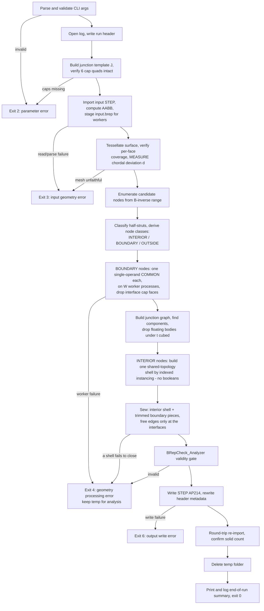
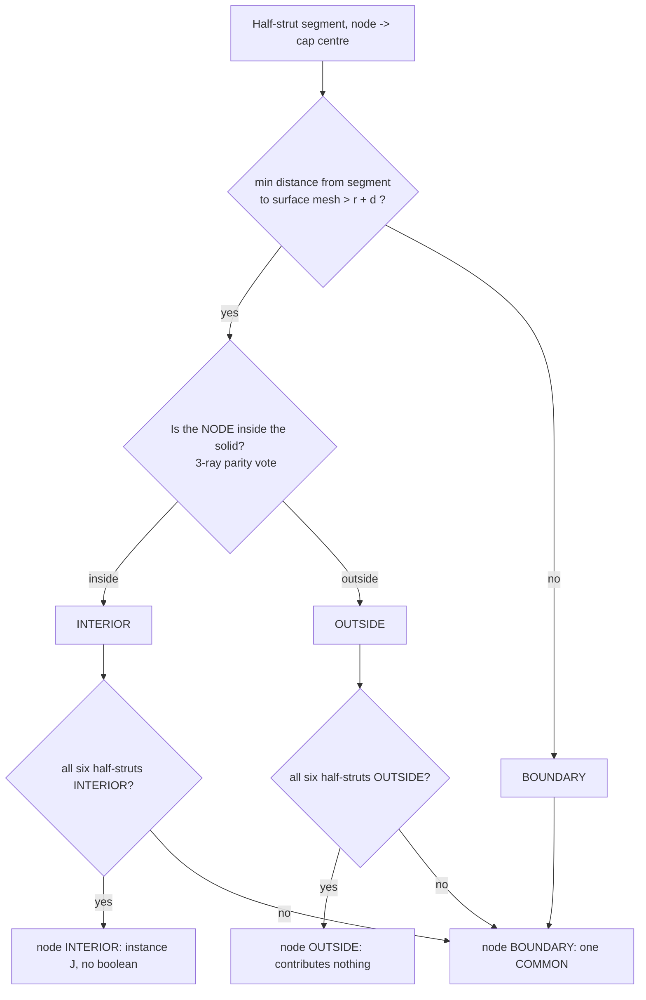

# latticegen2 Algorithm Specification

This document is the normative, implementable specification of the lattice
generation algorithm. It is referenced from [../CLAUDE.md](../CLAUDE.md) and
expands on [specification.md](specification.md) §4 (Geometry Domain) and §4.4
(Performance & Optimization). Where this document gives a formula or a diagram,
source code must implement it exactly — do not re-derive or approximate the
maths below.

All coordinates are in millimetres, in the same coordinate system as the input
STEP file. All angles are computed from expressions (`arcsin`, `arccos`, `sqrt`,
…), never as hard-coded decimals, so precision is IEEE-754 double throughout.

**Scope note.** This describes the current implementation, which builds the
lattice by *instancing* one pre-fused junction solid rather than by fusing struts
together. The previous Julia/gmsh implementation was organised around large
boolean fusions; its design and the investigations that led to its replacement
are preserved in §13 (History), because several of its findings are still
load-bearing here.

---

## 1. Terminology and symbols

| Symbol | Meaning |
|---|---|
| `cc` | CLI input: XY-plane distance between the bottom nodes of two adjacent cells (mm). |
| `t` | CLI input: side length of the diamond (square) strut profile (mm). |
| `a` | Cube edge length, `a = cc / √2`. |
| `θ` | Strut recline angle from +Z, `θ = arcsin(sqrt(2/3))` ≈ 54.7356°. |
| `e_k` | Unit direction vector of strut family `k ∈ {0,1,2}`. |
| `node (i,j,k)` | A lattice node addressed by integer triple, `i,j,k ∈ ℤ`. |
| `B` | 3×3 basis matrix mapping integer node indices to world coordinates. |
| `r` | Strut circumradius, `r = t/√2` (half the profile's diagonal). |
| `d` | Measured chordal deviation of the classification mesh from the true surface. |
| half-strut `(n, k, s)` | The half of a strut adjacent to node `n`, along `s·e_k`, `s ∈ {+1,−1}`, length `a/2`. |
| junction solid `J` | Union of the six half-struts one node owns. Congruent at every node. |
| cap quad | The `t×t` diamond face at distance `a/2` from a node along `±e_k`, where two adjacent junctions meet exactly. |
| junction graph | One vertex per instantiated junction (or piece of one), one edge per surviving cap interface. |
| INTERIOR / BOUNDARY / OUTSIDE | Classification of a half-strut, and derived from that, of a node (§5). |

---

## 2. Lattice mathematics

### 2.1 Strut directions

The lattice is a simple cubic lattice of node points, rotated so its `[1,1,1]`
body diagonal is aligned with +Z (a cube "standing on its tip" per spec §4.1).
Three strut directions emanate from every node, at azimuths 120° apart around Z,
each reclined from +Z by `θ`:

```python
THETA = arcsin(sqrt(2/3))              # ≈ 54.7356°, an expression, not a literal
SIN_THETA = sqrt(2/3)
COS_THETA = 1/sqrt(3)

def strut_direction(k):                # k = 0, 1, 2
    phi = 2*pi*k/3
    return (SIN_THETA*cos(phi), SIN_THETA*sin(phi), COS_THETA)   # |e_k| == 1
```

### 2.2 Cube edge length and node lattice

Per the user's decision (see [specification.md](specification.md) §4.2), `cc` is
the **XY-plane** distance between the bottom nodes of two adjacent cells, so
`a = cc / sqrt(2)`.

```python
node(i, j, k) = a * (i*e0 + j*e1 + k*e2)     # (i,j,k) in Z^3
```

From every node, three struts of length `a` extend along `+e0, +e1, +e2`.

### 2.3 Verified identities

These are both the mathematical justification for the model and the contents of
`test/test_lattice.py`. All hold to machine precision (`atol=1e-9`):

1. **Unit length:** `|e_k| ≈ 1` for `k = 0,1,2`.
2. **Recline angle:** `arccos(e_k · ẑ) ≈ θ`.
3. **Azimuthal separation:** the horizontal projections of `e0, e1, e2` are
   pairwise 120° apart.
4. **In-plane neighbour spacing:** `|node(1,0,0) − node(0,1,0)| ≈ cc`, and the two
   points have equal `z` — verifying `cc` really is a pure XY-plane distance.
5. **Vertical space diagonal:** `node(1,1,1) − node(0,0,0) ≈ (0, 0, a·sqrt(3))`.
6. **Mutual orthogonality:** `e0·e1 = e0·e2 = e1·e2 ≈ 0`.

Identity 6 is the one the whole architecture rests on, and it is not a
coincidence: the three strut directions are the edges of a cube meeting at a
corner, and the rotation that stands that cube on its tip does not change the
angles between them. Its consequences are developed in §3.

### 2.4 Basis matrix and candidate index range

```python
B = a * column_stack([e0, e1, e2])     # node(i,j,k) = B @ [i,j,k]
```

To enumerate every node whose junction could reach a world-space AABB
`[lo, hi]` (the input solid's bounds):

```python
corners   = the 8 corners of [lo, hi]
idx       = solve(B, corners)                  # world -> index space
pad       = ceil(r / a) + 1                    # safety margin, in cells
lo_idx    = floor(min(idx)) - pad
hi_idx    = ceil (max(idx)) + pad
```

A junction reaches at most `a/2` from its node, and `pad ≥ 1` cell, so no node
outside this range can contribute material inside the box. The cost of the
padding is a handful of nodes that classify trivially as OUTSIDE.

---

## 3. Strut cross-section, the junction solid, and cap integrity

### 3.1 Profile frame ("diamond" orientation)

The square profile for strut direction `k` is built in an orthonormal frame
`{u_k, v_k}` transverse to `e_k`:

```python
u_k = normalize(cross(ẑ, e_k))     # horizontal, perpendicular to e_k's azimuth
v_k = cross(e_k, u_k)              # lies in the vertical plane containing e_k and ẑ
```

The four profile vertices, centred on the strut axis at `c`:

```python
verts(c) = (c + r*u_k, c + r*v_k, c - r*u_k, c - r*v_k)      # r = t/sqrt(2)
```

This is a square of side `t` whose diagonals are `t·sqrt(2)` long, one horizontal
(along `u_k`) and one in the vertical plane of the strut axis — the "diamond on
edge" of spec §4.1.

### 3.2 The junction solid `J`

Cut every strut at its midpoint and assign each half to its nearer node. Every
node then owns exactly six **half-struts**, `(k, s)` for `k ∈ {0,1,2}` and
`s ∈ {+1,−1}`, each a prism of length `a/2`. Their union is the **junction
solid** `J`.

`J` is congruent at every node in the lattice — nodes differ only by a
translation — so it is built exactly once per run:

1. Build the six half-strut prisms at the origin (profile polygon → planar face →
   prism along `s·(a/2)·e_k`).
2. Fuse them with **one** boolean call. This is the only general fuse in the
   entire program. It takes about 40 ms.

**The key consequence of mutual orthogonality (§2.3 identity 6):** at every node
the six half-struts run along ±3 mutually perpendicular axes, so all strut-strut
overlap is confined to the node region and lies *inside* `J`. Two adjacent
junctions therefore **do not overlap in volume at all** — they meet exactly on
the shared mid-strut cap quad. Hence:

> **The fused lattice is translated copies of one solid, meeting on coincident
> planar quads.**

and the union's volume is the plain sum `N · volume(J)`, with no
inclusion-exclusion correction. That identity is an exact, independent check on
the assembled result and is asserted in `test/test_junction.py`.

### 3.3 Cap integrity holds across the whole parameter range

The architecture needs the six cap quads to survive the fuse of §3.2 intact: they
are the interfaces junctions are joined along. They always do, for every `(cc, t)`
the CLI accepts.

The bound is exact. A half-strut along `e_j` reaches toward an orthogonal `e_k`
only as far as its profile's **support** in that direction, which is

```
r · max(|u_j · e_k|, |v_j · e_k|)  =  r / sqrt(2)  =  t/2
```

— the square's *inradius*, because each diamond profile presents an **edge**, not
a corner, toward every orthogonal strut direction (verified for all six `(j,k)`
pairs in `test/test_junction.py`). The cap sits at `a/2`, so caps are intact
while `t/2 < a/2`, i.e. for exactly **`t < a`** — which is the cross-constraint
the CLI already enforces so a strut fits inside its cell.

An intermediate revision of this implementation assumed the relevant reach was
the circumradius `r` rather than the inradius, concluded that `t < cc/2` was
required, and rejected valid parameters accordingly. Measurement disproved it: a
sweep of `t/cc` from 0.45 up to the `t < a` limit at `cc ∈ {5, 10, 20}` mm keeps
all six caps throughout, and the analytic support calculation above explains why.
The restriction was removed rather than shipped — refusing valid input is not an
acceptable failure mode, which is the same lesson §13.3 records from the previous
implementation.

`build_template` still verifies cap integrity geometrically at the run's actual
parameters. It is a cheap defensive gate, not a documented limit: if a future
change to the profile or the cell invalidated the argument above, the run fails
immediately instead of producing geometry with broken interfaces.

---

## 4. End-to-end pipeline



Each stage maps to one source module — see §12.

---

## 5. Boundary classification

The single biggest performance lever is **avoiding boolean operations wherever
they are provably unnecessary**. Classification turns an O(all nodes) boolean
workload into an O(boundary nodes) ≈ O(surface area / cell area) one.

### 5.1 Surface pre-processing (once, on the master)

Tessellate the input solid's boundary with OCCT's `BRepMesh_IncrementalMesh`,
asking for a linear chordal deviation of `min(t, a)/10` and an angular deflection
of 0.2 rad.

No maximum element size is needed, unlike the gmsh-based predecessor: a planar
face meshes to a couple of *exact* triangles however large it is, and only
curvature drives refinement. This is why the mesh is now ~1,000 triangles for the
test cylinder where the old pipeline produced ~52,000, with no loss of fidelity.

Two gates run on the result.

**Gate 1 — per-face coverage (`check_surface_mesh_coverage`).** Every
classification decision depends on the mesh faithfully representing the solid's
boundary, so a silently incomplete mesh would misclassify struts beyond the
missing region as OUTSIDE — the one failure mode the rest of the design rules
out. Two per-face tests, each using a quantity that is sound *in the direction it
is used*:

* **Coverage** against the face's **exact trimmed area** (`BRepGProp`, OCCT Gauss
  quadrature) versus the summed area of that face's triangles. Rejected only when
  the shortfall clears **both** a relative bar (`area_rel_tol`, default 0.25) and
  an absolute one (`min_deficit = min(t, a)²`, one coarsest element's worth of
  area). Both are needed and both fire on real data — see §13.3.
* **Containment** against the face's CAD bounding box as an **upper bound only** —
  every mesh node must lie inside it, inflated by 1 mm.

A face with zero elements is always an error. The bounding box is deliberately
never used to test coverage: OCCT returns the control-point hull for B-spline
edges and the untrimmed UV rectangle for planar faces, so it over-estimates the
true extent, and a version of this gate that required the mesh to *reach* it
blocked a valid input file outright (§13.3).

**Gate 2 — measured chordal deviation.** The classification margin below depends
on a bound for how far the mesh departs from the true surface. That bound is
**measured, not assumed**: for every curved face, the true surface is evaluated at
the parametric midpoint of each triangle edge and the parametric centroid of each
triangle, and compared against the distance to the corresponding mesh element.
`d` is then `max(requested deflection, worst measured deviation)`.

This matters because OCCT does not reliably deliver the deflection it is asked
for. Measured: asked for 0.4 mm on `80mm-test-ball.step`, samples land up to
~2.8 mm off the sphere; asked for 0.15 mm on `TD_HX_Indre_Volum.step`, up to
~0.5 mm. A margin built on the requested figure would have been too small in both
cases. The measurement is deliberately conservative — it compares each sample
only against the element it parametrically belongs to, and takes the worst sample
on the face — because over-estimating `d` only sends more junctions down the
correct-but-slower boundary path, while under-estimating it could let a strut
that genuinely touches the surface be treated as clear of it.

A deviation exceeding `a/4` is a hard failure: classification would then be
dominated by meshing error rather than by geometry.

Finally a uniform spatial hash is built over the triangles, plus a coarser
occupancy grid sized to the near-surface query radius.

### 5.2 Per-half-strut classification, and node classes



* **Segment-mesh minimum distance:** query the spatial hash for triangles near the
  segment's AABB inflated by `r + d`; compute exact segment-triangle distances
  only for those; short-circuit as soon as any distance `≤ r + d` is found, since
  only the *predicate* matters, not the true minimum.
* **Point-in-solid:** ray-cast parity from the node against the triangle set,
  along **three fixed** non-parallel directions, majority vote. Three rays defeat
  the classic single-ray degeneracies (a ray grazing a shared edge or passing
  through a vertex is counted twice). The directions are fixed rather than
  sampled so a run is exactly reproducible — nondeterminism in a
  correctness-critical step would be at odds with the precision priority.
* **Why the margin is `r + d`:** the strut solid extends `r` from its axis, and
  the mesh approximates the true surface to within `d`. Folding both in means the
  discrete test can never wrongly promote a strut that genuinely touches the true
  surface into INTERIOR or OUTSIDE. The worst it can do is call a strut BOUNDARY
  that was actually clear — a wasted but still-correct boolean.

### 5.3 Two properties the rest of the pipeline depends on

**(a) One inside/outside test per node suffices.** If a half-strut's whole axis
segment stays further than `r + d` from the surface, the segment cannot cross the
surface, so its midpoint and its node are on the same side. The ray-parity test —
by far the most expensive part — therefore runs once per node rather than once per
half-strut.

**(b) An INTERIOR node's neighbours are always kept.** If node `A`'s half-strut
toward `B` is INTERIOR, then the strut `A→B` never approaches the surface along
that half and `A` is inside. `B`'s half-strut back toward `A` covers the other
half of the same strut; for it to be OUTSIDE, the surface would have to cross the
strut somewhere — but both halves are further than `r + d` from it. So `B` is
never classified OUTSIDE. Consequently **every cap of an INTERIOR node faces real
geometry**, which is what lets §6 drop all six unconditionally.

The same argument run the other way gives a third property used in §7: if a
node's neighbour *is* OUTSIDE, the shared cap lies entirely outside the solid and
the trim removes it completely. So an intact cap always has material on both
sides.

### 5.4 Staging, and complexity

The sweep is ordered cheapest-first:

1. A coarse occupancy query rules out every node whose junction cannot come near
   the surface at all — the interior and the padding, i.e. the overwhelming
   majority.
2. Those nodes are decided by the inside/outside test alone.
3. Only the remaining near-surface nodes pay for exact segment-triangle
   distances, six segments each.

Let `N` be the candidate node count (∝ volume) and `S` the near-surface count
(∝ surface area, so `S = O(N^{2/3})`). Classification is `O(N)` cheap tests plus
`O(S)` exact ones. The payoff is downstream: booleans run on `O(S)` junctions.

---

## 6. Interior construction: indexed instancing, zero booleans

Every INTERIOR node contributes one translated copy of the junction template's
faces **minus all six cap quads** (legitimate by §5.3(b)). Two adjacent instances
therefore present matching square holes to each other, and joining them is
bookkeeping rather than geometry.

The construction is *indexed*, not geometric:

* A global vertex is keyed by `(owning node, local template vertex)`. A vertex on
  an **incoming** cap (`h ≥ 3`) is re-attributed to the neighbour that owns the
  outgoing side of the same cap, via a correspondence map computed once at
  template build time by matching `verts[i] + a·e_k` against the opposite cap's
  vertices. At run time this is an integer lookup — never a coordinate search.
* Its position is computed once, from its owner. Two junctions sharing a vertex
  therefore reference the *same* `TopoDS_Vertex`, and edges built from those
  vertices are shared too. The shell is watertight **by construction**: there is
  no tolerance involved and no possibility of a near-miss.
* Each face is built on a plane whose normal is stated explicitly from the
  template's outward normal. Letting OCCT infer the plane from the wire picks an
  arbitrary normal direction and yields a shell whose faces point every which way
  — closed, but enclosing zero volume. This was observed directly during
  development.
* Edge usage is tallied as faces are added. A closed orientable surface uses every
  edge exactly twice, once in each direction; edges used once are the genuine open
  boundary (the holes where boundary junctions attach); anything else means the
  index is wrong and the build fails rather than presenting a bad shell as a
  solid. OCCT's `Closed` flag is then set from this computed truth, because
  `BRep_Builder` leaves it false on a hand-built shell regardless of the geometry
  and downstream code reads the flag rather than recomputing it.

**Why not simply sew the instances together.** Sewing has to *discover* by
geometric search the pairing that is already known here exactly, and it does not
scale: measured, `BRepBuilderAPI_Sewing` takes 14.9 s for 1,000 junctions and had
not finished after 250 s of CPU at 8,000. The indexed build is linear — 0.2 s at
64 junctions, 1.2 s at 512, 199 s at 64,000 (1.55 M faces) — and produces a valid
solid whose volume matches `N · volume(J)` to a relative 2×10⁻¹⁴. Sewing remains
the right tool where the pairing genuinely *isn't* known (§8), but it must not sit
on the path whose size scales with the volume of the part.

**Why not OCCT's glued boolean mode.** `BOPAlgo_Builder` with
`SetGlue(BOPAlgo_GlueFull)` is designed for operands meeting only on coincident
faces, which is exactly this contact pattern. Measured on 1,000 junctions it took
9.5 s and returned **1,000 solids** — it did not merge them at all. Rejected.

---

## 7. Boundary junctions

Each BOUNDARY node contributes exactly one boolean: its instanced junction solid
intersected with the input solid.

**One object operand per call, always.** OCCT's general boolean runs over all
object operands together, so two overlapping objects in one call are
*partitioned* against the tool rather than each trimmed independently. That
fragmentation cost the previous implementation dearly (§13.2, finding 1): three
struts sharing a node, intersected against a containing box in one call, returned
7 fragment solids instead of 1. A single already-fused junction cannot trigger it,
by construction — which is why this design needs no equivalent of the old
`trim_disjoint` machinery.

After trimming, every face lying in an **interface cap plane** is dropped, exactly
as the interior path drops caps, so the trimmed junction presents the same square
hole to its neighbour. Which caps are interfaces is decided by classification —
a cap is an interface iff the node across it is itself kept — not by inspecting
geometry. Identifying a cap-plane face is unambiguous: lateral faces of any
half-strut lie at `t/2` from the node (§3.3), caps at `a/2`, and `t < a`.

A trim can legitimately split one junction into several disconnected pieces when
the input surface cuts between its arms. Each piece becomes its own vertex in the
junction graph, carrying whichever caps ended up on it.

The work is embarrassingly parallel — constant-size, independent jobs — and is
distributed over worker processes with small-IPC discipline: the input body goes
to disk once as a `.brep` and workers read it directly; only file paths and small
plain metadata cross the process boundary.

---

## 8. Connectivity, the floating-body rule, and stitching

[specification.md](specification.md) §5 forbids emitting a floating body smaller
than `t³`, and is emphatic that "floating" means *provably disconnected* — a small
fragment still attached to the rest must never be deleted.

Here connectivity is known by construction. Two junctions are joined exactly when
they share a surviving cap interface, and which caps survived is recorded while
the geometry is built. So:

1. Build the **junction graph**: vertices are instantiated junctions (interior
   nodes, plus one per piece of each trimmed boundary junction), edges are caps
   present on both sides.
2. Find connected components by union-find. A component's volume is the sum of its
   members'.
3. Drop a component iff its total volume `< t³`. It is a floating body by
   definition of being a separate component.

No boolean is involved, and there is **no unresolvable case** — the previous
implementation's exit-4 "cannot determine whether this fragment is connected"
path does not exist here. When a trim splits a cap region across several pieces,
every pair is joined rather than left ambiguous: over-connecting can only keep a
body that might have been droppable, never delete one that was attached.

Removals are logged as **one aggregate line** (count, total volume, min/max, up to
20 sample volumes), never one line per body — the pattern that turned a
pathological run into a multi-hour logging tail in the old implementation
(§13.2).

**Stitching.** The interior shell and the surviving trimmed boundary pieces are
then sewn together. Because both are fed as *shells* whose interior edges are
already shared, sewing only sees the free edges at the interfaces, so its cost
scales with surface area rather than with volume. Two cross-checks follow:

* If sewing yields **more** solids than the junction graph has components, some
  interface failed to close and the output would not be watertight — hard failure
  (exit 4), temp kept.
* Any shell that is not closed is a hard failure for the same reason.

Boundary interfaces are stitched with a tolerance (1e-6 mm) rather than by index,
because a trimmed junction's faces come back from the boolean and cannot be
re-indexed. That tolerance only has to absorb the last-ulp difference between
computing a shared cap from one side of a strut or the other (~1e-14 mm at
realistic coordinates), and stays far below the smallest real feature
(`t ≥ 0.4` mm), so it can never weld two genuinely distinct vertices.

---

## 9. STEP export and metadata

* **Same-domain unification.** Before anything else, each solid's B-rep is
  compacted with `ShapeUpgrade_UnifySameDomain`, merging adjacent faces (and
  edges) that lie on one underlying surface.

  This is needed precisely *because* the lattice is instanced rather than fused.
  Instancing merges nothing, so across every shared mid-strut interface junction
  A's lateral face and junction B's are coplanar and share an edge yet remain two
  faces — every strut carries eight lateral faces where four suffice. The old
  fuse-based pipeline got this merge for free as a side effect of the boolean;
  removing the boolean removed the merge with it. The junction template itself is
  already minimal and unifies to itself (30 faces → 30): within one junction the
  `+e_k` and `−e_k` lateral faces are coplanar but *not* adjacent, because the
  other four half-struts cut them apart at the node. `test/test_junction.py` pins
  both halves of that finding.

  Measured on `dense-lattice`: **29,974 → 15,966 faces**, 122,556 → 67,898 edges,
  98.9 MB → 52.6 MB — within three faces of what the old pipeline produced for
  the same geometry. It costs ~8 s and *pays for itself*: export drops from 9.3 s
  to 5.7 s and the round-trip check from 23.5 s to 13.5 s, so the whole run gets
  faster. Re-tessellation also drops from 85,832 to 62,152 triangles, so
  downstream meshing and display get cheaper too.

  It is a **representation** change and must never become a geometry change, so
  two guards bracket it, both hard failures: the solid count must be unchanged
  (a change would also invalidate the junction-graph cross-check that precedes
  it), and each solid's volume must be preserved to `UNIFY_VOLUME_TOL` (1e-5
  relative). That bar is calibrated, not guessed: on purely planar geometry,
  where the volume is known analytically, the drift is 1.9e-15 — exact; it only
  appears on boundary solids carrying curved trimmed faces, where quadrature over
  a larger merged region differs slightly, at 2.4e-7 on `dense-lattice`. Every run
  logs the observed drift so the margin is visible rather than assumed. The
  stronger guard is the validity gate below: merging faces that are not the same
  surface moves the boundary, which shows up as an invalid solid long before it
  shows up as a changed volume.

  Each solid is unified independently rather than as one compound, which keeps the
  count guard exact and leaves the step straightforward to parallelise if it ever
  becomes the bottleneck at scale (~0.24 ms/face).

* **Validity gate.** Every output solid is checked with OCCT's
  `BRepCheck_Analyzer` before export. This is an *exact* B-rep check, not a
  mesh-based approximation of one — the gmsh-based predecessor could not express
  it at all, which is why §13.1's self-intersection question could only be
  answered there with indirect evidence.
* **Units.** STEP I/O is pinned to millimetres defensively, even though that is
  the default: a mismatched unit would silently corrupt every dimension rather
  than fail.
* **Export.** `STEPControl_Writer` with `write.step.schema = AP214IS`, producing an
  AP214 file per spec §5.
* **Header rewrite.** STEP is plain text. After export, a small quote-aware pass
  sets `FILE_NAME`'s first field to the part name `<input_stem>+cc<cc>+t<t>`
  (spec §5's `+`-separated convention, distinct from the `-`-separated default
  *file* name) with floats formatted without trailing zeros, and appends the full
  parameter string to `FILE_DESCRIPTION`. **`FILE_SCHEMA`'s value is only ever
  filled in when blank, never overwritten** — that is what keeps the file a clean
  standard document rather than a hand-patched hybrid.
* **Round-trip self-check.** Before declaring success the written file is re-read
  and its solid count compared against what the run believes it wrote. A mismatch
  is a failure (exit 6), not a warning — the previous implementation shipped a run
  whose summary claimed 2 solids while the file held 113 (§13.4).

---

## 10. Logging and failure modes

* Log path: `<output-stem>.log`, derived the same way as the output path, never
  `<output>.step.log`. Always written in full regardless of `-v`; `-v` only raises
  *console* verbosity.
* Content: run header (all parameters, start timestamp), one line per stage with
  its wall-clock duration, template/mesh/classification statistics, boundary-trim
  progress, the aggregate floating-body line, and the mandatory end-of-run summary
  (spec §3's list) printed to both console and log on success.
* Exit codes:

  | Code | Meaning |
  |---|---|
  | 0 | Success |
  | 2 | Parameter validation failure (before any computation) |
  | 3 | Input geometry read/parse failure, or a mesh too unfaithful to classify against |
  | 4 | Geometry processing failure (boundary trim, an interface that failed to close, an invalid output solid) |
  | 5 | Resource limits — retained for compatibility, currently unreachable |
  | 6 | Output write failure, or a failed round-trip check |
  | 130 | Cancelled by the user with Ctrl+C (`128 + SIGINT`) |

* Every non-zero exit prints exactly one human-readable reason line. Exit 130
  prints `CANCELLED:` rather than `FAILED:` and no traceback: a cancelled run did
  what the user asked, it did not malfunction.
* If a failure occurs after `temp/<ts>/` has been created it is left in place for
  post-mortem analysis (spec §4.4), and the message says where.

---

## 11. Correctness safeguards recap

Because priority #1 is precision, every optimization is designed so that its
*failure mode is "do more work", never "produce a wrong result"*:

* Classification degrades ambiguous cases to BOUNDARY (§5.2) — worst case is an
  unnecessary boolean, never a missed trim or a phantom strut.
* The classification margin uses a **measured** upper bound on mesh error (§5.1),
  so the guarantee above does not rest on the mesher honouring its parameters.
* Instancing is not an approximation of fusing: by §3.2 the union of translated
  junctions *is* the fused lattice, and the exact volume identity
  `N · volume(J)` is asserted against it.
* Watertightness of the interior is structural (shared topology, §6), and is
  additionally verified by the edge-use tally before the shell is accepted.
* Connectivity is proven, not guessed (§8), so no body is ever deleted without
  proof that it is disconnected.
* The output is checked with an exact B-rep validity test, and the file is re-read
  and compared before success is reported (§9).
* `check_surface_mesh_coverage` fails loudly rather than classifying against an
  incomplete mesh — while being careful that the gate is only as trustworthy as
  the tightness of the quantity it compares, which is the lesson of §13.3.

---

## 12. Complexity and the optimization strategy

Let `N` = candidate nodes (∝ volume), `S` = boundary nodes (∝ surface area,
`S = O(N^{2/3})`), `W` = worker count.

| Stage | Cost |
|---|---|
| Template | `O(1)` — one 6-operand fuse per run, ~40 ms |
| Tessellation | `O(input faces)`, independent of lattice density |
| Classification | `O(N)` cheap tests + `O(S)` exact ones |
| Interior | `O(N)` index operations and face constructions, **no booleans** |
| Unification | `O(faces)`, ~0.24 ms/face |
| Boundary | `O(S/W)` single-operand intersections |
| Connectivity | `O(N + S)` union-find |
| Stitching | `O(S)` free edges |
| Export | `O(faces)` — irreducible |

| Lever | Effect |
|---|---|
| Classify before intersecting | Booleans only for the `O(S)` boundary junctions |
| One junction template, instanced everywhere | The only general fuse is 6 operands, once per run |
| Indexed shared-topology interior shell | `O(N)` and exactly watertight; replaces a sewing step measured at 14.9 s per 1,000 junctions and growing superlinearly |
| Explicit face plane normals | Avoids a silently zero-volume shell (§6) |
| One object operand per COMMON | Makes OCCT's operand-fragmentation failure mode unreachable |
| Connectivity by graph | Floating-body rule needs no boolean, and has no unresolvable case |
| Sewing confined to boundary interfaces | Stitching scales with surface area, not volume |
| Same-domain unification before export (§9) | Recovers the face merging the removed boolean used to do for free: 47% fewer faces and half the file size, and it makes the run *faster* by shrinking export and the round-trip check |
| Process-parallel boundary junctions | Constant-size independent jobs |
| Coarse occupancy pre-filter before exact distance tests | Only near-surface nodes pay for segment-triangle maths |
| Vectorised ragged cell assignment in the spatial index | Building the index over a 200 k-triangle *output* mesh stays interactive |
| One ray-parity test per node, not per half-strut | Justified by §5.3(a); a third of the work |
| Planar faces skipped in deviation measurement | Lattice output is all planar, so verification re-tessellation stays cheap |
| Measured rather than assumed mesh deviation | Correctness safety net, not a speed lever (§5.1) |

Alternatives evaluated and rejected:

* **Voxel / marching-cubes implicit surfacing:** approximate, faceted output;
  violates the exact-B-rep requirement (spec §5).
* **Fusing struts or tiles:** the previous architecture. OCCT boolean fuse cost
  grows at roughly N^2.5 in operand count (§13.2), which is what made it
  unreachable at scale.
* **`BOPAlgo_GlueFull`:** measured, does not merge (§6).
* **CGAL Nef polyhedra:** correct and robust, but redundant once no large boolean
  exists to perform.

---

## 13. History: the superseded Julia/gmsh implementation

The sections below record investigations into the previous implementation, which
built the lattice by fusing struts into tiles and then hierarchically fusing
tiles. They are kept because several of their findings still constrain this
design — in particular the COMMON operand-disjointness invariant (§7), the
floating-body rule's insistence on proof before deletion (§8), the mesh-coverage
gate's calibration (§5.1) and the export-synchronisation lesson (§9). The
implementation itself is in [`../old-julia/`](../old-julia/) and is not
maintained.

### 13.1 Residual self-intersections on multi-tile boundary assembly

`tools/verify_geometry.jl`'s self-intersection check reported ~4,343 crossing
triangle pairs on the `smoke-fast` scenario. Two root causes were found. The
first was a genuine bug **in the checker**: its edge-piercing test flagged two
separate solids merely *touching* along a coincident face, because their
independent triangulations were not vertex-aligned — 344 false positives on two
boxes sharing one exact face. Adding a plane-straddle pre-check
(`triangles_properly_cross`, carried forward into `tools/verify_geometry.py`)
fixed that and dropped the count from ~18,400–32,500 to 4,343.

The residual 4,343 were traced to a minimal case — three struts sharing one node,
fused, no trimming or tiling — and attributed to thin-fold tessellation aliasing at
non-mitered strut junctions, on five lines of converging evidence: a
fuzzy-tolerance sweep showed no trend; refinement *increased* the count
(0 → 52 → 926 as resolution rose, the signature of an aliasing artefact rather
than a real crossing); inclusion-exclusion predicted the fused volume exactly
(`79.8528137423857`, difference 0.0); the exact B-rep topology was clean (15
faces, 36 edges, every edge bordering exactly 2 faces); and the flagged pairs lay
between *non-adjacent* faces at reflex corners. The conclusion was recorded as
evidenced but not proven, because no exact validity check was reachable through
gmsh's API.

**Resolved.** The current implementation has `BRepCheck_Analyzer`, and the same
scenario now reports **0 crossing pairs** and passes exact B-rep validation. The
open question is closed, and the diagnosis above was correct.

### 13.2 The `test-cylinder-cc5t1` assembly/cleanup blow-up

That scenario never completed: 1h 38m in the tile stage, then assembly hit its
600 s circuit breaker with 11,395 of 11,443 solids still unfused, then 3,740
"removed sub-threshold solid" log lines over 65 minutes. Four defects:

1. **`common_with` fragmented overlapping boundary-strut groups, and cleanup then
   deleted the fragments.** Three struts sharing a node, intersected against a box
   in one call, returned **7** solids (four 0.125 mm³ junction wedges plus three
   3.16 mm³ pieces) instead of 1 solid of 9.98 mm³ — and 0.125/0.25 were the two
   most common values in the removal histogram. *Carried forward:* §7's
   one-object-operand rule makes this structurally impossible.
2. **`bounding_box`'s implicit synchronize made the AABB pre-filter a net loss.**
   `gmsh.model.occ.synchronize()` is O(whole model) and was called once per solid,
   per group, per round: 200 one-at-a-time box queries took 22.47 s against 0.11 s
   for one shared sync plus 200 lookups — **202×**. *Carried forward:* the general
   lesson that an O(model) refresh can hide inside an O(1)-looking call.
3. **Auto-tuned tile size sat far past the fuse-cost knee.** Measured fuse cost:
   192 struts in 12.4 s, 648 struts in 256 s — far worse than quadratic (~N^2.5).
   The run had picked ~3,993 struts per tile from a memory-only formula. *Carried
   forward:* the N^2.5 figure is the quantitative reason this design removes
   fusion from the hot path entirely.
4. **Sub-threshold removal used the slow API.** `gmsh.model.removeEntities` was
   16× faster than the OCC-kernel `remove` for the same batch (0.74 s vs 11.97 s).

An unrelated correctness bug found while investigating: `build_prototypes` left
three "master" strut solids in the session that `gmsh.write` then exported into
*every* tile `.brep`, adding phantom material 90+ mm outside the part.

### 13.3 The mesh-coverage gate's bounding-box false positive

A run produced output visibly missing a large region of lattice; the input's
logged bounding box reached `x=190.25` while the mesh stopped at `x=171.58`. That
was read as a truncated tessellation, and a per-face bounding-box completeness
gate was added — which then rejected the entire `dense-lattice` scenario.

**The diagnosis was wrong.** `getBoundingBox` is a deliberate over-estimate: for a
B-spline edge it returns the control-point hull, for a planar face the untrimmed
UV rectangle. Face 9 of `test-cylinder.STEP` reported `xmax=190.25`; sampling its
own boundary B-spline at 2001 points gave `171.58`, and the mesh agreed. Measured
against **exact trimmed area** instead, every face of that part was meshed to
within 0.12%, face 9 to 0.999958. The missing lattice had a different cause
entirely — §13.4's stale export.

The gate was rebuilt to use each quantity only in the direction it is sound in
(§5.1), with both a relative and an absolute bar, each calibrated and each shown
to be load-bearing on real data: at `cc=10 t=1.5` a lattice *output* face of
0.0403 mm² meshed to 75.0% (trips the relative bar, spared by the absolute one),
while `TD_HX_Indre_Volum.step` at `cc=5 t=1` had an 18.5 mm² shortfall at a 0.990
ratio (the reverse).

**The lesson, which §3.3 of this document repeats in a new form:** a correctness
gate is only as trustworthy as the tightness of the quantity it compares, and
"refuse valid input" is not an acceptable failure mode even when "do more work"
is.

### 13.4 Export silently reflected stale, pre-fuse geometry

A run's summary read `Solids written: 2` while the exported file contained
**113**. `gmsh.model.occ.fuse` is an OCC-kernel-level operation and does not
synchronize gmsh's separate model-level entity list, and the export deliberately
used the non-syncing write (a syncing write would have resurrected entities that
had just been removed). So the run's accounting was right and the file was stale —
mutually-overlapping un-merged fragments delivered as the final output. Fixed
there by an explicit `sync_model()` before removal and export.

*Carried forward:* §9's round-trip check now compares the re-read solid count
against what the run believes it wrote, so this class of discrepancy fails the run
instead of shipping.

---

## 14. Mapping to source modules

| Module | Implements |
|---|---|
| [`src/latticegen2/cli.py`](../src/latticegen2/cli.py) | CLI parsing and validation, output path resolution |
| [`src/latticegen2/lattice.py`](../src/latticegen2/lattice.py) | §2 (directions, basis, node enumeration, index range), §3.1 (profile), half-struts |
| [`src/latticegen2/occ.py`](../src/latticegen2/occ.py) | OCCT helpers: STEP I/O, measurement, meshing, sewing, validity |
| [`src/latticegen2/junction.py`](../src/latticegen2/junction.py) | §3.2–§3.3 (the template and its cap-integrity gate) |
| [`src/latticegen2/classify.py`](../src/latticegen2/classify.py) | §5 (tessellation, both mesh gates, spatial indices, distance and ray-parity tests, node classes) |
| [`src/latticegen2/interior.py`](../src/latticegen2/interior.py) | §6 (template topology extraction, cap correspondence, indexed shell build) |
| [`src/latticegen2/boundary.py`](../src/latticegen2/boundary.py) | §7 (single-operand trim, cap dropping, worker processes) |
| [`src/latticegen2/connect.py`](../src/latticegen2/connect.py) | §8 (junction graph, components, floating-body rule) |
| [`src/latticegen2/stepout.py`](../src/latticegen2/stepout.py) | §9 (header rewrite, round-trip check) |
| [`src/latticegen2/runlog.py`](../src/latticegen2/runlog.py) | §10 (logging, stage timings, summary) |
| [`src/latticegen2/pipeline.py`](../src/latticegen2/pipeline.py) | §4 (orchestration) |
| [`src/latticegen2/__main__.py`](../src/latticegen2/__main__.py) | Entry point, failure reporting, exit codes |
