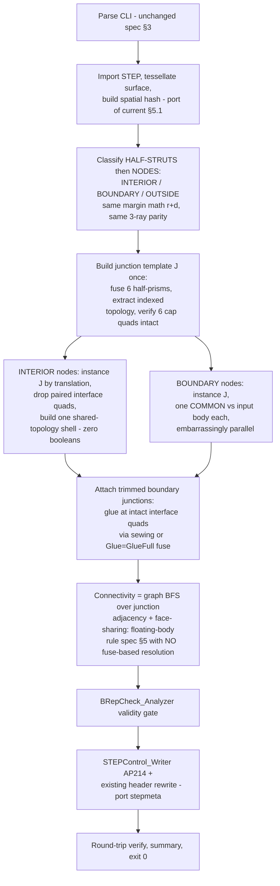

# Performance Re-Architecture Proposal: Fuse-Free Lattice Synthesis

**Status:** research proposal, branch `research/perf-rearchitecture`. Nothing here is
implemented, and nothing in [specification.md](../specification.md) has been changed.
Per the specification's own rules, every feature proposed here is Claude-proposed and
requires an explicit user decision before implementation — the companion
[implementation guide](perf-rearchitecture-implementation-guide.md) exists so that,
once approved, the work can be executed by less capable models without re-deriving
this analysis.

**Goal:** `dense-lattice` (`-i test/test-cylinder.STEP -cc 10 -t 1.5`) currently takes
**25m 55s**. Target: **under 10 minutes, ideally far under**, on an architecture that
still works at the stated future scale — parts ~8× larger in volume at `cc=5, t=1`
(≈ **64× more lattice cells** than today's dense-lattice run).

---

## 1. Where the 26 minutes actually go

Measured stage timings from the verified `dense-lattice` run
(docs/algorithm.md §11.3):

| Stage | Time | Share | What it is |
|---|---|---|---|
| import | 0.05 s | ~0% | STEP read |
| tessellate | 1.86 s | ~0% | classification mesh |
| classify | 0.50 s | ~0% | INTERIOR/BOUNDARY/OUTSIDE per strut |
| tile_stage | 1m 39s | 6% | per-tile build + fuse + trim on workers |
| **assembly** | **18m 06s** | **70%** | hierarchical `balanced_fuse!` of tile solids |
| **export** | **5m 22s** | **21%** | `filter_floating!` (more fuses) + STEP write |
| verify | 13.4 s | 1% | round-trip re-import |

**91% of wall time is OCCT boolean fusion and its aftermath.** Everything the project
has already optimized — classification-before-boolean, the periodicity shortcut, tile
sizing below the fuse-cost knee, the one-sync-per-round AABB filter, model-level
removal — attacks the *constants* of this workload. The remaining problem is the
workload itself: **general-purpose n-ary boolean fusion of thousands of
mutually-touching B-rep solids**, with measured cost growth of ~N^2.5
(docs/algorithm.md §11.2).

### Scale projection: the current architecture cannot reach the future target

Scaling laws (candidates ∝ volume/a³, boundary ∝ area/a²), anchored on the measured
dense-lattice counts (69,192 candidates → 1,976 interior / 2,655 boundary struts):

| Quantity | today (cc=10, t=1.5) | future (8× volume, cc=5, t=1) | factor |
|---|---|---|---|
| candidate struts | 69,192 | ≈ 4.4 M | 64× |
| interior struts | 1,976 | ≈ 126,000 | 64× |
| boundary struts | 2,655 | ≈ 42,500 | 16× |
| solids reaching assembly | ~10³ | ~10⁵ | ~100× |

At ~N^2.5, a 100× bigger assembly fuse is ~10⁵× more work. No amount of tuning inside
the current design closes that. The assembly stage must not merely be made faster —
**it must cease to exist as a boolean problem.**

---

## 2. The four structural insights the current design leaves unused

### Insight 1 — the strut directions are mutually orthogonal

`e0·e1 = e0·e2 = e1·e2 = 0` to machine precision (verified numerically; this is
expected — the lattice is a simple cubic grid rotated so [1,1,1] ∥ Z, and the struts
are cube edges). Consequence: at every node, the six incident half-struts run along
±3 orthogonal axes, and the volumetric overlap between struts sharing a node extends
at most ~`r = t/√2` from the node along each axis. For every practically relevant
parameter combination (`t < cc/2`, which covers `cc=5,t=1` with 2.5× margin), the
overlap is confined **well inside the near half of each strut**.

### Insight 2 — all lattice-only geometry is planar-polyhedral

Struts are extrusions of planar squares: every face is a plane, every edge a line.
The union of finitely many planar prisms is a **polyhedron**. "Exact B-rep solid"
(spec §5) does *not* imply NURBS machinery for the lattice body itself — curved
geometry enters only where boundary struts are trimmed against the input surface.
The current pipeline pays general-curved-boolean prices for what is, over ~98% of the
model, pure polyhedral set union.

### Insight 3 — the fused lattice is one junction solid, infinitely instanced

Cut every strut at its midpoint (plane ⟂ strut axis → an exact `t×t` diamond quad).
Assign each half-strut to its nearest node. Every node then owns six half-struts, and
their union — the **junction solid `J`** — is *congruent at every node of the
lattice* (pure translation). By Insight 1, all strut-strut overlap is contained
inside `J`; two adjacent junction solids do not overlap volumetrically at all — they
meet **exactly** on the shared mid-strut quad, vertex-for-vertex, bit-identically
(both sides derive from the same `node()` formula, docs/algorithm.md §3.2).

Therefore:

> **The infinite fused lattice = translated copies of one solid `J`, glued along
> coincident planar quads.**

Gluing coincident identical faces is *topological bookkeeping*, not boolean
computation. One small fuse (6 half-prisms, milliseconds) computes `J` once; every
interior junction thereafter is a translation + face-pairing operation with **zero
kernel time**. This generalizes the existing periodicity shortcut (§6.4) from "one
fuse per full-interior *tile*" to "**one fuse per run**" — and eliminates the entire
assembly stage, because there are no per-tile solids left to fuse: interfaces between
any two instanced junctions are exact shared quads by construction.

### Insight 4 — the ceiling is gmsh's API surface, not OCCT and not Julia

Everything the new design needs already exists inside OCCT, which the project already
ships (LGPL-2.1, vendored in the Gmsh SDK): shared-topology construction
(`BRep_Builder` reusing `TopoDS_Edge`/`Vertex`), sewing (`BRepBuilderAPI_Sewing`),
glued boolean mode for coincident-face-only contact (`BOPAlgo` `Glue=GlueFull` —
designed for exactly this contact pattern and dramatically cheaper than general
fuse), located instances (`TopLoc_Location` — O(1) transforms without copying
geometry), exact validity checking (`BRepCheck_Analyzer` — which would finally close
the §11.1 open question), and direct `STEPControl_Writer`. **None of these are
reachable through gmsh's scripting API**, which is why the current implementation
fuses everything the hard way and why §11.1 had to settle for indirect evidence. The
move that unlocks the design is not a new kernel — it is **talking to the existing
kernel directly**.

---

## 3. Proposed architecture: fuse-free lattice synthesis

### Why each expensive thing disappears

| Current cost | Fate under new design |
|---|---|
| tile_stage per-tile fuses (1m39s) | Gone. No per-tile fusion — interior is instanced, not fused. |
| assembly 18m06s | **Gone entirely.** There are no tile solids to merge; junction interfaces are exact shared quads, glued topologically. |
| `filter_floating!` fuse-based ambiguity resolution (bulk of export's 5m22s) | Gone. Connectivity is *known by construction* from the junction adjacency graph — deciding floating vs. connected is a BFS over which interface quads survived, not a boolean experiment. The spec §5 rule (drop only provably disconnected sub-threshold bodies) is enforced exactly, with proof coming from topology instead of from `fuse_all`. |
| `trim_disjoint` / operand-disjointness machinery | Gone. Each boundary COMMON has exactly **one** object operand (one already-fused junction instance), so the fragmentation failure mode (§6.3) cannot occur. |
| per-solid/model sync costs (§11.2 finding #2 class) | Gone. Direct OCCT has no separate gmsh model layer to synchronize. |
| STEP write | Remains — it is the irreducible O(faces) cost — but writes through `STEPControl_Writer` without a gmsh model round-trip. |

### Boundary stage, quantified

Each boundary junction COMMON is a ~20–30-face polyhedron against the input body
(13 faces for test-cylinder; input CAD is typically simple). These are
**independent, small, constant-size** booleans — the ideal parallel workload, using
the project's existing multi-process pattern. Estimated single-op cost:
milliseconds to low tens of milliseconds. If a future input body has thousands of
faces, localize first (intersect the input body once per coarse spatial bucket, then
run junction COMMONs against the small local piece) — an optimization hook, not a
prerequisite.

### Watertightness argument

- Interior/interior interfaces: both sides are the *same* canonical quad translated
  by the *same* `B*(i,j,k)` computed by the *same* expression → bit-identical
  vertices. Pairing is done by **precomputed index correspondence** (template vertex
  IDs), not floating-point tolerance search — exact by construction.
- Boundary/interior interfaces: a boundary junction's half-strut toward an
  INTERIOR-classified neighbor is, by the classification margin (`r+d`), strictly
  inside the input solid, so trimming cannot touch that interface quad — it survives
  COMMON intact and glues exactly as in the interior case. (Phase 0 must verify OCCT's
  COMMON preserves the untouched face's vertices bit-exactly; if it re-approximates,
  glue that seam with sewing at tight tolerance instead — a bounded O(surface)
  workload.)
- The result is validated by `BRepCheck_Analyzer` — a stronger gate than anything the
  current pipeline can express (§11.1's "no exact validity check reachable" caveat
  disappears).

---

## 4. Projected performance

Estimates are deliberately coarse; Phase 0 of the way-forward exists to replace them
with measurements before committing.

**dense-lattice today (cc=10, t=1.5; ~660 interior nodes, ~1,300 boundary nodes):**

| Stage | Current | Projected |
|---|---|---|
| import + tessellate + classify | ~2.4 s | ~5 s (per-node classification is 2× the segment tests, still threaded) |
| template + interior instancing | (n/a) | < 5 s |
| boundary COMMONs (parallel, 5 workers) | (inside 1m39 tile stage) | 10–40 s |
| glue/sew + connectivity | 18m06 + most of 5m22 | 10–60 s |
| STEP write + verify | remainder of export | 30–90 s |
| **Total** | **25m 55s** | **≈ 1–4 min** |

**Future scale (8× volume, cc=5, t=1; ≈126k interior, ≈42k boundary nodes):**

| Stage | Projected | Notes |
|---|---|---|
| classify ≈ 4.4M candidates | 1–3 min | vectorized/threaded, same math |
| interior instancing 126k junctions | < 1 min | O(1) per node, shared topology |
| boundary COMMONs 42k × ~20 ms / 10 workers | ~2–5 min | embarrassingly parallel |
| glue + connectivity | 1–5 min | v2 direct-topology path is O(faces·hash) |
| STEP write ~3M faces, multi-GB file | **the new bottleneck** | linear, benchmark in Phase 0 |
| **Total** | **plausibly 10–25 min** | vs. *days or never* on the current architecture |

**Honest scale caveat:** at 64× cells, the *output itself* is ~3M faces and a
multi-GB STEP file. That cost is intrinsic to "exact B-rep of every strut" — no
generator architecture removes it, and SolidWorks/Catia import of such a file will
have its own cost. If the future use case is real, it is worth a separate user-level
decision on whether downstream consumption at that scale is viable (e.g. whether a
multi-body-per-region output or a coarser `cc` is acceptable). The proposed
architecture is the right one either way; this caveat is about the destination
format, not the algorithm.

---

## 5. Technology recommendation

The design requires direct OCCT API access (Insight 4). Julia has no maintained
direct OCCT binding, and building one is more work than porting the (small,
precisely-specified) pure-math modules. Options considered:

| Option | Verdict |
|---|---|
| **A. Python 3.11 + OCP (`cadquery-ocp` wheels) — RECOMMENDED** | Full OCCT API surface; offline-installable (vendor the wheels, spec §2); all heavy work executes inside OCCT C++; classification vectorizes with NumPy; multiprocessing mirrors the proven worker pattern; by far the easiest platform for less capable models to implement correctly. Licenses: OCCT LGPL-2.1 (already in `licenses/`), OCP Apache-2.0, NumPy BSD. |
| B. C++17 + OCCT directly | Fastest possible, cleanest offline packaging (one static exe), but highest implementation risk for the intended implementers; keep as a later port target if Python-side overhead ever measures as material (it should not — the hot loops are all inside OCCT or NumPy). |
| C. Keep Julia+gmsh, add a helper exe for sew/glue | Two runtimes, custom IPC, still stuck with gmsh's model-sync layer for everything else. Rejected. |

What is **kept** regardless of language (ported, not re-invented): all §2/§3 lattice
math verbatim, the classification algorithm and its margin analysis (§5), the CLI
surface, exit codes, logging contract (§3, §9), the STEP header rewrite rules (§8),
`tools/verify_geometry.jl` and the golden-sample comparison as an *independent*
cross-check (deliberately in a different stack than the generator), and all test
scenarios (§6.1). The existing Julia pipeline remains on `main`, untouched, as the
reference implementation and fallback until the new one matches golden samples.

## 6. Alternatives evaluated and rejected

- **GPU implicit/SDF + dual contouring / marching cubes:** violates the exact-B-rep
  requirement (spec §5) — output would be faceted approximation. Rejected on spec, not
  on merit.
- **CGAL Nef / exact polyhedral booleans for the interior:** correct and robust, but
  redundant — Insight 3 removes the need for *any* large boolean, so CGAL would add a
  dependency to solve a problem the design no longer has. Worth remembering as an
  independent cross-check tool for the junction template.
- **Commercial kernels (Parasolid/ACIS):** licensing and offline constraints; no
  structural advantage once booleans are out of the hot path. Rejected.
- **Incremental: keep architecture, expose OCCT `Glue=GlueFull` to the assembly:**
  genuinely attractive as a low-risk fallback (tile contacts after the current
  pipeline are *mostly* coincident-face) — but struts within a tile still overlap
  volumetrically, tile fusion cost remains, and gmsh doesn't expose glue anyway, so it
  requires the same "go direct to OCCT" step as the full proposal while keeping the
  worst scaling term. Documented as **Plan B** in the implementation guide (it shares
  Phase 0/1 with the main plan, so no work is wasted if it's ever needed).

## 7. Way forward

Phased, with go/no-go gates — detailed, step-by-step in the
[implementation guide](perf-rearchitecture-implementation-guide.md):

- **Phase 0 — de-risking prototypes (no product code):** benchmark the five load-
  bearing assumptions: (0a) junction-template fuse + cap-integrity across the CLI
  parameter grid; (0b) instancing + glue/sew throughput at 10⁴–10⁶ faces; (0c)
  per-junction COMMON latency vs. real input bodies; (0d) `STEPControl_Writer`
  throughput and memory at 10⁵–10⁶ faces; (0e) COMMON's bit-exact preservation of
  untouched faces. Each has a numeric pass bar; failing one triggers the documented
  fallback, not improvisation.
- **Phase 1 — interior-only vertical slice:** template → instance → glue → STEP for a
  box volume; validate with `BRepCheck` + existing verify tools; compare volume
  against the analytic expectation.
- **Phase 2 — boundary trim + attach + connectivity/floating rule.**
- **Phase 3 — CLI/logging/exit-code parity, e2e harness port, golden-sample match**
  against `test/80mm-test-ball-cc20t4-golden-sample.step` and the committed
  `test/test-cylinder-cc10t1.5-golden-sample.step`.
- **Phase 4 — scale rehearsal:** synthetic 8×-volume `cc=5, t=1` run; measure, then
  decide the large-file downstream question with data.

Acceptance for the whole effort: `dense-lattice` end-to-end **< 10 min** with all
existing §6.2 checks green and golden-sample volume diff near zero; no regression on
`smoke-fast`/`smoke-verified`; `BRepCheck_Analyzer` clean.
